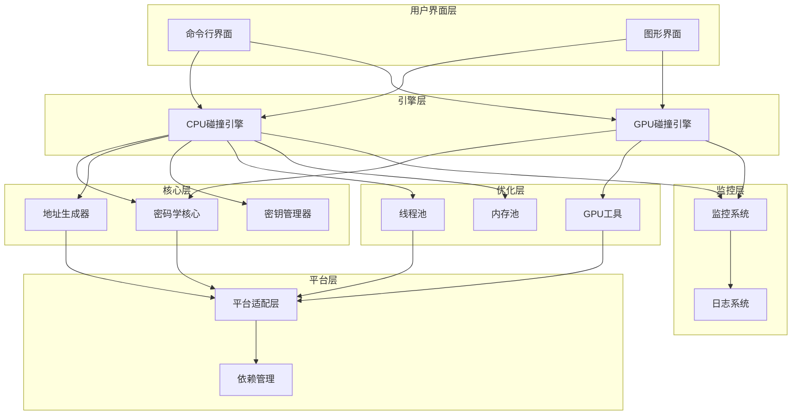
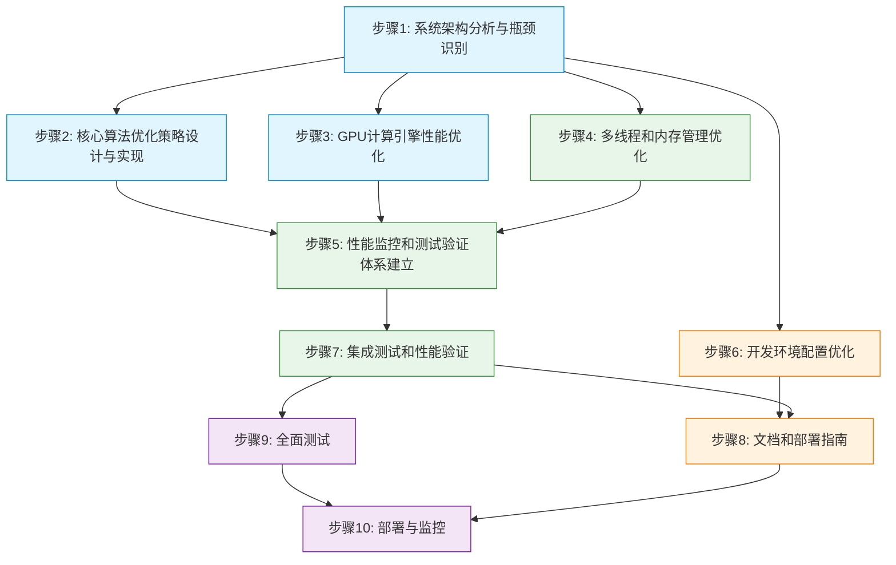
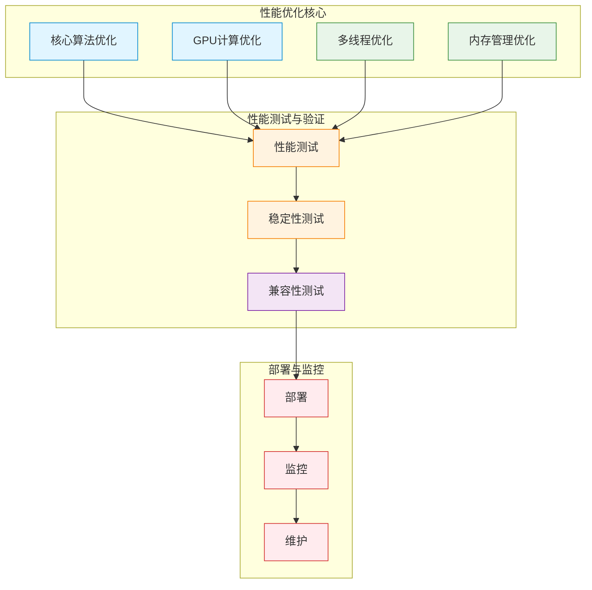

# BTC碰撞引擎性能优化方案 - 开发实现步骤流程

根据 `integrated_optimization_plan.md` 文件的分析，以下是BTC碰撞引擎性能优化的完整开发实现步骤流程：

## 项目架构拓扑图

## 开发实现流程图

## 性能优化结构图

## 阶段一：系统分析与准备 (P0)

### 步骤1: 系统架构分析与瓶颈识别
- **目标**: 分析当前系统架构，识别性能瓶颈
- **具体任务**:
  - 分析系统架构和模块依赖关系
  - 使用性能分析工具识别热点函数
  - 生成详细的架构分析报告，包含瓶颈识别和优化建议
  - 重点识别核心算法瓶颈（椭圆曲线运算、哈希计算、Base58编码）
  - 分析硬件利用瓶颈（GPU计算、多线程处理、内存管理）
  - 评估系统架构瓶颈（I/O操作、监控系统、平台兼容性）
- **输出**: 架构分析报告
- **验证标准**: 完成AC-1验收标准

## 阶段二：核心优化实现 (P0)

### 步骤2: 核心算法优化策略设计与实现
- **目标**: 优化椭圆曲线运算、哈希计算和Base58编码
- **具体任务**:
  - 实现Montgomery乘法、分支less热路径优化
  - 改进哈希计算和Base58编码：批量处理和查表优化
  - 实现预计算表和零分配设计
  - 应用Comba乘法和数据局部性优化
  - 实现批量哈希处理、查表优化、SIMD优化
  - 实现批量Base58编码、查表法、内存预分配
- **依赖**: 步骤1的架构分析结果
- **验证标准**: 核心算法性能提升50%以上 (AC-2)

### 步骤3: GPU计算引擎性能优化
- **目标**: 优化GPU内核和内存管理，实现多GPU并行
- **具体任务**:
  - 优化OpenCL内核代码：分支less设计、数据局部性优化
  - 改进GPU内存管理和数据传输：多级缓存、内存池
  - 实现多GPU并行和自动调优：负载均衡、动态参数调整
  - 针对不同GPU厂商的优化策略：NVIDIA、AMD、Intel
  - 优化内存访问模式，减少分支发散
  - 实现批量PADD和PMUL操作
- **依赖**: 步骤1的架构分析结果
- **验证标准**: GPU模式性能提升100x以上，单GPU达到2M+操作/秒 (AC-3)

## 阶段三：辅助优化 (P1)

### 步骤4: 多线程和内存管理优化
- **目标**: 优化线程池管理和内存使用
- **具体任务**:
  - 优化线程池管理和负载均衡
  - 改进内存使用和垃圾回收
  - 实现内存池和对象复用
  - 实现工作窃取算法、线程亲和性
  - 使用__slots__、内存对齐
- **依赖**: 步骤1的架构分析结果
- **验证标准**: 内存使用减少50%，多线程效率提升30% (AC-4)

### 步骤5: 性能监控和测试验证体系建立
- **目标**: 建立完整的性能监控和测试体系
- **具体任务**:
  - 扩展性能监控系统
  - 实现自动化性能测试
  - 建立性能基准和评估体系
  - 调整监控频率、实现采样机制
  - 建立性能指标监控和评估体系
- **依赖**: 步骤1、步骤2、步骤3的优化结果
- **验证标准**: 建立完整的性能指标监控和评估体系 (AC-5)

## 阶段四：配置与集成 (P1/P2)

### 步骤6: 开发环境配置优化
- **目标**: 优化开发环境配置，提供完整的环境搭建指南
- **具体任务**:
  - 优化开发环境配置
  - 提供完整的环境搭建指南
  - 配置性能测试环境
- **依赖**: 无
- **验证标准**: 提供完整的优化后环境搭建指南 (AC-6)

### 步骤7: 集成测试和性能验证
- **目标**: 集成所有优化组件，验证性能提升目标
- **具体任务**:
  - 集成所有优化组件
  - 运行完整的性能测试
  - 验证性能提升目标
- **依赖**: 步骤2、步骤3、步骤4、步骤5的优化结果
- **验证标准**: 整体性能提升验证，系统稳定性测试

### 步骤8: 文档和部署指南
- **目标**: 生成完整的性能优化文档和部署指南
- **具体任务**:
  - 生成完整的性能优化文档
  - 提供部署和配置指南
  - 编写性能调优最佳实践
- **依赖**: 步骤1-7的所有优化结果
- **验证标准**: 文档完整性和准确性，部署指南可行性

## 阶段五：测试与验证

### 步骤9: 全面测试
- **目标**: 确保系统在各种环境下的性能和稳定性
- **具体任务**:
  - 功能测试：单元测试、集成测试、端到端测试、回归测试
  - 性能测试：基准测试、场景测试、负载测试
  - 稳定性测试：长时间运行、内存泄漏、错误恢复
  - 兼容性测试：不同操作系统、硬件配置、依赖版本
- **依赖**: 步骤7的集成结果
- **验证标准**: 所有验证检查清单项目通过

## 阶段六：部署与维护

### 步骤10: 部署与监控
- **目标**: 部署优化后的系统，建立监控机制
- **具体任务**:
  - 按照部署指南部署系统
  - 建立性能监控和告警机制
  - 制定维护计划和应急方案
- **依赖**: 步骤8的部署指南
- **验证标准**: 系统正常运行，监控机制有效

## 实施顺序与依赖关系

1. **步骤1** → **步骤2** → **步骤3** → **步骤4** → **步骤5** → **步骤7** → **步骤9** → **步骤10**
2. **步骤1** → **步骤6** → **步骤8**
3. **步骤7** → **步骤8**

## 关键成功因素

- 严格按照优化计划执行，确保每个步骤都达到验收标准
- 充分利用硬件资源，特别是GPU并行计算能力
- 持续监控系统性能，及时调整优化策略
- 保持系统的稳定性、安全性和可维护性
- 确保向后兼容性，不破坏现有功能

通过以上步骤流程，BTC碰撞引擎将获得显著的性能提升，充分利用现代硬件资源，实现更高的私钥碰撞检测效率。