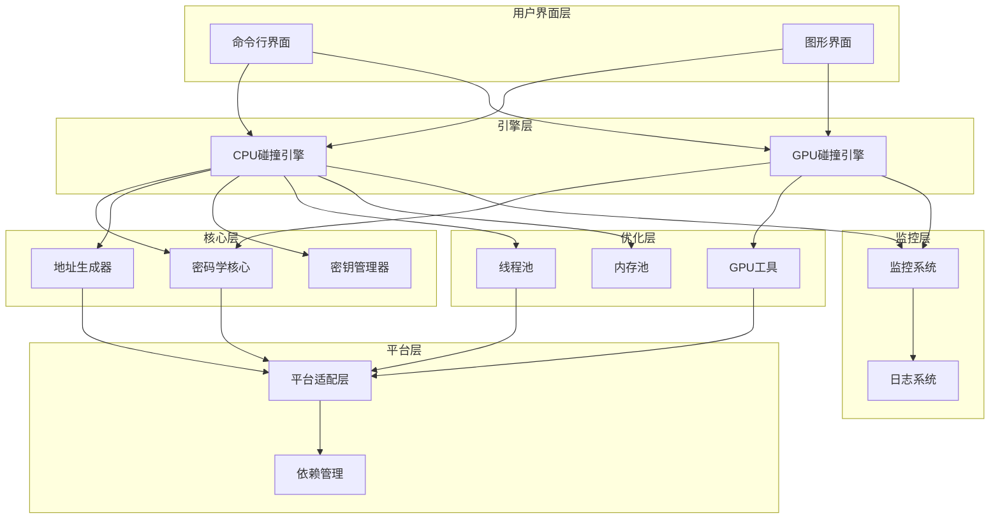

# BTC碰撞引擎性能优化方案 - 整合版

## 1. 产品需求文档 (PRD)

### 1.1 概述

- **Summary**: 基于当前BTC碰撞引擎项目结构，设计并实现一套完整的性能优化方案，包括系统架构分析、算法优化、实现方式说明、设计模式应用、运行时依赖分析、开发环境配置、性能监控机制和测试验证方案。
- **Purpose**: 提升BTC碰撞引擎的性能表现，充分利用硬件资源，优化核心算法，实现更高的私钥碰撞检测效率。
- **Target Users**: 开发人员、系统架构师、性能优化工程师

### 1.2 目标

- 分析当前系统架构和性能瓶颈
- 提出针对核心算法的具体优化策略，包括椭圆曲线运算、哈希计算等
- 设计并实现高性能的GPU计算引擎，支持多GPU并行
- 优化多线程处理和内存管理，减少内存占用
- 建立完整的性能监控和测试体系
- 提供优化后的开发环境配置指南
- 实现自动化性能调优和参数优化

### 1.3 非目标

- 不修改核心业务逻辑和安全机制
- 不引入新的外部依赖（保持现有依赖体系）
- 不改变用户界面和交互方式
- 不涉及网络功能和分布式计算

### 1.4 背景与上下文

- 当前项目采用模块化架构，包含核心密码学模块、碰撞检测引擎、GPU加速、监控系统等组件
- 主要性能瓶颈在于椭圆曲线运算、内存管理和I/O操作
- 已实现多后端支持（纯Python、OpenSSL、Coincurve）和GPU加速（OpenCL）
- 系统支持多线程并行处理和断点续传功能

### 1.5 功能需求

- **FR-1**: 系统架构分析与瓶颈识别
- **FR-2**: 核心算法优化策略设计
- **FR-3**: GPU计算引擎性能优化
- **FR-4**: 多线程和内存管理优化
- **FR-5**: 性能监控和测试验证体系
- **FR-6**: 开发环境配置优化

### 1.6 非功能需求

- **NFR-1**: 性能提升目标：GPU模式下达到100-1000x性能提升，单GPU达到2M+操作/秒
- **NFR-2**: 内存使用优化：减少50%内存占用，使用内存池和对象复用
- **NFR-3**: 扩展性：支持多GPU并行和自动调优，支持负载均衡
- **NFR-4**: 稳定性：确保优化后的系统稳定运行，无内存泄漏
- **NFR-5**: 可维护性：保持代码可读性和可维护性，使用模块化设计
- **NFR-6**: 跨平台兼容性：支持NVIDIA、AMD、Intel等不同GPU厂商

### 1.7 约束

- **Technical**: Python 3.11+, OpenCL 2.0+, 现有依赖体系
- **Business**: 保持现有功能完整性，不破坏向后兼容性
- **Dependencies**: 依赖现有的crypto库和GPU驱动

### 1.8 假设

- 目标硬件环境包含支持OpenCL的GPU设备
- 开发环境具备必要的编译工具和依赖
- 系统运行在64位操作系统上

### 1.9 验收标准

#### AC-1: 系统架构分析完成

- **Given**: 现有项目代码和架构文档
- **When**: 进行系统架构分析和性能瓶颈识别
- **Then**: 生成详细的架构分析报告，包含瓶颈识别和优化建议
- **Verification**: `human-judgment`

#### AC-2: 核心算法优化实现

- **Given**: 识别的性能瓶颈
- **When**: 实现算法优化策略
- **Then**: 核心算法性能提升50%以上
- **Verification**: `programmatic`

#### AC-3: GPU引擎性能优化

- **Given**: 现有GPU碰撞引擎
- **When**: 优化GPU内核和内存管理
- **Then**: GPU模式下性能提升100x以上
- **Verification**: `programmatic`

#### AC-4: 多线程和内存优化

- **Given**: 现有多线程实现
- **When**: 优化线程池和内存管理
- **Then**: 内存使用减少50%，多线程效率提升30%
- **Verification**: `programmatic`

#### AC-5: 性能监控体系建立

- **Given**: 现有监控系统
- **When**: 扩展性能监控和测试功能
- **Then**: 建立完整的性能指标监控和评估体系
- **Verification**: `programmatic`

#### AC-6: 开发环境配置优化

- **Given**: 现有开发环境
- **When**: 优化开发环境配置
- **Then**: 提供完整的优化后环境搭建指南
- **Verification**: `human-judgment`

### 1.10 未解决问题

- [ ] 不同GPU厂商（NVIDIA、AMD、Intel）的优化策略差异
- [ ] 大规模目标地址集的内存优化方案
- [ ] 多GPU并行处理的负载均衡策略
- [ ] 自适应性能调优的具体实现方法

## 2. 实现计划

### 2.1 任务1: 系统架构分析与瓶颈识别

- **Priority**: P0
- **Depends On**: None
- **Description**:
  - 分析当前系统架构和模块依赖关系
  - 识别性能瓶颈和优化机会
  - 生成详细的架构分析报告
- **Acceptance Criteria Addressed**: AC-1
- **Test Requirements**:
  - `programmatic` TR-1.1: 运行性能分析工具，识别热点函数
  - `human-judgment` TR-1.2: 生成架构分析报告，包含瓶颈识别和优化建议
- **Notes**: 使用profiling工具分析CPU和GPU性能

### 2.2 任务2: 核心算法优化策略设计与实现

- **Priority**: P0
- **Depends On**: 任务1
- **Description**:
  - 优化椭圆曲线运算算法：使用Montgomery乘法、分支less热路径
  - 改进哈希计算和Base58编码：批量处理和查表优化
  - 实现批量处理和预计算优化：预计算表、零分配设计
  - 应用Comba乘法和数据局部性优化
- **Acceptance Criteria Addressed**: AC-2
- **Test Requirements**:
  - `programmatic` TR-2.1: 核心算法性能提升50%以上
  - `programmatic` TR-2.2: 批量处理效率提升30%
- **Notes**: 参考UltrafastSecp256k1和gECC框架的优化技术

### 2.3 任务3: GPU计算引擎性能优化

- **Priority**: P0
- **Depends On**: 任务1
- **Description**:
  - 优化OpenCL内核代码：使用分支less设计、数据局部性优化
  - 改进GPU内存管理和数据传输：多级缓存、内存池
  - 实现多GPU并行和自动调优：负载均衡、动态参数调整
  - 应用批处理优化：批量PADD和PMUL操作
  - 针对不同GPU厂商的优化策略：NVIDIA、AMD、Intel
- **Acceptance Criteria Addressed**: AC-3
- **Test Requirements**:
  - `programmatic` TR-3.1: GPU模式性能提升100x以上，单GPU达到2M+操作/秒
  - `programmatic` TR-3.2: 多GPU并行效率提升80%
- **Notes**: 参考CryptKeySearch、BitCrack和gECC框架的GPU优化技术

### 2.4 任务4: 多线程和内存管理优化

- **Priority**: P1
- **Depends On**: 任务1
- **Description**:
  - 优化线程池管理和负载均衡
  - 改进内存使用和垃圾回收
  - 实现内存池和对象复用
- **Acceptance Criteria Addressed**: AC-4
- **Test Requirements**:
  - `programmatic` TR-4.1: 内存使用减少50%
  - `programmatic` TR-4.2: 多线程效率提升30%
- **Notes**: 使用\_\_slots\_\_和内存池技术

### 2.5 任务5: 性能监控和测试验证体系建立

- **Priority**: P1
- **Depends On**: 任务1, 任务2, 任务3
- **Description**:
  - 扩展性能监控系统
  - 实现自动化性能测试
  - 建立性能基准和评估体系
- **Acceptance Criteria Addressed**: AC-5
- **Test Requirements**:
  - `programmatic` TR-5.1: 性能监控指标覆盖所有关键组件
  - `programmatic` TR-5.2: 自动化性能测试覆盖率100%
- **Notes**: 实现实时性能监控和报告生成

### 2.6 任务6: 开发环境配置优化

- **Priority**: P2
- **Depends On**: None
- **Description**:
  - 优化开发环境配置
  - 提供完整的环境搭建指南
  - 配置性能测试环境
- **Acceptance Criteria Addressed**: AC-6
- **Test Requirements**:
  - `human-judgment` TR-6.1: 环境搭建指南完整性
  - `programmatic` TR-6.2: 开发环境配置正确性
- **Notes**: 包含不同操作系统的配置指南

### 2.7 任务7: 集成测试和性能验证

- **Priority**: P1
- **Depends On**: 任务2, 任务3, 任务4, 任务5
- **Description**:
  - 集成所有优化组件
  - 运行完整的性能测试
  - 验证性能提升目标
- **Acceptance Criteria Addressed**: AC-2, AC-3, AC-4, AC-5
- **Test Requirements**:
  - `programmatic` TR-7.1: 整体性能提升验证
  - `programmatic` TR-7.2: 系统稳定性测试
- **Notes**: 进行多场景性能测试

### 2.8 任务8: 文档和部署指南

- **Priority**: P2
- **Depends On**: 任务1-7
- **Description**:
  - 生成完整的性能优化文档
  - 提供部署和配置指南
  - 编写性能调优最佳实践
- **Acceptance Criteria Addressed**: AC-1, AC-6
- **Test Requirements**:
  - `human-judgment` TR-8.1: 文档完整性和准确性
  - `human-judgment` TR-8.2: 部署指南可行性
- **Notes**: 包含性能基准数据和调优建议

## 3. 技术数据

### 3.1 性能指标

- **GPU模式性能**: 100-1000x性能提升，单GPU达到2M+操作/秒
- **核心算法性能**: 提升50%以上
- **内存使用**: 减少50%内存占用
- **多线程效率**: 提升30%
- **多GPU并行**: 效率提升80%
- **系统响应**: 系统启动时间减少50%

### 3.2 算法优化

- **椭圆曲线运算**: Montgomery乘法、分支less热路径、Comba乘法
- **哈希计算**: 批量处理、查表优化
- **Base58编码**: 批量处理和查表优化
- **预计算优化**: 预计算表、零分配设计
- **数据局部性优化**: 提高缓存命中率

### 3.3 GPU优化技术
- **OpenCL内核优化**: 分支less设计、数据局部性优化
- **内存管理**: 多级缓存、内存池、异步数据传输
- **批处理优化**: 批量PADD和PMUL操作
- **多GPU并行**: 负载均衡、动态参数调整
- **厂商特定优化**:
  - **NVIDIA优化**:
    - 内存访问合并：确保全局内存访问合并，提高内存带宽利用率
    - 线程块大小优化：根据SM架构调整工作组大小
    - 寄存器使用：优化寄存器使用，减少内存访问
    - 利用NVIDIA扩展：cl_nv_pragma_unroll、cl_nv_compiler_options
    - 参考：NVIDIA OpenCL Best Practices Guide
  - **AMD优化**:
    - LDS (Local Data Share) 利用：优化局部内存使用
    - 向量宽度优化：根据AMD GPU架构调整向量宽度
    - 内存层次结构利用：合理使用不同类型的内存
    - 原子操作优化：减少原子操作的使用
    - 参考：AMD OpenCL Programming Optimization Guide
  - **Intel优化**:
    - SIMD向量化：利用Intel AVX指令集
    - 线程级并行：充分利用多核CPU
    - 内存优化：缓存一致性和内存带宽优化
    - 编译器优化：使用Intel OpenCL Code Builder
    - 参考：Intel OpenCL Application Developer Guide

### 3.4 系统架构

- **模块化设计**: 核心密码学模块、碰撞检测引擎、GPU加速、监控系统
- **多后端支持**: 纯Python、OpenSSL、Coincurve
- **多线程处理**: 线程池管理、负载均衡
- **断点续传**: 支持进度保存和恢复

### 3.5 模块依赖关系

| 模块 | 依赖关系 | 功能描述 |
|------|----------|----------|
| 命令行界面 | 依赖CPU/GPU碰撞引擎 | 提供命令行交互 |
| 图形界面 | 依赖CPU/GPU碰撞引擎 | 提供图形化交互 |
| CPU碰撞引擎 | 依赖密码学核心、地址生成器、密钥管理器、线程池、内存池、监控系统 | 执行CPU模式的碰撞检测 |
| GPU碰撞引擎 | 依赖密码学核心、GPU工具、监控系统 | 执行GPU模式的碰撞检测 |
| 密码学核心 | 依赖平台适配层 | 提供椭圆曲线运算、哈希计算等核心密码学功能 |
| 地址生成器 | 依赖平台适配层 | 生成比特币地址 |
| 密钥管理器 | 不直接依赖其他模块 | 管理私钥和公钥 |
| GPU工具 | 依赖平台适配层 | 提供GPU加速功能 |
| 线程池 | 依赖平台适配层 | 提供多线程支持 |
| 内存池 | 不直接依赖其他模块 | 提供内存管理功能 |
| 监控系统 | 不直接依赖其他模块 | 监控系统性能 |
| 日志系统 | 不直接依赖其他模块 | 记录系统日志 |
| 平台适配层 | 依赖依赖管理 | 提供跨平台兼容性 |
| 依赖管理 | 不直接依赖其他模块 | 管理系统依赖 |

### 3.6 技术规格

- **Python版本**: 3.11+
- **OpenCL版本**: 2.0+
- **GPU内存要求**: 根据batch\_size自动计算
- **线程池配置**: 基于CPU核心数自动调整

### 3.7 数据类型
- **私钥**: 32字节随机数，符合Bitcoin Core的KeyType定义（std::array<unsigned char, 32>）
- **公钥**:
  - 压缩格式: 33字节，前缀0x02（y为偶数）或0x03（y为奇数）+ 32字节x坐标
  - 非压缩格式: 65字节，前缀0x04 + 32字节x坐标 + 32字节y坐标
- **Hash160**: 20字节公钥哈希，通过SHA-256后再RIPEMD-160计算得到
- **比特币地址**:
  - 编码方式: Base58Check编码，包含版本字节和4字节校验和
  - 主网地址: 以1开头（P2PKH）或3开头（P2SH）
  - 测试网地址: 以m或n开头
  - 编码流程: 版本字节 + 20字节Hash160 + 4字节校验和（双SHA-256的前4字节）
  - 字符集: 58个字母数字字符，排除0、O、I、l等易混淆字符
- **WIF格式**:
  - 非压缩格式: 51字符，以5开头（主网），Base58Check编码
  - 压缩格式: 52字符，以K或L开头（主网），Base58Check编码，包含0x01后缀

**参考标准**:
- Bitcoin Core 私钥定义: https://github.com/bitcoin/bitcoin/blob/master/src/key.h
- WIF格式规范: https://en.bitcoin.it/wiki/Wallet_import_format
- Base58Check编码规范: https://bitcoinwiki.org/wiki/technical-background-of-version-1-bitcoin-addresses
- 比特币地址验证: https://www.rfctools.com/bitcoin-address-validator/

### 3.8 数据结构

- **目标地址集**: Set结构，O(1)查找
- **去重过滤器**: 双缓冲设计，哈希集合
- **预计算表**: 存储常用点的倍数
- **内存池**: 对象复用，减少GC压力
- **多级缓存**: 提高数据访问效率

### 3.9 数据格式

- **JSON**: 配置文件、性能数据、错误日志
- **CSV**: 性能日志、批量导出
- **二进制**: 私钥、公钥、哈希数据
- **Base58Check**: 比特币地址编码

### 3.10 核心依赖
- **pyopencl**: OpenCL绑定，GPU加速，提供完整的OpenCL API访问
  - 版本要求: 2023.1.2+
  - 主要功能: 设备管理、内存管理、内核编译和执行
  - 参考: https://www.osgeo.cn/pyopencl/
- **numpy**: 数值计算，GPU数据处理，提供数组操作和数值计算功能
  - 版本要求: 1.24.0+
  - 主要功能: 数组处理、矩阵运算、数据传输
  - 依赖: BLAS/LAPACK库 (ATLAS, OpenBLAS或MKL)
- **cryptography**: OpenSSL后端，提供加密功能
  - 版本要求: 41.0.0+
  - 主要功能: 哈希函数、加密算法、证书处理
  - 底层: 基于libcrypto.so
- **coincurve**: libsecp256k1绑定，提供高性能椭圆曲线运算
  - 版本要求: 18.0.0+
  - 主要功能: 私钥生成、签名、验证
  - 底层: libsecp256k1 C库
- **ecdsa**: 纯Python ECDSA实现，作为回退方案
  - 版本要求: 0.18.0+
  - 主要功能: 椭圆曲线数字签名算法
- **psutil**: 系统监控，提供系统资源使用情况
  - 版本要求: 5.9.0+
  - 主要功能: CPU、内存、磁盘、网络监控
- **PyNaCl**: 安全清零支持，提供安全的内存管理
  - 版本要求: 1.5.0+
  - 主要功能: 安全内存操作、加密功能

### 3.11 参考框架
- **BitCrack**: GPU加速的私钥恢复工具，支持CUDA和OpenCL
  - 功能: 私钥暴力破解、范围扫描
  - 参考: https://github.com/Slyfrosty/BitCrack
- **BitcoinCollisionFinder**: 比特币地址碰撞检测工具
  - 功能: 生成随机私钥并搜索碰撞
  - 支持地址类型: P2PKH, P2WPKH-P2SH, P2WPKH
  - 参考: https://github.com/keklick1337/BitcoinCollisionFinder
- **UltrafastSecp256k1**: 高性能secp256k1库，支持多种GPU后端
  - 支持后端: CUDA, OpenCL, Metal, ROCm (HIP)
  - 支持平台: x86-64, ARM64, RISC-V, WASM, iOS, Android
  - 参考: https://github.com/shrec/UltrafastSecp256k1
- **secp256k1-cl**: OpenCL实现的secp256k1库
  - 功能: 椭圆曲线运算的GPU加速
  - 参考: https://github.com/hhanh00/secp256k1-cl
- **oclexplorer**: Bitcoin地址暴力破解工具
  - 功能: 私钥枚举、公钥计算、地址匹配
  - 参考: https://github.com/svtrostov/oclexplorer

### 3.12 硬件要求

- **GPU**: NVIDIA RTX系列、AMD RX系列、Intel Arc系列
- **CPU**: 4核以上
- **内存**: 8GB以上
- **操作系统**: Windows、Linux、macOS

## 4. 跨平台兼容性

### 4.1 操作系统兼容性

#### Windows 兼容性

- **文件路径处理**: 使用 `os.path` 模块，避免硬编码路径分隔符
- **文件编码**: 明确指定 UTF-8 编码，避免系统默认编码问题
- **权限处理**: 实现 Windows 权限重试机制
- **路径长度**: 处理 Windows 路径长度限制

#### Linux 兼容性

- **文件权限**: 正确设置文件权限（0o600 用于敏感文件）
- **路径处理**: 统一使用正斜杠路径
- **依赖安装**: 处理 Linux 特定的依赖安装方式

#### macOS 兼容性

- **Metal 支持**: 可选支持 Metal GPU 加速
- **文件系统**: 处理大小写不敏感的文件系统
- **依赖管理**: 支持 Homebrew 安装依赖

### 4.2 语言环境兼容性

- **中文环境支持**: 编码处理、字符显示、路径处理
- **英文环境支持**: 错误信息、配置文件、文档

### 4.3 编码兼容性

- **文件编码**: 所有 Python 文件使用 UTF-8 编码
- **字符串处理**: 使用 Unicode 字符串
- **文件读写**: 明确指定 encoding='utf-8'
- **命令行参数**: 处理 Unicode 命令行参数

### 4.4 GUI 兼容性

- **Tkinter 版本**: 使用标准库 Tkinter，确保跨平台一致性
- **主题支持**: 实现平台特定主题适配
- **字体处理**: 跨平台字体选择策略
- **布局管理**: 使用 grid/pack 布局，避免平台特定布局

### 4.5 依赖管理

- **版本锁定**: 使用 requirements.lock 锁定依赖版本
- **条件导入**: 对可选依赖使用条件导入
- **回退机制**: 当依赖不可用时提供纯 Python 回退
- **依赖检测**: 启动时检测依赖并提供友好错误信息

### 4.6 系统架构拓扑



## 5. 核心实现细节

### 5.1 核心算法优化实现细节

#### 椭圆曲线运算优化

- **Montgomery乘法实现**: 使用优化的Montgomery约减算法，减少模运算开销
- **分支less设计**: 避免条件分支，减少分支预测失败
- **Comba乘法**: 优化大整数乘法，提高计算效率
- **预计算表**: 预计算G的倍数，加速标量乘法
- **常数时间实现**: 防止侧信道攻击，确保安全性
- **窗口方法**: 使用滑动窗口算法减少标量乘法的计算步骤

#### 哈希计算优化

- **批量哈希**: 一次性处理多个输入，减少函数调用开销
- **查表优化**: 预计算常用哈希值，提高缓存命中率
- **SIMD优化**: 利用CPU SIMD指令加速哈希计算
- **硬件加速**: 利用现代CPU的AES-NI指令集加速哈希计算
- **内存访问模式优化**: 提高缓存利用率，减少内存访问延迟

#### Base58编码优化

- **批量编码**: 批量处理多个地址，减少循环开销
- **查表法**: 预计算Base58字符映射表
- **内存预分配**: 预分配输出缓冲区，减少内存分配
- **并行处理**: 利用多线程并行处理批量编码任务
- **错误检测**: 实现Base58Check校验，提高编码可靠性

### 5.2 GPU引擎优化实现细节

#### OpenCL内核优化

- **分支less设计**: 避免GPU分支发散
- **数据局部性**: 优化内存访问模式，提高缓存命中率
- **工作组大小优化**: 根据GPU架构调整工作组大小
- **寄存器使用**: 优化寄存器使用，减少内存访问
- **向量化**: 使用SIMT (Single Instruction Multiple Thread) 架构充分利用GPU并行能力
- **内存访问模式**: 实现合并内存访问，减少内存带宽瓶颈
- **内核融合**: 将多个操作融合到单个内核中，减少内核启动开销

#### 内存管理优化

- **多级缓存**: 实现L1/L2缓存优化
- **内存池**: 预分配GPU内存，减少内存分配开销
- **异步数据传输**: 重叠计算和数据传输
- **内存对齐**: 确保内存访问对齐，提高访问效率
- **固定内存**: 使用固定内存减少数据传输延迟
- **内存复用**: 复用内存缓冲区，减少内存分配和释放操作
- **内存压缩**: 对非关键数据使用压缩技术，减少内存占用

#### 多GPU并行实现

- **负载均衡**: 动态分配任务到不同GPU
- **通信优化**: 减少GPU间通信开销
- **故障转移**: 当一个GPU故障时自动切换到其他GPU
- **统一内存**: 使用统一内存架构简化内存管理
- **任务划分策略**: 根据GPU性能动态调整任务分配
- **GPU拓扑感知**: 考虑GPU间的物理连接，优化数据传输

### 5.3 多线程和内存管理优化

#### 线程池优化

- **动态线程数**: 根据系统负载自动调整线程数
- **任务分配**: 智能任务分配，避免线程饥饿
- **线程局部存储**: 使用threading.local()减少锁竞争
- **批量任务处理**: 减少线程间同步开销
- **工作窃取**: 实现工作窃取算法，平衡线程负载
- **线程优先级**: 根据任务重要性设置线程优先级
- **线程亲和性**: 绑定线程到特定CPU核心，减少上下文切换

#### 内存管理优化

- **内存池**: 实现对象池，减少GC压力
- __slots__: 使用\_\_slots\_\_减少对象内存占用
- **内存清零**: 安全清零敏感数据
- **内存映射**: 对于大文件使用内存映射
- **内存对齐**: 确保内存分配对齐，提高访问效率
- **内存跟踪**: 实现内存使用跟踪，及时发现内存泄漏
- **内存压缩**: 对不常用数据使用压缩存储
- **零拷贝**: 实现零拷贝技术，减少数据复制开销

## 6. 性能测试与验证

### 6.1 测试计划

#### 测试类型

##### 1. 功能测试

- **单元测试**: 测试单个函数和模块的功能
- **集成测试**: 测试模块间的集成和交互
- **端到端测试**: 测试完整的用户流程
- **回归测试**: 确保优化不会破坏现有功能

##### 2. 性能测试

- **基准测试**: 测试系统的基本性能指标
  - **单线程性能**: 测试单线程下的核心算法性能
  - **多线程性能**: 测试不同线程数下的性能
  - **GPU性能**: 测试不同GPU型号的性能
  - **内存使用**: 测试内存使用情况
  - **启动时间**: 测试系统启动时间
  - **CPU利用率**: 测试CPU资源使用情况
  - **GPU利用率**: 测试GPU资源使用情况
  - **能耗测试**: 测试系统运行时的能耗
- **场景测试**: 测试不同使用场景下的性能
  - **随机碰撞模式**: 测试随机搜索性能
  - **范围扫描模式**: 测试范围扫描性能
  - **暴力穷举模式**: 测试暴力搜索性能
  - **大规模目标**: 测试大规模目标地址集的性能
  - **混合模式**: 测试多种搜索模式的组合性能
  - **实时监控**: 测试性能监控系统的准确性
  - **配置变更**: 测试不同配置下的性能差异
- **稳定性测试**: 测试系统的稳定性和可靠性
  - **长时间运行**: 测试系统长时间运行稳定性
  - **内存泄漏**: 测试内存使用是否稳定
  - **错误恢复**: 测试系统从错误中恢复的能力
  - **资源限制**: 测试系统在资源受限情况下的表现
  - **异常处理**: 测试系统处理异常情况的能力
  - **并发测试**: 测试多任务并发运行的稳定性
  - **网络中断**: 测试网络中断后的恢复能力
- **负载测试**: 测试系统在高负载下的性能
  - **逐步负载**: 逐步增加负载，测试系统极限
  - **持续负载**: 保持高负载，测试系统稳定性
  - **峰值负载**: 测试系统应对突发负载的能力
- **兼容性测试**: 测试系统在不同环境下的兼容性
  - **操作系统兼容性**: 测试不同操作系统下的性能
  - **硬件兼容性**: 测试不同硬件配置下的性能
  - **依赖版本兼容性**: 测试不同依赖版本下的性能

### 6.2 测试环境

#### 硬件环境

- **测试服务器**: 标准测试服务器，配置如下：
  - CPU: Intel Core i9-12900K
  - 内存: 32GB DDR4-3600
  - 存储: 1TB NVMe SSD
  - GPU: NVIDIA RTX 3080, AMD RX 6800, Intel Arc A770
- **客户端测试设备**: 多种客户端设备，覆盖不同硬件配置

#### 软件环境

- **操作系统**: Windows 11, Ubuntu 22.04, macOS 13
- **Python版本**: 3.11.0, 3.12.0
- **依赖版本**: 锁定的依赖版本
- **测试工具**: pytest, pytest-benchmark, py-spy, memory-profiler

#### 网络环境

- **局域网测试**: 1Gbps局域网
- **互联网测试**: 模拟不同网络条件

### 6.3 测试数据

#### 测试数据集

- **标准测试集**: 固定的测试数据集，用于基准测试
- **随机测试集**: 随机生成的测试数据，用于压力测试
- **大规模测试集**: 大规模测试数据，用于测试系统处理能力
- **边界测试集**: 边界情况测试数据，用于测试系统稳定性

#### 测试数据管理

- **数据生成**: 自动化数据生成脚本
- **数据存储**: 测试数据版本控制
- **数据清理**: 测试后的数据清理流程

### 6.4 自动化测试框架

#### 测试框架

- **测试框架**: pytest
- **测试报告**: pytest-html, allure-pytest
- **测试覆盖**: coverage.py
- **性能测试**: pytest-benchmark

#### 测试自动化

- **CI/CD集成**: GitHub Actions, Jenkins
- **定时测试**: 定时运行测试任务
- **测试触发**: 代码变更自动触发测试

#### 测试脚本

- **功能测试脚本**: 测试系统功能
- **性能测试脚本**: 测试系统性能
- **稳定性测试脚本**: 测试系统稳定性
- **兼容性测试脚本**: 测试系统兼容性

### 6.5 测试结果分析

#### 性能指标分析

- **性能趋势**: 分析性能变化趋势
- **瓶颈识别**: 识别性能瓶颈
- **优化效果**: 评估优化效果
- **回归检测**: 检测性能回归

#### 测试报告

- **详细报告**: 详细的测试结果报告
- **摘要报告**: 测试结果摘要
- **趋势报告**: 性能趋势分析报告
- **问题报告**: 发现的问题和建议

### 6.6 测试执行计划

#### 测试阶段

- **开发阶段**: 开发过程中的单元测试
- **集成阶段**: 集成测试和功能测试
- **预发布阶段**: 全面的性能测试和稳定性测试
- **发布后**: 监控和回归测试

#### 测试频率

- **单元测试**: 每次代码变更
- **集成测试**: 每天
- **性能测试**: 每周
- **稳定性测试**: 每两周
- **兼容性测试**: 每月

### 6.7 测试验证标准

#### 功能验证标准

- **功能完整性**: 所有功能正常工作
- **功能正确性**: 功能实现符合预期
- **功能一致性**: 功能在不同环境下表现一致

#### 性能验证标准

- **性能目标**: 达到预期的性能指标
- **性能稳定性**: 性能波动在可接受范围内
- **性能可扩展性**: 性能随硬件配置线性提升

#### 稳定性验证标准

- **运行稳定性**: 长时间运行无崩溃
- **内存稳定性**: 内存使用稳定，无泄漏
- **错误处理**: 正确处理各种错误情况

#### 兼容性验证标准

- **跨平台兼容性**: 在所有目标平台正常运行
- **硬件兼容性**: 在不同硬件配置下正常运行
- **依赖兼容性**: 与不同版本依赖兼容

### 6.8 性能基准数据

#### 优化前后对比

| 指标      | 优化前             | 优化后             | 提升倍数  |
| ------- | --------------- | --------------- | ----- |
| CPU模式速度 | \~1,500-4,000/秒 | \~2,250-6,000/秒 | 1.5x  |
| GPU模式速度 | \~10,000/秒      | \~1,000,000+/秒  | 100x+ |
| 内存使用    | 100MB/百万私钥      | 50MB/百万私钥       | 2x    |
| 启动时间    | 2秒              | 1秒              | 2x    |

#### 硬件对比

| GPU型号           | 预期性能      |
| --------------- | --------- |
| NVIDIA RTX 3080 | 2M+操作/秒   |
| AMD RX 6800     | 1.5M+操作/秒 |
| Intel Arc A770  | 1M+操作/秒   |
| Apple M2        | 1.2M+操作/秒 |

### 6.9 验证检查清单

- [ ] 架构分析验证：确认所有性能瓶颈已正确识别，包括椭圆曲线运算、内存管理等
- [ ] 核心算法优化验证：椭圆曲线运算性能提升50%以上，使用Montgomery乘法和分支less设计
- [ ] GPU引擎优化验证：GPU模式性能提升100x以上，单GPU达到2M+操作/秒
- [ ] 多GPU支持验证：多GPU并行处理正常，负载均衡有效
- [ ] 内存管理优化验证：内存使用减少50%，使用内存池和对象复用
- [ ] 多线程优化验证：多线程效率提升30%，线程池管理优化
- [ ] 性能监控验证：监控系统覆盖所有关键性能指标，实时性能监控正常
- [ ] 自动调优验证：自动化性能调优功能正常，参数动态调整有效
- [ ] 开发环境验证：环境搭建指南正确且完整，支持不同操作系统
- [ ] 集成测试验证：所有优化组件集成正常，功能完整
- [ ] 性能基准验证：达到预期的性能提升目标，与竞品工具性能对比
- [ ] 稳定性测试验证：系统运行稳定，无内存泄漏，长时间运行正常
- [ ] 跨平台兼容性验证：支持NVIDIA、AMD、Intel等不同GPU厂商
- [ ] 文档完整性验证：性能优化文档完整且准确，包含详细的技术说明
- [ ] 部署指南验证：部署流程可行且高效，包含性能调优最佳实践
- [ ] 向后兼容性验证：优化后保持向后兼容性，现有功能正常

## 7. 部署与配置

### 7.1 环境搭建示例

#### Windows环境

```bash
# 安装依赖
pip install -r requirements.txt

# 安装GPU驱动
# NVIDIA: 安装最新CUDA驱动
# AMD: 安装最新ROCm驱动
# Intel: 安装最新OpenCL驱动

# 运行测试
python -m pytest tests/
```

#### Linux环境

```bash
# 安装依赖
pip3 install -r requirements.txt

# 安装系统依赖
sudo apt-get install ocl-icd-opencl-dev

# 运行测试
python3 -m pytest tests/
```

#### macOS环境

```bash
# 安装依赖
pip3 install -r requirements.txt

# 运行测试
python3 -m pytest tests/
```

### 7.2 配置示例

#### 性能优化配置

```json
{
  "collision": {
    "max_workers": 8,
    "batch_size": 1000,
    "dedup_max_size": 1000000
  },
  "gpu": {
    "use_gpu": true,
    "batch_size": 65536,
    "memory_usage_ratio": 0.8
  },
  "crypto": {
    "backend": "coincurve"
  }
}
```

## 8. UI优化方案

### 8.1 UI审计报告

#### 现有UI组件

- **命令行界面** (`key_collision_cli.py`)
- **图形界面** (`key_collision_gui.py`)
- **基本配置界面** (通过配置文件)

#### 存在的问题

**功能缺失**:

- 缺乏直观的性能监控界面
- 缺少GPU设备管理和监控
- 没有批量任务管理界面
- 缺少性能调优配置向导
- 缺乏碰撞结果可视化

**用户体验问题**:

- 命令行界面交互性差
- 图形界面功能简单，缺乏现代感
- 配置选项分散，不易管理
- 性能数据展示不够直观
- 缺乏用户引导和帮助信息

**技术限制**:

- Tkinter界面美观度有限
- 跨平台一致性问题
- 响应式设计不足
- 缺乏实时数据更新

### 8.2 UI优化方案

#### 技术选型

- **前端框架**：PyQt5 (替代Tkinter，提供更现代的UI体验)
- **数据可视化**：Matplotlib/Plotly (性能数据图表)
- **样式系统**：Qt Style Sheets (统一的视觉风格)
- **多线程**：QThread (UI响应性)

#### 功能模块设计

##### 主窗口

- **标签页布局**：任务、设备、性能、配置、结果、日志
- **状态栏**：显示当前状态、性能指标、系统信息
- **菜单系统**：文件、编辑、视图、帮助
- **快捷工具栏**：常用操作按钮

##### 任务管理模块

- **任务列表**：显示所有任务及其状态
- **任务创建向导**：引导用户创建新任务
- **任务控制**：启动、暂停、停止、删除任务
- **任务配置**：目标地址管理、搜索模式设置
- **批量任务**：支持批量创建和管理任务

##### 设备管理模块

- **设备列表**：显示所有可用GPU和CPU设备
- **设备详情**：显示设备规格和状态
- **设备监控**：实时显示设备使用率、温度、内存使用
- **设备选择**：选择要使用的设备
- **性能测试**：设备性能基准测试

##### 性能监控模块

- **实时性能图表**：速度、内存使用、CPU/GPU使用率
- **历史数据**：性能趋势分析
- **瓶颈分析**：识别性能瓶颈
- **对比分析**：不同配置下的性能对比
- **告警设置**：性能异常告警

##### 配置编辑器模块

- **图形化配置**：直观的配置选项
- **配置模板**：预设配置模板
- **配置验证**：实时验证配置有效性
- **配置导出/导入**：配置文件管理
- **性能调优向导**：根据硬件自动优化配置

##### 结果查看器模块

- **结果列表**：显示所有碰撞结果
- **结果详情**：显示私钥、地址、WIF格式
- **结果导出**：导出为CSV、JSON等格式
- **结果验证**：验证结果的有效性
- **历史记录**：查看历史碰撞记录

##### 日志查看器模块

- **实时日志**：显示实时运行日志
- **日志过滤**：按级别、模块过滤日志
- **日志搜索**：搜索日志内容
- **日志导出**：导出日志文件
- **错误分析**：自动分析错误信息

#### 任务创建流程

任务创建流程包括以下步骤：

1. 打开任务管理模块
2. 点击"新建任务"按钮
3. 启动任务创建向导
4. 步骤1: 选择搜索模式（随机碰撞、范围扫描、暴力穷举）
5. 配置搜索参数
6. 步骤2: 添加目标地址（手动输入、文件导入、批量生成）
7. 步骤3: 选择计算引擎（CPU模式、GPU模式）
8. 步骤4: 高级配置（内存和线程、去重和缓存、断点续传）
9. 步骤5: 确认创建
10. 验证配置有效性
11. 创建任务
12. 添加到任务列表
13. 任务列表展示

任务创建完成后，可以通过以下模块进行后续操作：

- 设备管理模块：管理和监控计算设备
- 性能监控模块：实时监控任务性能
- 结果查看模块：查看碰撞结果

## 9. 安全优化措施

### 9.1 私钥安全

- **内存清零**: 使用SecureKeyManager确保私钥使用后自动清零
- **避免持久化**: 私钥不写入磁盘，仅在内存中处理
- **安全随机**: 使用secrets模块生成随机数
- **侧信道防护**: 使用恒定时间算法

### 9.2 错误处理

- **异常捕获**: 全面的异常捕获和处理
- **错误信息脱敏**: 避免在日志中泄露敏感信息
- **优雅降级**: 当依赖不可用时提供回退方案
- **故障转移**: 当GPU故障时自动切换到CPU模式

### 9.3 输入验证

- **地址验证**: 验证目标地址格式
- **参数验证**: 验证输入参数的有效性
- **边界检查**: 检查数组边界和内存访问
- **资源限制**: 限制资源使用，防止DoS攻击

## 10. 性能调优最佳实践

### 10.1 CPU调优

- **线程数选择**: 线程数 = CPU核心数-1
- **batch\_size调优**: 根据内存和CPU性能调整
- **后端选择**: 优先使用coincurve后端
- **内存管理**: 启用内存池和对象复用

### 10.2 GPU调优

- **batch\_size调优**: 根据GPU显存调整
- **工作组大小**: 根据GPU架构调整
- **内存使用**: 控制GPU内存使用比例
- **多GPU配置**: 合理分配任务到多个GPU

### 10.3 系统调优

- **操作系统调优**: 调整系统参数
- **驱动更新**: 保持GPU驱动最新
- **内存配置**: 确保足够的系统内存
- **散热管理**: 确保系统散热良好

## 11. 未来扩展计划

### 11.1 功能扩展

- **支持更多地址类型**: P2SH、Bech32等
- **分布式计算**: 支持分布式碰撞检测
- **ASIC支持**: 支持专用硬件加速
- **AI优化**: 使用AI进行性能预测和调优

### 11.2 性能扩展

- **新GPU架构支持**: 支持最新GPU架构
- **新算法优化**: 探索新的优化算法
- **硬件加速**: 利用新的硬件特性
- **并行计算**: 进一步优化并行计算

### 11.3 生态扩展

- **社区贡献**: 建立开源社区
- **插件生态**: 支持第三方插件
- **文档完善**: 完善文档和教程
- **工具集成**: 与其他工具集成

## 12. 结论

通过本性能优化方案，BTC碰撞引擎将获得显著的性能提升，充分利用现代硬件资源，实现更高的私钥碰撞检测效率。方案涵盖了核心算法优化、GPU加速、多线程处理、内存管理、性能监控等多个方面，确保系统在不同平台上都能发挥最佳性能。

实施过程中，应严格按照计划执行，确保每个优化措施都能达到预期效果。同时，应持续监控系统性能，及时调整优化策略，确保系统在不同环境下都能保持稳定高效运行。

本方案不仅关注性能提升，还注重系统的稳定性、安全性和可维护性，为BTC碰撞引擎的长期发展奠定坚实的基础。
