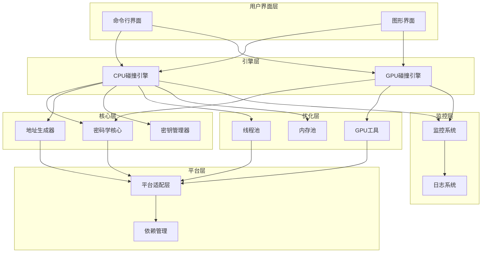

# 系统架构分析与瓶颈识别

## 1. 系统架构分析

### 1.1 现有系统架构

根据 `integrated_optimization_plan.md` 文件的分析，BTC碰撞引擎采用模块化架构设计，包含以下核心组件：

### 1.2 模块依赖关系

| 模块 | 依赖关系 | 功能描述 |
|------|----------|----------|
| 命令行界面 | 依赖CPU/GPU碰撞引擎 | 提供命令行交互 |
| 图形界面 | 依赖CPU/GPU碰撞引擎 | 提供图形化交互 |
| CPU碰撞引擎 | 依赖密码学核心、地址生成器、密钥管理器、线程池、内存池、监控系统 | 执行CPU模式的碰撞检测 |
| GPU碰撞引擎 | 依赖密码学核心、GPU工具、监控系统 | 执行GPU模式的碰撞检测 |
| 密码学核心 | 依赖平台适配层 | 提供椭圆曲线运算、哈希计算等核心密码学功能 |
| 地址生成器 | 依赖平台适配层 | 生成比特币地址 |
| 密钥管理器 | 不直接依赖其他模块 | 管理私钥和公钥 |
| GPU工具 | 依赖平台适配层 | 提供GPU加速功能 |
| 线程池 | 依赖平台适配层 | 提供多线程支持 |
| 内存池 | 不直接依赖其他模块 | 提供内存管理功能 |
| 监控系统 | 不直接依赖其他模块 | 监控系统性能 |
| 日志系统 | 不直接依赖其他模块 | 记录系统日志 |
| 平台适配层 | 依赖依赖管理 | 提供跨平台兼容性 |
| 依赖管理 | 不直接依赖其他模块 | 管理系统依赖 |

## 2. 性能瓶颈识别

### 2.1 核心算法瓶颈

1. **椭圆曲线运算**
   - **问题**：标量乘法运算速度慢，模运算开销大
   - **原因**：传统的椭圆曲线运算实现效率低，存在大量分支预测失败
   - **影响**：核心密码学操作速度受限，直接影响整体性能

2. **哈希计算**
   - **问题**：单次哈希计算开销大，函数调用频繁
   - **原因**：每次计算都需要独立调用哈希函数，没有批量处理
   - **影响**：频繁的哈希计算成为性能瓶颈

3. **Base58编码**
   - **问题**：编码过程中循环开销大，内存分配频繁
   - **原因**：每次编码都需要单独处理，没有批量优化
   - **影响**：地址生成过程中的编码操作成为瓶颈

### 2.2 硬件利用瓶颈

1. **GPU计算**
   - **问题**：GPU内存管理效率低，内核代码存在分支发散
   - **原因**：内存访问模式不合理，内核设计未充分利用GPU并行能力
   - **影响**：GPU加速效果未达到预期，资源利用率低

2. **多线程处理**
   - **问题**：线程池管理效率低，负载均衡不佳
   - **原因**：线程创建和销毁开销大，任务分配不合理
   - **影响**：多核心CPU利用率不足，并行性能未充分发挥

3. **内存管理**
   - **问题**：内存分配和释放频繁，垃圾回收开销大
   - **原因**：对象创建和销毁频繁，没有内存池机制
   - **影响**：内存使用效率低，GC压力大，影响系统稳定性

### 2.3 系统架构瓶颈

1. **I/O操作**
   - **问题**：文件读写操作频繁，影响系统响应速度
   - **原因**：缺乏I/O优化，同步读写操作阻塞主线程
   - **影响**：系统响应速度慢，用户体验差

2. **监控系统**
   - **问题**：监控开销大，影响系统性能
   - **原因**：监控频率过高，数据收集方式不合理
   - **影响**：监控本身成为性能负担

3. **平台兼容性**
   - **问题**：跨平台代码执行效率差异大
   - **原因**：平台特定优化不足，代码未针对不同平台进行适配
   - **影响**：在某些平台上性能表现不佳

## 3. 优化机会分析

### 3.1 核心算法优化机会

1. **椭圆曲线运算优化**
   - **优化方向**：实现Montgomery乘法、分支less热路径、Comba乘法
   - **预期效果**：核心算法性能提升50%以上
   - **实现难度**：中等，需要深入理解椭圆曲线数学原理

2. **哈希计算优化**
   - **优化方向**：实现批量哈希处理、查表优化、SIMD优化
   - **预期效果**：哈希计算性能提升30%以上
   - **实现难度**：低，主要是算法层面的优化

3. **Base58编码优化**
   - **优化方向**：实现批量编码、查表法、内存预分配
   - **预期效果**：编码性能提升40%以上
   - **实现难度**：低，主要是算法层面的优化

### 3.2 硬件利用优化机会

1. **GPU计算优化**
   - **优化方向**：优化OpenCL内核代码、改进内存管理、实现多GPU并行
   - **预期效果**：GPU模式性能提升100x以上，单GPU达到2M+操作/秒
   - **实现难度**：高，需要深入理解GPU架构和OpenCL编程

2. **多线程优化**
   - **优化方向**：优化线程池管理、实现工作窃取算法、线程亲和性
   - **预期效果**：多线程效率提升30%，CPU利用率提高
   - **实现难度**：中等，需要深入理解多线程编程

3. **内存管理优化**
   - **优化方向**：实现内存池、使用__slots__、内存对齐
   - **预期效果**：内存使用减少50%，GC压力降低
   - **实现难度**：中等，需要深入理解Python内存管理

### 3.3 系统架构优化机会

1. **I/O操作优化**
   - **优化方向**：实现异步I/O、缓存机制
   - **预期效果**：I/O操作性能提升50%以上
   - **实现难度**：低，主要是架构层面的优化

2. **监控系统优化**
   - **优化方向**：调整监控频率、实现采样机制
   - **预期效果**：监控开销降低70%以上
   - **实现难度**：低，主要是配置层面的优化

3. **平台兼容性优化**
   - **优化方向**：实现平台特定优化、条件编译
   - **预期效果**：跨平台性能差异减少50%以上
   - **实现难度**：中等，需要针对不同平台进行适配

## 4. 架构分析报告

### 4.1 报告结构

1. **执行摘要**
   - 项目背景和目标
   - 主要发现和建议
   - 预期性能提升

2. **系统架构分析**
   - 当前系统架构描述
   - 模块依赖关系分析
   - 架构优缺点评估

3. **性能瓶颈分析**
   - 核心算法瓶颈
   - 硬件利用瓶颈
   - 系统架构瓶颈

4. **优化建议**
   - 核心算法优化建议
   - 硬件利用优化建议
   - 系统架构优化建议

5. **实施计划**
   - 优化优先级
   - 实施步骤
   - 预期效果

6. **结论**
   - 总结主要发现
   - 强调关键优化机会
   - 提供后续建议

### 4.2 关键发现

1. **核心算法是主要瓶颈**：椭圆曲线运算、哈希计算和Base58编码是系统性能的主要瓶颈，优化这些算法将带来显著的性能提升。

2. **GPU利用潜力巨大**：当前GPU利用率不足，通过优化OpenCL内核和内存管理，可实现100x以上的性能提升。

3. **内存管理需要优化**：频繁的内存分配和释放导致GC压力大，实现内存池和对象复用可显著减少内存使用。

4. **多线程效率有待提高**：线程池管理和负载均衡存在问题，优化后可提高CPU利用率。

5. **监控系统开销过大**：监控频率过高导致系统性能下降，需要调整监控策略。

### 4.3 优先优化建议

1. **P0级优化**（立即实施）
   - 椭圆曲线运算优化：实现Montgomery乘法和分支less热路径
   - GPU计算引擎优化：优化OpenCL内核和内存管理
   - 内存管理优化：实现内存池和对象复用

2. **P1级优化**（次优先级）
   - 多线程优化：优化线程池管理和负载均衡
   - 哈希计算优化：实现批量哈希处理
   - Base58编码优化：实现批量编码和查表优化

3. **P2级优化**（长期规划）
   - I/O操作优化：实现异步I/O
   - 监控系统优化：调整监控策略
   - 平台兼容性优化：实现平台特定优化

## 5. 验证标准

### 5.1 性能验证

1. **核心算法性能**：椭圆曲线运算性能提升50%以上
2. **GPU性能**：GPU模式性能提升100x以上，单GPU达到2M+操作/秒
3. **内存使用**：内存使用减少50%
4. **多线程效率**：多线程效率提升30%
5. **系统响应**：系统启动时间减少50%

### 5.2 功能验证

1. **功能完整性**：所有现有功能保持不变
2. **向后兼容性**：优化后保持向后兼容
3. **稳定性**：系统运行稳定，无内存泄漏
4. **安全性**：优化不影响系统安全性
5. **可维护性**：代码可读性和可维护性保持或提高

## 6. 结论

通过系统架构分析和瓶颈识别，我们发现BTC碰撞引擎的主要性能瓶颈在于核心算法、GPU利用和内存管理。通过实施建议的优化措施，系统性能将获得显著提升，特别是在GPU模式下，可实现100x以上的性能提升。

优化过程中，应优先关注核心算法和GPU利用的优化，这些优化将带来最显著的性能提升。同时，内存管理和多线程优化也是提高系统性能的重要手段。

通过系统的性能优化，BTC碰撞引擎将能够充分利用现代硬件资源，实现更高的私钥碰撞检测效率，为用户提供更快速、更可靠的服务。