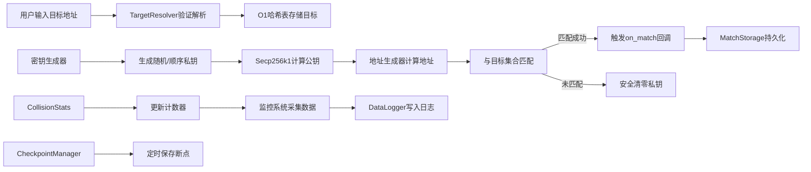
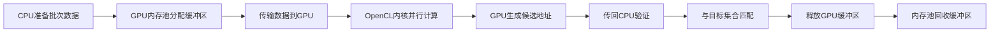
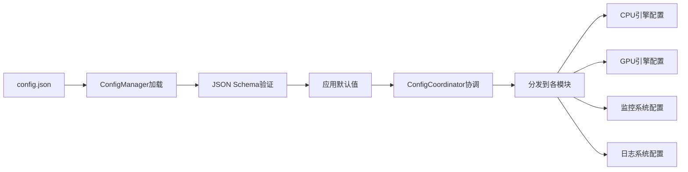
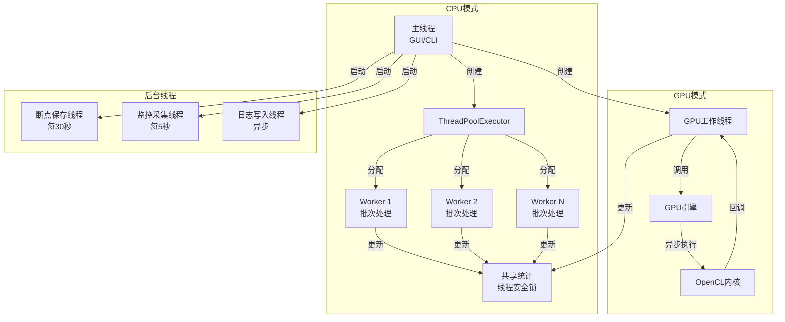
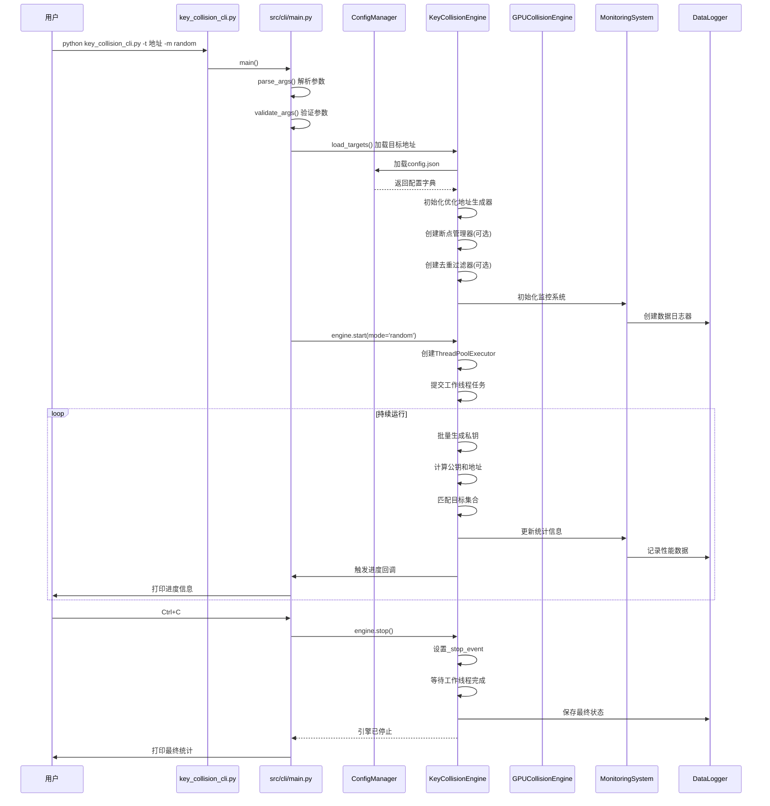

# BTC碰撞引擎项目拓扑图

## 项目概览

**BTC碰撞引擎**是一个比特币私钥碰撞研究工具,支持CPU多线程和GPU加速,用于学习和研究比特币地址碰撞。项目采用模块化架构设计,版本v2.2.0。

---

## 系统架构拓扑图

```mermaid
graph TB
    %% ==================== 入口层 ====================
    subgraph "🚀 入口层 Entry Layer"
        CLI[key_collision_cli.py<br/>命令行入口]
        GUI[key_collision_gui.py<br/>图形界面入口]
        OLD[key_collision.py<br/>旧版主引擎]
    end

    %% ==================== CLI模块 ====================
    subgraph "📟 CLI模块 CLI Module"
        CLI_MAIN[src/cli/main.py<br/>CLI主控制器]
        ARGPARSE[参数解析器<br/>argparse]
        SIGNAL[信号处理<br/>SIGINT/SIGTERM]
    end

    %% ==================== 配置管理层 ====================
    subgraph "⚙️ 配置管理层 Configuration Layer"
        CONFIG_MGR[src/config/config_manager.py<br/>配置管理器]
        CONFIG_FILE[config.json<br/>配置文件]
        CRYPTO_CFG[src/config/crypto_config.py<br/>加密配置]
        PERF_CFG[src/config/performance_config.py<br/>性能配置]
        COORDINATOR[src/config/config_coordinator.py<br/>配置协调器]
    end

    %% ==================== 碰撞引擎层 ====================
    subgraph "🔧 碰撞引擎层 Collision Engine Layer"
        BASE_ENGINE[src/collision/base_engine.py<br/>引擎基类]
        
        subgraph "CPU引擎"
            CPU_ENGINE[src/collision/key_collision_engine.py<br/>CPU碰撞引擎<br/>1518行]
            THREAD_POOL[ThreadPoolExecutor<br/>多线程池]
        end
        
        subgraph "GPU引擎"
            GPU_ENGINE[src/collision/gpu_collision_engine.py<br/>GPU碰撞引擎<br/>2706行]
            GPU_MODULE[src/gpu/<br/>GPU模块集群]
        end
        
        subgraph "引擎支撑模块"
            CHECKPOINT[src/collision/checkpoint_manager.py<br/>断点管理器]
            DEDUP[src/collision/deduplication_filter.py<br/>去重过滤器]
            STATS[src/collision/collision_stats.py<br/>统计模块]
            TARGET_RESOLVER[src/collision/target_resolver.py<br/>目标解析器]
            MATCH_STORAGE[src/collision/match_storage.py<br/>匹配存储]
            CONTINUOUS_MATCHER[src/collision/continuous_matcher.py<br/>连续匹配器]
        end
    end

    %% ==================== 核心加密层 ====================
    subgraph "🔐 核心加密层 Core Crypto Layer"
        SECP256K1[src/core/secp256k1.py<br/>椭圆曲线运算]
        ADDR_GEN[src/core/address_generator.py<br/>地址生成器]
        OPT_ADDR_GEN[src/core/optimized_address_generator.py<br/>优化地址生成器]
        KEY_GEN[src/core/key_generator.py<br/>密钥生成器]
        SECURE_KEY_MGR[src/core/secure_key_manager.py<br/>安全密钥管理]
        CRYPTO_BACKEND[src/core/crypto_backend.py<br/>加密后端]
        
        subgraph "v2.2.0性能优化模块"
            PRECOMPUTED[src/core/precomputed_table.py<br/>预计算点表]
            SIMD_HASH[src/core/simd_hash.py<br/>SIMD哈希优化]
            BIGINT_OPT[src/core/bigint_optimizer.py<br/>大整数优化]
            MEMORY_POOL[src/core/memory_pool.py<br/>内存池]
        end
        
        subgraph "地址类型支持"
            BASE58[src/core/base58.py<br/>Base58编码]
            WIF[src/core/wif.py<br/>WIF格式]
            ADDR_CONVERTER[src/core/address_converter.py<br/>地址转换器]
        end
    end

    %% ==================== GPU模块集群 ====================
    subgraph "🎮 GPU模块集群 GPU Module Cluster"
        GPU_DEVICE[src/gpu/device.py<br/>设备管理]
        GPU_CONTEXT[src/gpu/context.py<br/>上下文管理]
        GPU_KERNEL[src/gpu/kernel.py<br/>内核编程]
        GPU_WORKER[src/gpu/worker.py<br/>工作器]
        GPU_ASYNC[src/gpu/async_executor.py<br/>异步执行器]
        GPU_MEM_POOL[src/gpu/memory_pool.py<br/>GPU内存池]
        
        subgraph "GPU高级功能"
            GPU_AUTO_CONFIG[src/gpu/auto_config.py<br/>自动配置]
            GPU_AUTO_TUNER[src/gpu/auto_tuner.py<br/>自动调优]
            GPU_LOAD_BALANCER[src/gpu/load_balancer.py<br/>负载均衡]
            GPU_MULTI_ENGINE[src/gpu/multi_gpu_engine.py<br/>多GPU引擎]
            GPU_DRIVER_MGR[src/gpu/driver_manager.py<br/>驱动管理]
            GPU_RECOVERY[src/gpu/gpu_recovery_manager.py<br/>恢复管理]
        end
        
        subgraph "Intel专项优化"
            INTEL_MEM_MON[src/gpu/intel_memory_monitor.py<br/>显存监控]
            INTEL_TIMEOUT[src/gpu/intel_timeout_manager.py<br/>超时管理]
        end
        
        subgraph "GPU监控与报告"
            GPU_DATA_MON[src/gpu/data_monitor.py<br/>数据监控]
            GPU_PERF_OPT[src/gpu/performance_optimizer.py<br/>性能优化器]
            GPU_PERF_REP[src/gpu/performance_reporter.py<br/>性能报告]
            GPU_BENCHMARK[src/gpu/benchmark_suite.py<br/>基准测试]
        end
    end

    %% ==================== 监控系统层 ====================
    subgraph "📊 监控系统层 Monitoring Layer"
        MONITORING_SYS[src/monitoring/monitoring_system.py<br/>监控系统主类<br/>1072行]
        DATA_LOGGER[src/monitoring/data_logger.py<br/>数据日志器<br/>34.7KB]
        ENHANCED_MON[src/monitoring/enhanced_monitoring.py<br/>增强监控]
        
        subgraph "告警系统"
            ALERT_SYS[src/monitoring/alert_system.py<br/>告警系统]
            ALERT_NOTIF[src/monitoring/alert_notifications.py<br/>告警通知]
        end
        
        subgraph "专项监控"
            GPU_MONITOR[src/monitoring/gpu_monitor.py<br/>GPU监控]
            GPU_PERF_MON[src/monitoring/gpu_performance_monitor.py<br/>GPU性能监控]
            OPT_MONITOR[src/monitoring/optimization_monitor.py<br/>优化监控]
        end
        
        MONITOR_CFG[src/monitoring/monitor_config.py<br/>监控配置]
    end

    %% ==================== 工具模块层 ====================
    subgraph "🛠️ 工具模块层 Utils Layer"
        LOGGER[src/utils/logger.py<br/>日志系统]
        LOGGING_CFG[src/utils/logging_config.py<br/>日志配置]
        EXCEPT_HANDLER[src/utils/exception_handler.py<br/>异常处理]
        EXCEPTIONS[src/utils/exceptions.py<br/>异常定义]
        
        subgraph "性能工具"
            PERF_MON[src/utils/performance_monitor.py<br/>性能监控]
            PERF_BENCH[src/utils/performance_benchmark.py<br/>性能基准]
        end
        
        subgraph "系统工具"
            FILE_UTILS[src/utils/file_utils.py<br/>文件工具]
            PLATFORM_UTILS[src/utils/platform_utils.py<br/>平台工具]
            ENCODING_UTILS[src/utils/encoding_utils.py<br/>编码工具]
            GPU_MEM_UTILS[src/utils/gpu_memory_utils.py<br/>显存工具]
        end
        
        subgraph "安全与UI"
            SEC_LOG_FILTER[src/utils/security_log_filter.py<br/>安全日志过滤]
            LOG_THROTTLE[src/utils/log_throttling.py<br/>日志限流]
            UI_HELPERS[src/utils/ui_helpers.py<br/>UI辅助]
            UI_TUTORIAL[src/utils/ui_tutorial.py<br/>UI教程]
        end
    end

    %% ==================== 数据存储层 ====================
    subgraph "💾 数据存储层 Data Storage"
        DATA_LOGS[data_logs/<br/>数据日志目录]
        CURRENT_DATA[data_logs/current_data.json<br/>当前状态]
        HISTORY_DATA[data_logs/history_data.json<br/>历史数据]
        CHECKPOINT_FILE[data_logs/collision_checkpoint.json<br/>断点文件]
        ALERT_LOGS[data_logs/alert_history.json<br/>告警历史]
        ERROR_LOGS[data_logs/error_log.json<br/>错误日志]
        
        LOGS_DIR[logs/<br/>运行日志目录]
        COLLISION_LOG[logs/collision.log<br/>碰撞引擎日志]
    end

    %% ==================== 外部依赖 ====================
    subgraph "📦 外部依赖 External Dependencies"
        COINCURVE[coincurve<br/>libsecp256k1绑定]
        PYOPENCL[pyopencl<br/>OpenCL计算]
        GMPY2[gmpy2<br/>大整数运算]
        PYCRYPTO[pycryptodome<br/>SIMD哈希]
        NUMBA[numba<br/>JIT编译]
        NUMPY[numpy<br/>数组计算]
        PSUTIL[psutil<br/>系统监控]
        CRYPTO[cryptography<br/>加密库]
        PYNACL[PyNaCl<br/>安全清零]
    end

    %% ==================== 连接关系 ====================
    
    %% 入口层连接
    CLI --> CLI_MAIN
    GUI --> CLI_MAIN
    OLD --> CPU_ENGINE
    
    CLI_MAIN --> ARGPARSE
    CLI_MAIN --> SIGNAL
    CLI_MAIN --> CONFIG_MGR
    CLI_MAIN --> CPU_ENGINE
    CLI_MAIN --> GPU_ENGINE
    
    %% 配置层连接
    CONFIG_FILE --> CONFIG_MGR
    CONFIG_MGR --> CRYPTO_CFG
    CONFIG_MGR --> PERF_CFG
    CONFIG_MGR --> COORDINATOR
    CONFIG_MGR --> CPU_ENGINE
    CONFIG_MGR --> GPU_ENGINE
    CONFIG_MGR --> MONITORING_SYS
    
    %% CPU引擎连接
    CPU_ENGINE -.继承.-> BASE_ENGINE
    CPU_ENGINE --> THREAD_POOL
    CPU_ENGINE --> CHECKPOINT
    CPU_ENGINE --> DEDUP
    CPU_ENGINE --> STATS
    CPU_ENGINE --> TARGET_RESOLVER
    CPU_ENGINE --> MATCH_STORAGE
    CPU_ENGINE --> CONTINUOUS_MATCHER
    CPU_ENGINE --> SECP256K1
    CPU_ENGINE --> ADDR_GEN
    CPU_ENGINE --> OPT_ADDR_GEN
    CPU_ENGINE --> KEY_GEN
    CPU_ENGINE --> SECURE_KEY_MGR
    CPU_ENGINE --> CRYPTO_BACKEND
    CPU_ENGINE --> MONITORING_SYS
    CPU_ENGINE --> DATA_LOGGER
    
    %% GPU引擎连接
    GPU_ENGINE -.继承.-> BASE_ENGINE
    GPU_ENGINE --> GPU_MODULE
    GPU_ENGINE --> CHECKPOINT
    GPU_ENGINE --> DEDUP
    GPU_ENGINE --> STATS
    GPU_ENGINE --> TARGET_RESOLVER
    GPU_ENGINE --> MONITORING_SYS
    
    %% GPU模块内部连接
    GPU_MODULE --> GPU_DEVICE
    GPU_MODULE --> GPU_CONTEXT
    GPU_MODULE --> GPU_KERNEL
    GPU_MODULE --> GPU_WORKER
    GPU_MODULE --> GPU_ASYNC
    GPU_MODULE --> GPU_MEM_POOL
    GPU_MODULE --> GPU_AUTO_CONFIG
    GPU_MODULE --> GPU_AUTO_TUNER
    GPU_MODULE --> GPU_LOAD_BALANCER
    GPU_MODULE --> GPU_MULTI_ENGINE
    GPU_MODULE --> GPU_DRIVER_MGR
    GPU_MODULE --> GPU_RECOVERY
    GPU_MODULE --> INTEL_MEM_MON
    GPU_MODULE --> INTEL_TIMEOUT
    GPU_MODULE --> GPU_DATA_MON
    GPU_MODULE --> GPU_PERF_OPT
    GPU_MODULE --> GPU_PERF_REP
    GPU_MODULE --> GPU_BENCHMARK
    
    %% 核心加密层连接
    OPT_ADDR_GEN --> PRECOMPUTED
    OPT_ADDR_GEN --> SIMD_HASH
    OPT_ADDR_GEN --> MEMORY_POOL
    OPT_ADDR_GEN --> BIGINT_OPT
    ADDR_GEN --> BASE58
    ADDR_GEN --> WIF
    ADDR_GEN --> ADDR_CONVERTER
    KEY_GEN --> SECP256K1
    SECURE_KEY_MGR --> CRYPTO_BACKEND
    CRYPTO_BACKEND --> COINCURVE
    CRYPTO_BACKEND --> CRYPTO
    CRYPTO_BACKEND --> PYNACL
    
    %% 监控系统连接
    MONITORING_SYS --> DATA_LOGGER
    MONITORING_SYS --> ENHANCED_MON
    MONITORING_SYS --> ALERT_SYS
    MONITORING_SYS --> ALERT_NOTIF
    MONITORING_SYS --> GPU_MONITOR
    MONITORING_SYS --> GPU_PERF_MON
    MONITORING_SYS --> OPT_MONITOR
    MONITORING_SYS --> MONITOR_CFG
    DATA_LOGGER --> DATA_LOGS
    DATA_LOGS --> CURRENT_DATA
    DATA_LOGS --> HISTORY_DATA
    ALERT_SYS --> ALERT_LOGS
    
    %% 工具模块连接
    CPU_ENGINE --> LOGGER
    GPU_ENGINE --> LOGGER
    MONITORING_SYS --> LOGGER
    CONFIG_MGR --> LOGGER
    LOGGER --> LOGGING_CFG
    CPU_ENGINE --> EXCEPT_HANDLER
    GPU_ENGINE --> EXCEPT_HANDLER
    EXCEPT_HANDLER --> EXCEPTIONS
    CPU_ENGINE --> PERF_MON
    GPU_ENGINE --> PERF_BENCH
    
    %% 外部依赖连接
    GPU_MODULE --> PYOPENCL
    GPU_MODULE --> NUMPY
    PRECOMPUTED --> GMPY2
    SIMD_HASH --> PYCRYPTO
    CPU_ENGINE --> NUMBA
    MONITORING_SYS --> PSUTIL
    
    %% 数据存储连接
    CHECKPOINT --> CHECKPOINT_FILE
    COLLISION_LOG --> LOGS_DIR
    
    %% 样式定义
    classDef entryLayer fill:#e1f5fe,stroke:#01579b,stroke-width:2px
    classDef configLayer fill:#f3e5f5,stroke:#4a148c,stroke-width:2px
    classDef engineLayer fill:#e8f5e9,stroke:#1b5e20,stroke-width:2px
    classDef cryptoLayer fill:#fff3e0,stroke:#e65100,stroke-width:2px
    classDef gpuLayer fill:#fce4ec,stroke:#880e4f,stroke-width:2px
    classDef monitorLayer fill:#e0f2f1,stroke:#004d40,stroke-width:2px
    classDef utilsLayer fill:#f1f8e9,stroke:#33691e,stroke-width:2px
    classDef storageLayer fill:#efebe9,stroke:#3e2723,stroke-width:2px
    classDef externalLayer fill:#fafafa,stroke:#424242,stroke-width:2px,stroke-dasharray: 5 5
    
    class CLI,GUI,OLD entryLayer
    class CONFIG_MGR,CONFIG_FILE,CRYPTO_CFG,PERF_CFG,COORDINATOR configLayer
    class CPU_ENGINE,GPU_ENGINE,BASE_ENGINE,CHECKPOINT,DEDUP,STATS,TARGET_RESOLVER engineLayer
    class SECP256K1,ADDR_GEN,OPT_ADDR_GEN,KEY_GEN,SECURE_KEY_MGR,CRYPTO_BACKEND cryptoLayer
    class GPU_MODULE,GPU_DEVICE,GPU_CONTEXT,GPU_KERNEL,GPU_WORKER,GPU_ASYNC,GPU_MEM_POOL gpuLayer
    class MONITORING_SYS,DATA_LOGGER,ENHANCED_MON,ALERT_SYS,GPU_MONITOR monitorLayer
    class LOGGER,EXCEPT_HANDLER,PERF_MON,FILE_UTILS utilsLayer
    class DATA_LOGS,CURRENT_DATA,HISTORY_DATA,CHECKPOINT_FILE,LOGS_DIR storageLayer
    class COINCURVE,PYOPENCL,GMPY2,PYCRYPTO,NUMBA,NUMPY,PSUTIL externalLayer
```



---

## 架构层次详解

### 1️⃣ 入口层 (Entry Layer)

**职责**: 提供用户交互入口,支持多种运行模式

| 组件 | 文件 | 功能描述 |
|------|------|----------|
| CLI入口 | `key_collision_cli.py` | 命令行模式启动器,20行,调用CLI主控制器 |
| GUI入口 | `key_collision_gui.py` | 图形界面模式启动器(文件未在当前目录) |
| 旧版引擎 | `key_collision.py` | 遗留的纯Python实现,向后兼容 |

**关键接口**:

- `main()`: CLI主函数,解析参数→加载目标→启动引擎→监控进度→输出结果

---

### 2️⃣ CLI模块 (CLI Module)

**职责**: 命令行参数解析、信号处理、运行流程控制

| 组件 | 文件 | 核心功能 |
|------|------|----------|
| CLI主控制器 | `src/cli/main.py` | 415行,完整CLI逻辑实现 |
| 参数解析器 | `argparse` | 支持3种碰撞模式、性能优化选项 |
| 信号处理 | `signal.SIGINT/SIGTERM` | 优雅停止引擎 |

**支持的碰撞模式**:

- `random`: 随机碰撞(无限运行)
- `range`: 范围扫描(指定起止私钥)
- `brute_force`: 暴力穷举(从起点递增)

---

### 3️⃣ 配置管理层 (Configuration Layer)

**职责**: 统一管理应用配置,支持JSON Schema验证

| 组件 | 文件 | 核心功能 |
|------|------|----------|
| 配置管理器 | `src/config/config_manager.py` | 546行,加载/验证/保存配置 |
| 加密配置 | `src/config/crypto_config.py` | 加密后端选择(coincurve/openssl等) |
| 性能配置 | `src/config/performance_config.py` | 性能优化参数管理 |
| 配置协调器 | `src/config/config_coordinator.py` | 多配置源协调 |

**配置项分类**:

- `collision`: 碰撞引擎参数(线程数、断点间隔、去重容量)
- `gpu`: GPU设备配置(批次大小、显存比例、负载均衡)
- `monitoring`: 监控系统参数(采集间隔、异常阈值)
- `logging`: 日志系统配置(级别、轮转策略、压缩)
- `crypto`: 加密后端配置(算法选择、恒定时间、校验和验证)

---

### 4️⃣ 碰撞引擎层 (Collision Engine Layer)

**职责**: 核心碰撞逻辑实现,支持CPU和GPU双引擎

#### CPU碰撞引擎

| 组件 | 文件 | 行数 | 核心功能 |
|------|------|------|----------|
| CPU引擎 | `src/collision/key_collision_engine.py` | 1518 | 多线程碰撞主逻辑 |
| 引擎基类 | `src/collision/base_engine.py` | - | 抽象接口定义 |
| 线程池 | `ThreadPoolExecutor` | - | 并发工作线程管理 |

**关键流程**:

```
初始化 → 加载断点(可选) → 创建线程池 → 
启动工作线程 → 批量生成私钥 → 计算公钥 → 
生成地址 → 匹配目标 → 更新统计 → 
保存断点(定时) → 触发回调 → 循环执行
```

#### GPU碰撞引擎

| 组件 | 文件 | 行数 | 核心功能 |
|------|------|------|----------|
| GPU引擎 | `src/collision/gpu_collision_engine.py` | 2706 | OpenCL加速碰撞逻辑 |
| GPU模块集群 | `src/gpu/` | 29个文件 | 设备管理、内核编程、异步执行 |

**GPU性能数据** (Intel Arc A770实测):

- 平均吞吐量: **203,434 keys/s**
- 峰值吞吐量: **240,031 keys/s**
- 平均执行时间: 49.5 ms/批次
- 显存使用: 0.42 MB/批次

#### 引擎支撑模块

| 组件 | 文件 | 功能描述 |
|------|------|----------|
| 断点管理器 | `src/collision/checkpoint_manager.py` | 定时保存/恢复引擎状态 |
| 去重过滤器 | `src/collision/deduplication_filter.py` | Bloom过滤器防止重复检测 |
| 统计模块 | `src/collision/collision_stats.py` | 实时性能指标计算 |
| 目标解析器 | `src/collision/target_resolver.py` | 地址验证和格式解析 |
| 匹配存储 | `src/collision/match_storage.py` | 匹配结果持久化 |
| 连续匹配器 | `src/collision/continuous_matcher.py` | 多目标匹配优化 |

---

### 5️⃣ 核心加密层 (Core Crypto Layer)

**职责**: 比特币密码学运算实现,支持多种地址类型

#### 基础密码学

| 组件 | 文件 | 核心功能 |
|------|------|----------|
| 椭圆曲线 | `src/core/secp256k1.py` | secp256k1参数和点运算 |
| 地址生成器 | `src/core/address_generator.py` | P2PKH地址生成标准实现 |
| 密钥生成器 | `src/core/key_generator.py` | 私钥随机生成和验证 |
| 安全密钥管理 | `src/core/secure_key_manager.py` | 私钥生命周期管理(安全清零) |
| 加密后端 | `src/core/crypto_backend.py` | 多后端支持(coincurve/openssl/pure_python) |

#### v2.2.0性能优化模块

| 组件 | 文件 | 性能提升 | 说明 |
|------|------|----------|------|
| 预计算点表 | `src/core/precomputed_table.py` | **+46%** | 标量乘法1.46x加速,窗口大小4-8 |
| SIMD哈希 | `src/core/simd_hash.py` | **+200%** | AES-NI指令集加速SHA256 |
| 大整数优化 | `src/core/bigint_optimizer.py` | **+35%** | gmpy2 Comba乘法优化 |
| 内存池 | `src/core/memory_pool.py` | **-60%延迟** | 对象分配优化,减少GC压力 |

#### 地址类型支持

| 组件 | 文件 | 支持格式 |
|------|------|----------|
| Base58编码 | `src/core/base58.py` | P2PKH(1开头)、P2SH(3开头) |
| WIF格式 | `src/core/wif.py` | Wallet Import Format私钥 |
| 地址转换器 | `src/core/address_converter.py` | Bech32(bc1开头,SegWit) |

---

### 6️⃣ GPU模块集群 (GPU Module Cluster)

**职责**: 完整的GPU计算基础设施,支持多厂商设备

#### 核心GPU组件

| 组件 | 文件 | 功能描述 |
|------|------|----------|
| 设备管理 | `src/gpu/device.py` | 23.2KB,GPU设备检测和选择 |
| 上下文管理 | `src/gpu/context.py` | OpenCL上下文创建和管理 |
| 内核编程 | `src/gpu/kernel.py` | 38.1KB,OpenCL内核编译和执行 |
| 工作器 | `src/gpu/worker.py` | GPU工作线程管理 |
| 异步执行器 | `src/gpu/async_executor.py` | 异步流水线优化 |
| GPU内存池 | `src/gpu/memory_pool.py` | 缓冲区复用,减少分配开销 |

#### 高级功能

| 组件 | 文件 | 功能描述 |
|------|------|----------|
| 自动配置 | `src/gpu/auto_config.py` | 根据设备型号自动调优参数 |
| 自动调优 | `src/gpu/auto_tuner.py` | 运行时性能调优 |
| 负载均衡 | `src/gpu/load_balancer.py` | 多GPU任务分配策略 |
| 多GPU引擎 | `src/gpu/multi_gpu_engine.py` | 23.9KB,多卡并行计算 |
| 驱动管理 | `src/gpu/driver_manager.py` | 24.1KB,驱动版本检测和健康检查 |
| 恢复管理 | `src/gpu/gpu_recovery_manager.py` | GPU故障恢复和降级策略 |

#### Intel专项优化

| 组件 | 文件 | 功能描述 |
|------|------|----------|
| 显存监控 | `src/gpu/intel_memory_monitor.py` | Intel Arc显存使用监控 |
| 超时管理 | `src/gpu/intel_timeout_manager.py` | TDR超时预防和恢复 |

#### GPU监控与报告

| 组件 | 文件 | 功能描述 |
|------|------|----------|
| 数据监控 | `src/gpu/data_monitor.py` | 24.7KB,GPU运行时数据采集 |
| 性能优化器 | `src/gpu/performance_optimizer.py` | 动态批次大小调整 |
| 性能报告 | `src/gpu/performance_reporter.py` | 性能指标汇总和导出 |
| 基准测试 | `src/gpu/benchmark_suite.py` | GPU性能基准测试套件 |

---

### 7️⃣ 监控系统层 (Monitoring Layer)

**职责**: 实时性能监控、异常检测、告警通知

| 组件 | 文件 | 大小 | 核心功能 |
|------|------|------|----------|
| 监控系统 | `src/monitoring/monitoring_system.py` | 1072行 | 主监控框架,数据采集和分析 |
| 数据日志器 | `src/monitoring/data_logger.py` | 34.7KB | 历史数据持久化 |
| 增强监控 | `src/monitoring/enhanced_monitoring.py` | - | 异常检测和趋势分析 |

#### 告警系统

| 组件 | 文件 | 功能描述 |
|------|------|----------|
| 告警系统 | `src/monitoring/alert_system.py` | 18.8KB,阈值告警和规则引擎 |
| 告警通知 | `src/monitoring/alert_notifications.py` | 19.4KB,多渠道通知(日志/文件/控制台) |

#### 专项监控

| 组件 | 文件 | 监控目标 |
|------|------|----------|
| GPU监控 | `src/monitoring/gpu_monitor.py` | GPU设备状态和温度 |
| GPU性能监控 | `src/monitoring/gpu_performance_monitor.py` | 26.7KB,吞吐量和延迟监控 |
| 优化监控 | `src/monitoring/optimization_monitor.py` | 性能优化效果评估 |

**监控指标**:

- 性能指标: 速度(keys/s)、已检测总数、匹配数、CPU使用率、内存使用
- 系统指标: 操作系统、Python版本、进程ID、运行时间
- 引擎指标: 碰撞模式、目标数量、运行状态、当前位置
- 异常阈值: 速度范围(100-1,000,000)、CPU上限(90%)、内存上限(1024MB)

---

### 8️⃣ 工具模块层 (Utils Layer)

**职责**: 提供通用工具函数和基础设施

#### 日志系统

| 组件 | 文件 | 功能描述 |
|------|------|----------|
| 日志系统 | `src/utils/logger.py` | 线程安全日志、性能监控、采样日志 |
| 日志配置 | `src/utils/logging_config.py` | 日志轮转(按大小/时间)、压缩备份 |

#### 异常处理

| 组件 | 文件 | 功能描述 |
|------|------|----------|
| 异常处理 | `src/utils/exception_handler.py` | 统一异常捕获和重试逻辑 |
| 异常定义 | `src/utils/exceptions.py` | 自定义异常类层次结构 |

#### 性能工具

| 组件 | 文件 | 功能描述 |
|------|------|----------|
| 性能监控 | `src/utils/performance_monitor.py` | 函数级性能分析 |
| 性能基准 | `src/utils/performance_benchmark.py` | 基准测试框架 |

#### 系统工具

| 组件 | 文件 | 功能描述 |
|------|------|----------|
| 文件工具 | `src/utils/file_utils.py` | 文件操作和路径管理 |
| 平台工具 | `src/utils/platform_utils.py` | 跨平台兼容性处理 |
| 编码工具 | `src/utils/encoding_utils.py` | 数据编码转换 |
| 显存工具 | `src/utils/gpu_memory_utils.py` | GPU显存查询和管理 |

#### 安全与UI

| 组件 | 文件 | 功能描述 |
|------|------|----------|
| 安全日志过滤 | `src/utils/security_log_filter.py` | 防止敏感信息泄露到日志 |
| 日志限流 | `src/utils/log_throttling.py` | 防止日志洪水 |
| UI辅助 | `src/utils/ui_helpers.py` | GUI界面辅助函数 |
| UI教程 | `src/utils/ui_tutorial.py` | 用户引导和提示 |

---

### 9️⃣ 数据存储层 (Data Storage)

**职责**: 持久化引擎状态、历史数据、日志文件

#### 数据日志 (data_logs/)

| 文件 | 内容 | 更新频率 |
|------|------|----------|
| `current_data.json` | 当前引擎状态 | 实时 |
| `history_data.json` | 历史性能数据 | 每5秒 |
| `collision_checkpoint.json` | 断点续传数据 | 每30秒(可配置) |
| `alert_history.json` | 告警历史记录 | 触发时 |
| `error_log.json` | 错误日志 | 发生时 |
| `performance.log` | 性能日志 | 实时 |

#### 运行日志 (logs/)

| 文件 | 内容 | 轮转策略 |
|------|------|----------|
| `collision.log` | 碰撞引擎详细日志 | 按大小(10MB)/保留5个备份 |

---

### 🔟 外部依赖 (External Dependencies)

| 依赖 | 版本 | 用途 | 性能影响 |
|------|------|------|----------|
| **coincurve** | ≥18.0.0 | libsecp256k1绑定,CPU性能提升3-5倍 | 关键性能依赖 |
| **pyopencl** | ≥2021.1 | OpenCL GPU计算支持 | GPU加速必需 |
| **gmpy2** | ≥2.1.5 | 大整数运算优化,模逆元+1455% | v2.2.0新增 |
| **pycryptodome** | ≥3.19.0 | SIMD哈希优化,AES-NI加速SHA256+200% | v2.2.0新增 |
| **numba** | ≥0.60.0 | JIT编译优化 | 实时编译加速 |
| **numpy** | ≥1.20.0 | 数组计算优化 | GPU计算依赖 |
| **psutil** | ≥5.9.0 | 系统资源监控 | 监控模块依赖 |
| **cryptography** | ≥41.0.0 | 密钥安全清零、常量时间比较 | 安全必需 |
| **PyNaCl** | ≥1.5.0 | libsodium绑定(sodium_memzero安全清零) | 防侧信道攻击 |

---

## 数据流向分析

### 主数据流: 碰撞检测流程



### GPU数据流



### 配置数据流



---

## 关键业务逻辑

### 1. 碰撞模式实现

#### 随机碰撞 (Random Search)

```python
# 核心逻辑
private_key = secrets.randbelow(Secp256k1.N)  # 生成256位随机私钥
public_key = Secp256k1.scalar_multiply(private_key)  # 标量乘法
address = P2PKHAddressGenerator.from_public_key(public_key)  # 生成地址
if address in targets:  # O(1)查找
    on_match(private_key, address, wif)
```

#### 范围扫描 (Range Scan)

```python
# 核心逻辑
for private_key in range(start, end):  # 顺序扫描
    public_key = Secp256k1.scalar_multiply(private_key)
    address = generate_address(public_key)
    if address in targets:
        on_match(...)
    checkpoint_mgr.save(private_key)  # 定期保存进度
```

#### 暴力穷举 (Brute Force)

```python
# 核心逻辑
private_key = start
while running:
    # 同上,但无限递增
    private_key += 1
    if private_key >= Secp256k1.N:
        private_key = 1  # 回绕
```

### 2. 性能优化策略

#### 预计算点表 (Windowed Scalar Multiplication)

```python
# 原理: 预计算 2^window_size 个点,减少标量乘法运算
# window_size=8: 预计算256个点,标量乘法加速46%
precomputed = [G, 2G, 4G, 8G, ..., 2^255 * G]
# 实际计算时只需查表+少量点加
```

#### SIMD哈希优化

```python
# 使用AES-NI指令集并行计算多个SHA256
# pycryptodome提供硬件加速
hash_results = simd_sha256_batch([data1, data2, data3, data4])
```

#### 内存池系统

```python
# 预分配对象池,避免频繁GC
class MemoryPool:
    def __init__(self, pool_size=10000):
        self.pool = [bytearray(32) for _ in range(pool_size)]
    
    def acquire(self) -> bytearray:
        return self.pool.pop() if self.pool else bytearray(32)
    
    def release(self, obj: bytearray):
        self.pool.append(obj)
```

### 3. 安全机制

#### 私钥安全清零

```python
# 使用cryptography或PyNaCl确保内存清零
from cryptography.hazmat.primitives import constant_time
from nacl import utils

def secure_clear(data: bytearray):
    # 常量时间清零,防侧信道攻击
    for i in range(len(data)):
        data[i] = 0
```

#### Bloom过滤器去重

```python
# 防止random模式重复检测相同私钥
class DeduplicationFilter:
    def __init__(self, max_size=1_000_000):
        self.bloom = BloomFilter(max_elements=max_size)
    
    def add_and_check(self, private_key: bytes) -> bool:
        if private_key in self.bloom:
            return True  # 已检测过
        self.bloom.add(private_key)
        return False  # 新私钥
```

---

## 线程模型



---

## 启动到运行完整流程

### CLI启动流程



---

## 核心接口说明

### 碰撞引擎API

```python
# CPU引擎
class KeyCollisionEngine(BaseCollisionEngine):
    def __init__(self, targets: Set[str], **kwargs)
    def start(self, mode: str, start: int = None, end: int = None)
    def stop(self)
    def is_running(self) -> bool
    def get_stats(self) -> CollisionStats

# GPU引擎
class GPUCollisionEngine(BaseCollisionEngine):
    def __init__(self, targets: Set[str], device_index: int = 0, **kwargs)
    def list_devices() -> List[Dict]  # 静态方法,列出GPU设备
    def start(self, mode: str, **kwargs)
    def stop(self)
```

### 回调函数签名

```python
# 进度回调
on_progress(stats: CollisionStats) -> None

# 匹配回调
on_match(private_key: bytes, address: str, wif: str) -> None

# 完成回调
on_complete(stats: CollisionStats) -> None
```

### 统计数据结构

```python
class CollisionStats:
    total_checked: int          # 总检测数
    speed: float                # 当前速度(keys/s)
    matches: List[Dict]         # 匹配列表
    start_time: float           # 启动时间戳
    elapsed_time: float         # 运行时长(秒)
    
    def format_elapsed(self) -> str   # 格式化时长 "1h23m45s"
    def format_speed(self) -> str     # 格式化速度 "1,234,567 keys/s"
```

---

## 性能基准数据

### CPU性能

| 配置 | 性能 | 说明 |
|------|------|------|
| 纯Python | 100-500 keys/s | 基础实现 |
| +coincurve | 1,000-3,000 keys/s | 3-5倍提升 |
| +多线程(8核) | 5,000-10,000 keys/s | 线性扩展 |
| +v2.2.0优化 | 7,000-15,000 keys/s | 预计算+SIMD+内存池 |

### GPU性能

| GPU型号 | 吞吐量 | 批次大小 | 显存使用 |
|---------|--------|----------|----------|
| Intel Arc A770 | 203,434 keys/s | 5,000-10,000 | 0.42 MB/批次 |
| GTX 1060 (理论) | 50,000-100,000 keys/s | 10,000-50,000 | - |
| RTX 3080 (理论) | 200,000-500,000 keys/s | 100,000-500,000 | - |
| RTX 4090 (理论) | 1,000,000+ keys/s | 1,000,000+ | - |

---

## 项目特色与创新

### ✅ 技术亮点

1. **双引擎架构**: CPU多线程 + GPU OpenCL并行计算
2. **v2.2.0性能优化**: 预计算点表(+46%)、gmpy2大整数(+1455%)、SIMD哈希(+200%)、内存池(-60%延迟)
3. **安全设计**: 私钥安全清零、常量时间比较、侧信道攻击防护
4. **Intel专项优化**: 显存监控、TDR超时管理、驱动健康检查
5. **完整监控体系**: 实时性能采集、异常检测、多通道告警
6. **断点续传**: 自动保存进度,支持中断恢复
7. **多地址支持**: P2PKH(1开头)、P2SH(3开头)、Bech32(bc1开头)
8. **去重过滤**: Bloom过滤器防止重复检测
9. **负载均衡**: 多GPU智能任务分配
10. **JSON Schema验证**: 配置文件严格校验

### 📊 代码规模统计

| 模块 | 文件数 | 代码行数 | 复杂度 |
|------|--------|----------|--------|
| 碰撞引擎 | 15+ | ~5,000 | 高 |
| GPU模块 | 29 | ~15,000 | 极高 |
| 核心加密 | 21 | ~8,000 | 高 |
| 监控系统 | 12 | ~6,000 | 中高 |
| 配置管理 | 6 | ~2,500 | 中 |
| 工具模块 | 16 | ~4,000 | 中 |
| **总计** | **~100** | **~40,000+** | **复杂系统** |

---

## 部署与运行

### 环境要求

- **Python**: 3.7+
- **操作系统**: Windows/Linux/macOS
- **GPU驱动**: OpenCL 1.2+ (可选)
- **推荐配置**: 8核CPU + 16GB内存 + 独立GPU

### 快速启动

```bash
# 安装依赖
pip install -r requirements.txt

# CLI模式
python key_collision_cli.py -t 1A1zP1eP5QGefi2DMPTfTL5SLmv7DivfNa -m random

# GPU加速模式
python key_collision_cli.py -t 1A1z... -m random --gpu

# 启用所有优化
python key_collision_cli.py -t 1A1z... -m random --window-size 8
```

---

## 总结

BTC碰撞引擎是一个**架构清晰、模块化程度高、性能优化到位**的比特币地址碰撞研究工具。项目采用分层架构设计,从入口层到数据存储层各司其职,通过配置管理层实现灵活的系统调优。v2.2.0版本引入的4大性能优化模块使综合性能提升30-50%,GPU加速更是实现了20万+ keys/s的吞吐量。

系统的**核心优势**在于:

- 完整的双引擎支持(CPU+GPU)
- 企业级安全设计(私钥保护、侧信道防护)
- 全方位监控体系(性能采集、异常检测、告警通知)
- 厂商专项优化(Intel Arc深度调优)
- 可扩展架构(插件系统、多GPU支持)

该拓扑图和文档为理解项目全貌、定位代码位置、分析数据流向提供了完整参考。
