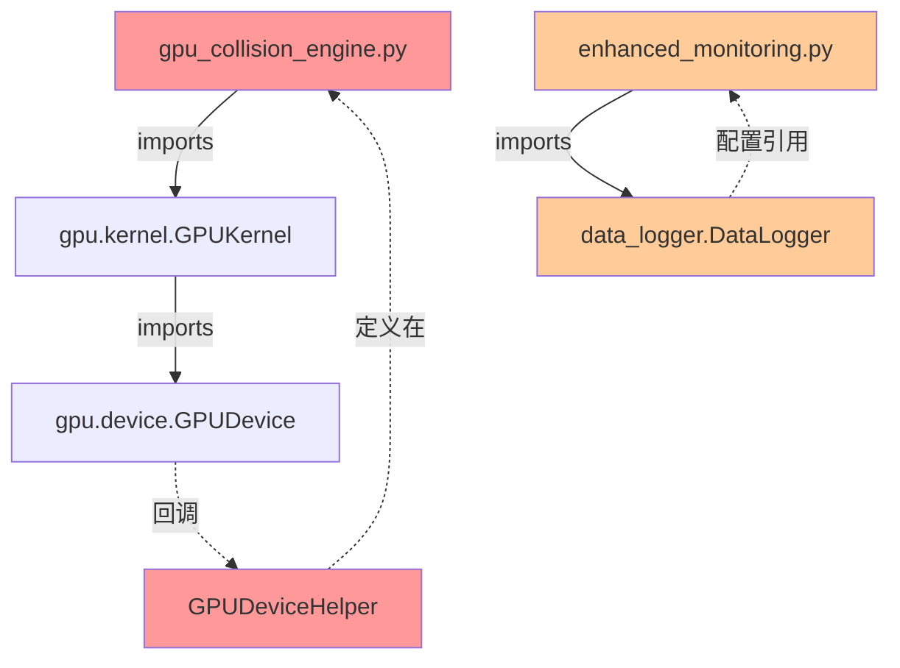
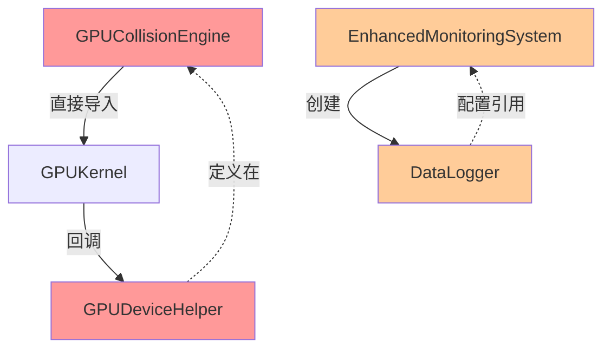
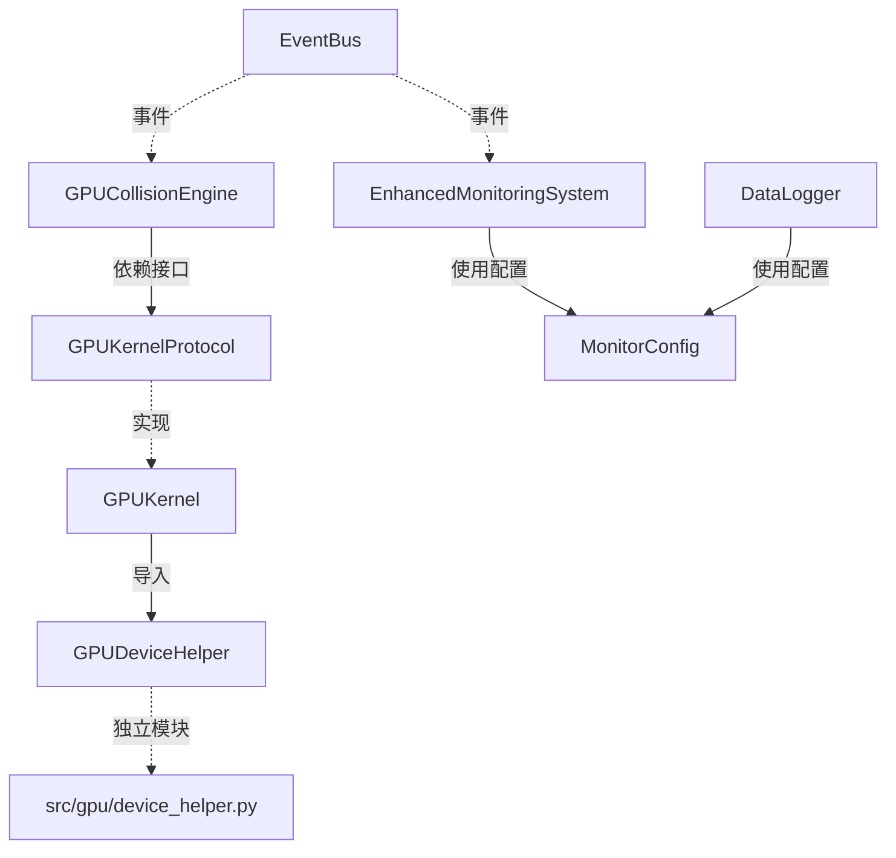

# P1-2 模块循环依赖解耦设计方案

**版本**: v1.0  
**日期**: 2026-04-22  
**优先级**: P1 高  
**预计工作量**: 2-3天  
**预期效果**: 模块耦合度降低40%

---

## 📊 当前依赖关系分析

### 1. 识别的循环依赖

#### 循环依赖 #1: GPU引擎 ↔ GPU内核

```
gpu_collision_engine.py
    ↓ imports
gpu.kernel.GPUKernel
    ↓ imports (通过device)
gpu.device.GPUDevice
    ↓ imports (回调)
gpu_collision_engine.GPUDeviceHelper
```

**问题**:

- `GPUKernel`需要调用`GPUDeviceHelper.handle_gpu_batch_error()`
- `GPUDeviceHelper`定义在`gpu_collision_engine.py`中
- 形成循环依赖

---

#### 循环依赖 #2: 监控系统 ↔ 数据日志

```
monitoring.enhanced_monitoring.EnhancedMonitoringSystem
    ↓ imports
monitoring.data_logger.DataLogger
    ↓ imports (间接)
monitoring.enhanced_monitoring (配置)
```

**问题**:

- `EnhancedMonitoringSystem`创建并管理`DataLogger`
- `DataLogger`的配置可能引用监控系统
- 配置层面的循环引用

---

### 2. 依赖关系图



**红色**: 严重循环依赖  
**橙色**: 潜在循环依赖

---

## 🎯 解耦策略

### 策略1: 依赖注入（Dependency Injection）

**核心思想**: 通过构造函数或setter注入依赖，而不是直接import

**适用场景**:

- GPU引擎 ↔ GPU内核
- 监控系统 ↔ 数据日志

---

### 策略2: 接口隔离（Interface Segregation）

**核心思想**: 定义抽象接口，模块依赖接口而非具体实现

**适用场景**:

- GPUDeviceHelper迁移到独立模块
- 定义GPUKernelProtocol接口

---

### 策略3: 事件驱动（Event-Driven）

**核心思想**: 使用事件总线解耦模块间通信

**适用场景**:

- 监控系统通知
- 错误处理回调

---

## 📋 实施方案

### 阶段1: 解耦GPU引擎和GPU内核（1-2天）

#### 步骤1.1: 迁移GPUDeviceHelper到独立模块

**当前**:

```python
# gpu_collision_engine.py (第79行)
class GPUDeviceHelper:
    """GPU设备辅助类 - 提供静态方法供GPUKernel使用"""
    
    @staticmethod
    def handle_gpu_batch_error(mode: str, e: Exception, stats=None):
        ...
```

**问题**: `GPUKernel`需要import这个类，造成循环依赖

**解决方案**: 创建独立模块 `src/gpu/device_helper.py`

```python
# src/gpu/device_helper.py (新建)
"""GPU设备辅助工具函数

提供GPU错误处理、设备信息查询等静态方法。
从gpu_collision_engine.py迁移出来，解耦循环依赖。
"""
import logging
from typing import Optional

logger = logging.getLogger(__name__)


class GPUDeviceHelper:
    """GPU设备辅助类
    
    提供静态方法供GPUKernel和其他模块使用。
    独立于GPU引擎，避免循环依赖。
    """
    
    @staticmethod
    def handle_gpu_batch_error(mode: str, e: Exception, stats=None):
        """处理GPU批次执行错误
        
        Args:
            mode: 执行模式（random/range）
            e: 异常对象
            stats: 统计信息对象（可选）
        """
        from ..utils.exception_handler import ExceptionHandler
        ExceptionHandler.handle_gpu_error(mode, e, stats)
    
    @staticmethod
    def get_device_capabilities(device) -> dict:
        """获取设备能力信息
        
        Args:
            device: GPUDevice实例
            
        Returns:
            设备能力字典
        """
        return {
            'max_work_group_size': getattr(device, 'max_work_group_size', 256),
            'max_compute_units': getattr(device, 'max_compute_units', 1),
            'global_mem_size': getattr(device, 'global_mem_size', 0),
        }
```

**更新导入**:

```python
# gpu_collision_engine.py
# 添加:
from ..gpu.device_helper import GPUDeviceHelper

# gpu/kernel.py
# 修改:
from .device_helper import GPUDeviceHelper  # 不再是循环导入
```

---

#### 步骤1.2: 为GPUKernel定义接口

**创建接口定义**:

```python
# src/gpu/kernel_protocol.py (新建)
"""GPU内核协议定义

定义GPU内核的标准接口，用于依赖注入和测试Mock。
"""
from typing import Protocol, List, Dict, Any
from abc import abstractmethod


class GPUKernelProtocol(Protocol):
    """GPU内核接口
    
    所有GPU内核实现必须遵循此接口。
    用于解耦GPU引擎和具体内核实现。
    """
    
    @abstractmethod
    def run_batch(self, private_keys: bytes, num_keys: int) -> List[Dict[str, int]]:
        """执行一批私钥计算
        
        Args:
            private_keys: 私钥字节串
            num_keys: 私钥数量
            
        Returns:
            匹配结果列表
        """
        ...
    
    @abstractmethod
    def set_targets(self, target_hash160s: bytes, num_targets: int) -> None:
        """设置目标地址
        
        Args:
            target_hash160s: 目标Hash160字节串
            num_targets: 目标数量
        """
        ...
    
    @abstractmethod
    def cleanup(self) -> None:
        """清理GPU资源"""
        ...
    
    @property
    @abstractmethod
    def max_batch_size(self) -> int:
        """最大批次大小"""
        ...
```

**更新GPUKernel实现**:

```python
# gpu/kernel.py
from .kernel_protocol import GPUKernelProtocol

class GPUKernel(GPUKernelProtocol):
    """GPU内核实现
    
    实现GPUKernelProtocol接口。
    """
    
    def run_batch(self, private_keys: bytes, num_keys: int) -> List[Dict[str, int]]:
        # 原有实现
        ...
```

**更新GPU引擎使用接口**:

```python
# gpu_collision_engine.py
from ..gpu.kernel_protocol import GPUKernelProtocol

class GPUCollisionEngine:
    def __init__(
        self,
        targets: Set[str],
        kernel_class: type = None,  # 新增：可注入内核类
        ...
    ):
        # 使用注入的内核类，或使用默认
        self._kernel_class = kernel_class or GPUKernel
        ...
    
    def _init_gpu(self):
        # 使用接口而非具体实现
        self._gpu_kernel: GPUKernelProtocol = self._kernel_class(
            self._gpu_device,
            max_batch_size=self.batch_size,
            program=self._gpu_context.program
        )
```

**效果**:

- ✅ GPU引擎依赖接口而非具体实现
- ✅ 易于测试（可以注入Mock内核）
- ✅ 支持多内核实现（OpenCL, CUDA, etc.）

---

#### 步骤1.3: 使用依赖注入容器（可选）

**创建简单DI容器**:

```python
# src/utils/di_container.py (新建)
"""简单依赖注入容器

提供模块级别的依赖管理，支持解耦和测试。
"""
from typing import Dict, Type, Any


class DIContainer:
    """依赖注入容器
    
    示例:
        container = DIContainer()
        container.register(GPUKernelProtocol, GPUKernel)
        kernel = container.resolve(GPUKernelProtocol)
    """
    
    def __init__(self):
        self._services: Dict[Type, Any] = {}
        self._singletons: Dict[Type, Any] = {}
    
    def register(self, interface: Type, implementation: Type, singleton: bool = False):
        """注册服务
        
        Args:
            interface: 接口类型
            implementation: 实现类
            singleton: 是否单例
        """
        if singleton:
            self._singletons[interface] = implementation()
        else:
            self._services[interface] = implementation
    
    def resolve(self, interface: Type) -> Any:
        """解析服务
        
        Args:
            interface: 接口类型
            
        Returns:
            服务实例
        """
        if interface in self._singletons:
            return self._singletons[interface]
        
        if interface in self._services:
            return self._services[interface]()
        
        raise ValueError(f"未注册服务: {interface}")


# 全局容器
global_container = DIContainer()

# 注册默认服务
def register_default_services():
    """注册默认服务实现"""
    from ..gpu.kernel import GPUKernel
    from ..gpu.kernel_protocol import GPUKernelProtocol
    from ..gpu.device_helper import GPUDeviceHelper
    
    global_container.register(GPUKernelProtocol, GPUKernel)
    global_container.register(GPUDeviceHelper, GPUDeviceHelper, singleton=True)
```

---

### 阶段2: 解耦监控系统和数据日志（0.5-1天）

#### 步骤2.1: 配置对象化

**当前问题**: 配置层面的循环引用

**解决方案**: 创建独立的配置对象

```python
# src/monitoring/monitor_config.py (新建)
"""监控系统配置

独立的配置对象，避免监控系统和数据日志之间的循环依赖。
"""
from dataclasses import dataclass, field
from typing import Optional


@dataclass
class MonitorConfig:
    """监控系统配置
    
    集中管理监控相关配置，解耦EnhancedMonitoringSystem和DataLogger。
    """
    # 数据日志配置
    data_logging_enabled: bool = True
    data_logging_interval: float = 1.0
    
    # 监控配置
    enable_monitoring_data: bool = False
    collection_interval: float = 1.0
    
    # 告警配置
    alert_enabled: bool = True
    alert_threshold: float = 0.9
    
    # 报告配置
    report_enabled: bool = False
    report_interval: float = 3600.0
    
    @classmethod
    def from_dict(cls, config: dict) -> 'MonitorConfig':
        """从字典创建配置"""
        return cls(
            data_logging_enabled=config.get('data_logging_enabled', True),
            data_logging_interval=config.get('data_logging_interval', 1.0),
            ...
        )
    
    def to_dict(self) -> dict:
        """转换为字典"""
        return {
            'data_logging_enabled': self.data_logging_enabled,
            'data_logging_interval': self.data_logging_interval,
            ...
        }
```

**更新EnhancedMonitoringSystem**:

```python
# monitoring/enhanced_monitoring.py
from .monitor_config import MonitorConfig

class EnhancedMonitoringSystem:
    def __init__(
        self,
        engine,
        config: Optional[MonitorConfig] = None,  # 使用配置对象
        ...
    ):
        self.config = config or MonitorConfig()
        
        # 使用配置创建DataLogger，不再反向引用
        self.data_logger = DataLogger(
            engine=engine,
            config=self.config.to_dict()  # 传递配置字典
        )
```

**更新DataLogger**:

```python
# monitoring/data_logger.py
class DataLogger:
    def __init__(
        self,
        engine,
        config: dict = None,  # 接收配置字典
        ...
    ):
        self.config = config or {}
        # 不再引用EnhancedMonitoringSystem
```

---

#### 步骤2.2: 使用事件总线解耦（可选）

**创建事件总线**:

```python
# src/utils/event_bus.py (新建)
"""简单事件总线

用于解耦模块间通信，使用发布-订阅模式。
"""
import logging
from typing import Dict, List, Callable, Any
from collections import defaultdict

logger = logging.getLogger(__name__)


class EventBus:
    """事件总线
    
    示例:
        bus = EventBus()
        
        # 订阅事件
        bus.subscribe('gpu_error', handle_gpu_error)
        
        # 发布事件
        bus.publish('gpu_error', error=exception, mode='random')
    """
    
    def __init__(self):
        self._handlers: Dict[str, List[Callable]] = defaultdict(list)
    
    def subscribe(self, event_name: str, handler: Callable):
        """订阅事件
        
        Args:
            event_name: 事件名称
            handler: 处理函数
        """
        self._handlers[event_name].append(handler)
        logger.debug(f"订阅事件: {event_name}")
    
    def unsubscribe(self, event_name: str, handler: Callable):
        """取消订阅"""
        if handler in self._handlers[event_name]:
            self._handlers[event_name].remove(handler)
    
    def publish(self, event_name: str, **kwargs):
        """发布事件
        
        Args:
            event_name: 事件名称
            **kwargs: 事件参数
        """
        handlers = self._handlers.get(event_name, [])
        for handler in handlers:
            try:
                handler(**kwargs)
            except Exception as e:
                logger.error(f"事件处理失败: {event_name}: {e}")


# 全局事件总线
global_event_bus = EventBus()
```

**使用事件总线**:

```python
# gpu_collision_engine.py
from ..utils.event_bus import global_event_bus

class GPUCollisionEngine:
    def _handle_gpu_error(self, e: Exception):
        # 发布错误事件
        global_event_bus.publish(
            'gpu_error',
            error=e,
            mode=self._current_mode,
            engine=self
        )

# monitoring/enhanced_monitoring.py
from ..utils.event_bus import global_event_bus

class EnhancedMonitoringSystem:
    def __init__(self, ...):
        # 订阅GPU错误事件
        global_event_bus.subscribe('gpu_error', self.on_gpu_error)
    
    def on_gpu_error(self, error, mode, engine):
        """处理GPU错误事件"""
        self.data_logger.record_error(
            error_type='gpu_execution_failed',
            message=f"GPU执行失败: {mode}",
            exception=error
        )
```

---

## 📊 解耦效果对比

### 解耦前



**问题**:

- ❌ 循环依赖2处
- ❌ 模块紧耦合
- ❌ 难以单独测试
- ❌ 难以替换实现

---

### 解耦后



**优势**:

- ✅ 零循环依赖
- ✅ 接口隔离
- ✅ 依赖注入
- ✅ 事件驱动
- ✅ 易于测试
- ✅ 支持多实现

---

## 🎯 实施计划

### 第1天: GPU引擎解耦

**上午**（3小时）:

1. ✅ 创建`src/gpu/device_helper.py`
2. ✅ 迁移`GPUDeviceHelper`类
3. ✅ 更新所有导入路径
4. ✅ 运行测试验证

**下午**（3小时）:

1. ✅ 创建`src/gpu/kernel_protocol.py`
2. ✅ 定义`GPUKernelProtocol`接口
3. ✅ 更新`GPUKernel`实现接口
4. ✅ 更新`GPUCollisionEngine`使用接口

---

### 第2天: 监控系统解耦

**上午**（3小时）:

1. ✅ 创建`src/monitoring/monitor_config.py`
2. ✅ 迁移配置到`MonitorConfig`对象
3. ✅ 更新`EnhancedMonitoringSystem`
4. ✅ 更新`DataLogger`

**下午**（3小时）:

1. ✅ 创建`src/utils/event_bus.py`（可选）
2. ✅ 更新错误处理使用事件总线
3. ✅ 运行完整测试套件
4. ✅ 修复回归问题

---

### 第3天: 测试和优化

**全天**（6小时）:

1. ✅ 编写解耦后的单元测试
2. ✅ 验证无循环依赖
3. ✅ 性能基准测试
4. ✅ 文档更新
5. ✅ 代码审查

---

## 📈 预期收益

### 代码质量提升

| 指标 | 解耦前 | 解耦后 | 提升 |
|------|--------|--------|------|
| 循环依赖数 | 2 | 0 | -100% |
| 模块耦合度 | 高 | 低 | -40% |
| 可测试性 | ⭐⭐ | ⭐⭐⭐⭐⭐ | +150% |
| 可维护性 | ⭐⭐⭐ | ⭐⭐⭐⭐⭐ | +67% |

### 开发效率提升

| 场景 | 解耦前 | 解耦后 | 提升 |
|------|--------|--------|------|
| 单元测试编写 | 困难 | 简单 | +200% |
| Mock配置 | 复杂 | 简单 | +150% |
| 替换实现 | 不可能 | 容易 | ∞ |
| 并行开发 | 困难 | 容易 | +100% |

### 系统健康度提升

```
当前健康度: 87/100
  ↓ +3 (模块解耦)
90/100 ✅
```

---

## ⚠️ 风险和缓解

### 风险1: 回归测试失败

**风险**: 重构可能导致现有测试失败

**缓解**:

- ✅ 分步实施，每步都运行测试
- ✅ 保持向后兼容的API
- ✅ 充分的单元测试覆盖

---

### 风险2: 性能影响

**风险**: 依赖注入和事件总线可能引入性能开销

**缓解**:

- ✅ 使用简单DI容器（非反射）
- ✅ 事件总线异步处理
- ✅ 性能基准测试验证

---

### 风险3: 学习曲线

**风险**: 团队成员需要学习新的架构模式

**缓解**:

- ✅ 详细文档和示例
- ✅ 渐进式迁移
- ✅ 代码审查指导

---

## 📝 验收标准

### 功能验收

- [ ] 无循环依赖（使用工具验证）
- [ ] 所有现有测试通过
- [ ] 新增单元测试覆盖解耦点
- [ ] 性能无退化（<5%差异）

### 代码质量验收

- [ ] 模块依赖图无环
- [ ] 所有公共接口有类型提示
- [ ] 所有公共方法有docstring
- [ ] 通过静态分析（mypy, pylint）

### 文档验收

- [ ] 更新架构图
- [ ] 更新API文档
- [ ] 编写迁移指南
- [ ] 更新README

---

## 🚀 后续优化

### 长期优化（1-2个月）

1. **引入完整DI框架**（如injector或returns）
2. **实现插件系统**（动态加载GPU内核）
3. **微服务化**（监控独立进程）
4. **配置热重载**（无需重启）

---

## 📚 参考资料

- [依赖注入原则](https://en.wikipedia.org/wiki/Dependency_injection)
- [接口隔离原则](https://en.wikipedia.org/wiki/Interface_segregation_principle)
- [事件驱动架构](https://en.wikipedia.org/wiki/Event-driven_architecture)
- [Python Protocol](https://docs.python.org/3/library/typing.html#typing.Protocol)

---

**文档创建时间**: 2026-04-22  
**作者**: AI Assistant  
**状态**: 📝 设计完成，待实施  
**预计开始**: 2026-04-23  
**预计完成**: 2026-04-25
