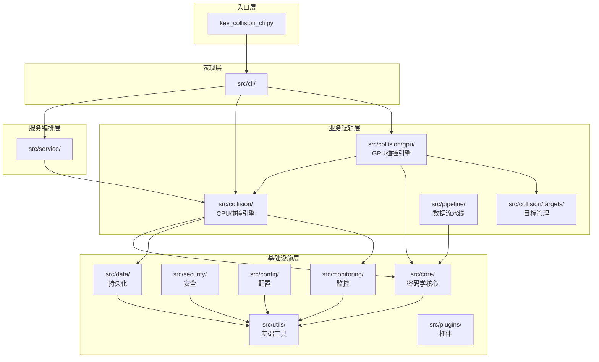
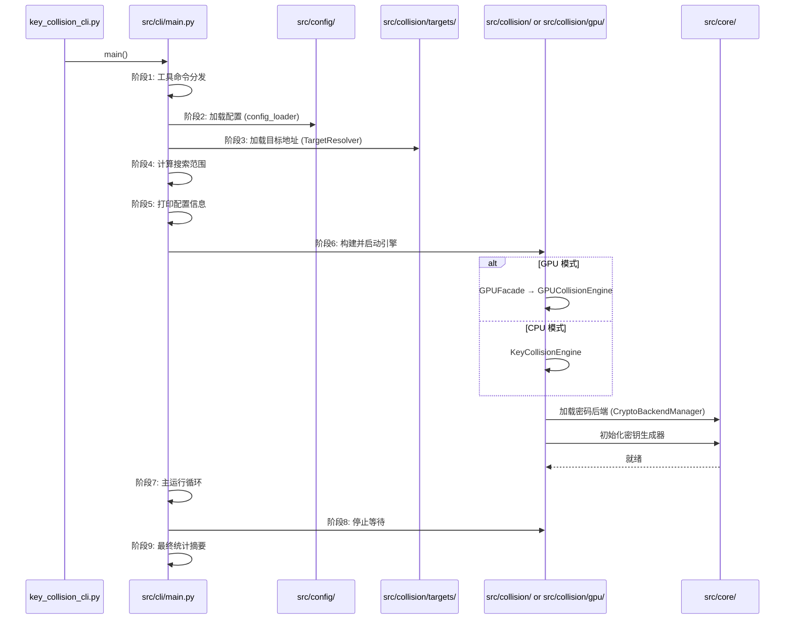
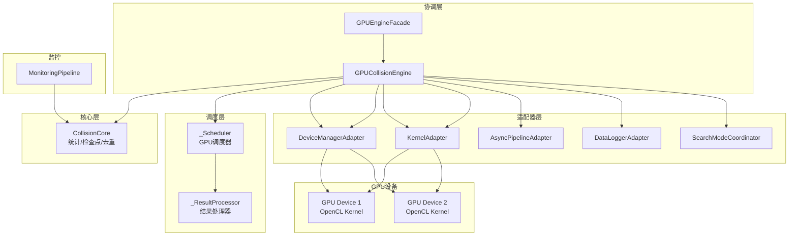
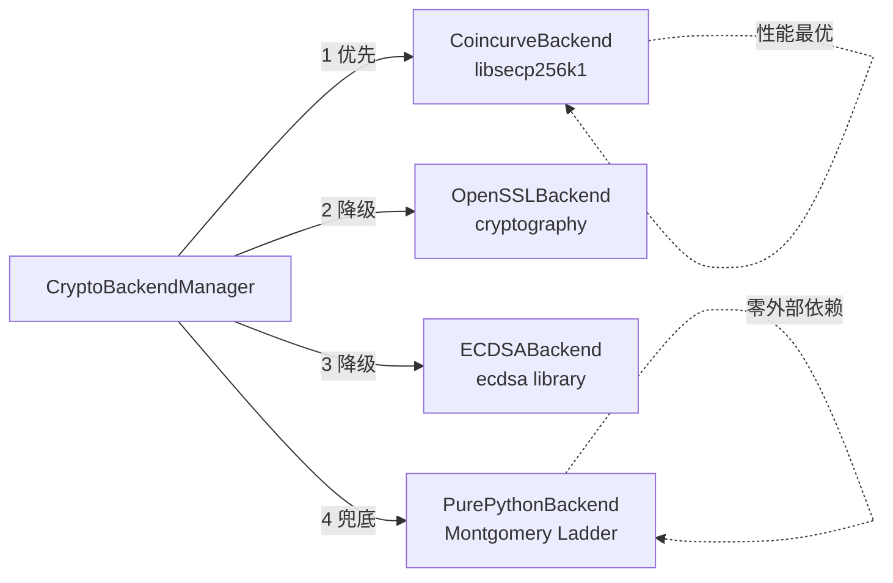
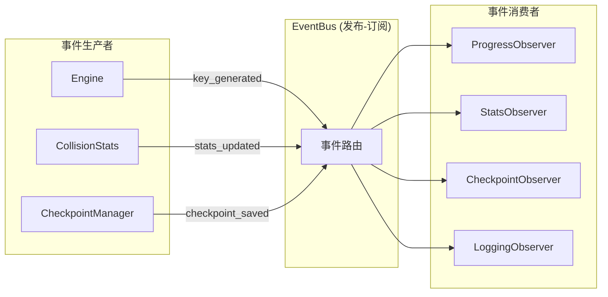

# BTC Collision Engine — 模块架构文档

**版本**: v5.0.0  
**最后更新**: 2026-05-24  
**项目定位**: 面向学习和研究的比特币私钥碰撞检测系统，支持 CPU / GPU 加速

---

## 目录

1. [整体架构概览](#1-整体架构概览)

2. [模块分层与依赖关系](#2-模块分层与依赖关系)

3. [应用启动流](#3-应用启动流)

4. [核心数据流](#4-核心数据流)

5. [模块详解](#5-模块详解)

   - [5.1 src/utils/ — 基础工具层](#51-srcutils--基础工具层)

   - [5.2 src/core/ — 密码学核心层](#52-srccore--密码学核心层)

   - [5.3 src/config/ — 配置管理层](#53-srcconfig--配置管理层)

   - [5.4 src/security/ — 安全层](#54-srcsecurity--安全层)

   - [5.5 src/collision/ — 碰撞引擎层](#55-srccollision--碰撞引擎层)

   - [5.6 src/collision/gpu/ — GPU 引擎层](#56-srccollisiongpu--gpu-引擎层)

   - [5.7 src/collision/targets/ — 目标地址管理层](#57-srccollisiontargets--目标地址管理层)

   - [5.8 src/pipeline/ — 流水线层](#58-srcpipeline--流水线层)

   - [5.9 src/data/ — 数据持久化层](#59-srcdata--数据持久化层)

   - [5.10 src/monitoring/ — 监控层](#510-srcmonitoring--监控层)

   - [5.11 src/cli/ — 命令行界面层](#511-srccli--命令行界面层)

   - [5.12 src/service/ — 服务编排层](#512-srcservice--服务编排层)

   - [5.13 src/plugins/ — 插件系统](#513-srcplugins--插件系统)

6. [模块间依赖矩阵](#6-模块间依赖矩阵)

---

## 1. 整体架构概览

项目采用**分层架构**设计，13 个核心源码模块按职责分为 5 个逻辑层：



**设计原则**:

- **基础设施层**无业务依赖，仅依赖标准库和第三方库

- **业务逻辑层**依赖基础设施层，彼此间松耦合

- **服务编排层**组装业务模块，提供统一服务接口

- **表现层**仅处理用户交互，依赖服务层和业务层

---

## 2. 模块分层与依赖关系

### 2.1 分层依赖图

```mermaid
graph LR
    subgraph L0["第0层: 外部依赖"]
        ext["Python stdlib<br/>numpy, gmpy2<br/>OpenCL, secp256k1"]
    end

    subgraph L1["第1层: 基础设施"]
        utils["src/utils/<br/>日志/异常/编解码"]
        core["src/core/<br/>椭圆曲线/哈希/地址"]
        config["src/config/"]
        security["src/security/"]
        data["src/data/"]
        monitoring["src/monitoring/"]
    end

    subgraph L2["第2层: 领域服务"]
        collision["src/collision/<br/>碰撞引擎(CPU)"]
        gpu["src/collision/gpu/<br/>GPU引擎"]
        targets["src/collision/targets/"]
        pipeline["src/pipeline/"]
    end

    subgraph L3["第3层: 应用编排"]
        service["src/service/"]
        plugins["src/plugins/"]
    end

    subgraph L4["第4层: 用户界面"]
        cli["src/cli/"]
    end

    ext --> L1
    L1 --> L2
    L2 --> L3
    L3 --> L4

```



### 2.2 关键依赖方向

```
src/cli/
  ├── src/service/         (编排)
  ├── src/collision/       (CPU 引擎)
  ├── src/collision/gpu/   (GPU 引擎)
  ├── src/collision/targets/ (目标解析)
  ├── src/config/          (配置加载)
  ├── src/data/            (结果输出)
  └── src/monitoring/      (进度展示)

src/collision/
  ├── src/core/            (密码运算)
  ├── src/collision/targets/ (地址匹配)
  ├── src/config/          (引擎配置)
  ├── src/data/            (结果持久化)
  ├── src/monitoring/      (统计采集)
  └── src/utils/           (日志/异常)

src/core/
  └── src/utils/           (仅日志/异常，无其他 src 依赖)

```

---

## 3. 应用启动流

从 CLI 入口到碰撞引擎运行的完整流程：



**9 个启动阶段**:

| 阶段 | 函数 | 职责 |
|------|------|------|
| 1 | `_dispatch_utility_commands()` | 处理 `--version`、`--help` 等工具命令 |
| 2 | `validate_args()` | CLI 参数验证 |
| 3 | `config_loader` + `TargetResolver` | 加载运行时配置 + 目标地址列表 |
| 4 | `_compute_range()` | 计算私钥搜索范围 |
| 5 | `_print_config_info()` | 终端显示配置摘要 |
| 6 | `_setup_and_start_engine()` | 构建引擎实例（GPU/CPU）并启动 |
| 7 | `_run_collision_loop()` | 主循环：轮询进度、处理中断 |
| 8 | 停止等待 | 超时轮询，等待引擎优雅停止 |
| 9 | `_print_final_summary()` | 输出最终统计信息 |

---

## 4. 核心数据流

### 4.1 单次碰撞检测数据流

```mermaid
flowchart LR
    subgraph 密钥生成
        A[CSPRNG<br/>随机数源] --> B[SecureKeyGenerator<br/>安全密钥生成]
    end

    subgraph 公钥派生
        B --> C[secp256k1<br/>椭圆曲线点乘]
        C --> D[(预计算点表<br/>加速)]
    end

    subgraph 地址生成
        D --> E[SHA-256]
        E --> F[RIPEMD-160]
        F --> G[Base58Check<br/>编码]
    end

    subgraph 碰撞匹配
        G --> H[TargetAddressTable<br/>O(1)查找]
        H --> I{匹配?}
        I -->|是| J[结果持久化]
        I -->|否| K[去重过滤]
        K --> L[继续下一轮]
    end

```

### 4.2 CPU 引擎内部数据流

```mermaid
flowchart TB
    subgraph 主线程
        M[Engine Controller]
    end

    subgraph 工作线程池
        W1[Worker 1<br/>KeyGen→PubKey→Address→Match]
        W2[Worker 2<br/>KeyGen→PubKey→Address→Match]
        W3[Worker N<br/>KeyGen→PubKey→Address→Match]
    end

    subgraph 共享组件
        TT[(TargetAddressTable<br/>共享只读)]
        DF[DeduplicationFilter<br/>线程安全)]
        EB[EventBus<br/>异步事件)]
        CK[CheckpointManager<br/>断点续传)]
    end

    M -->|启动| W1
    M -->|启动| W2
    M -->|启动| W3
    W1 & W2 & W3 -->|查找| TT
    W1 & W2 & W3 -->|去重| DF
    W1 & W2 & W3 -->|事件| EB
    M -->|保存/恢复| CK

```

### 4.3 GPU 引擎数据流 (重构后 v6.0)



---

## 5. 模块详解

### 5.1 `src/utils/` — 基础工具层

| 属性 | 值 |
|------|------|
| **路径** | `src/utils/` |
| **层级** | L1 (基础设施层) |
| **依赖** | 仅 Python 标准库 + 第三方库，不依赖其他 `src/` 模块 |
| **被依赖方** | 所有其他模块 |

**核心职责**: 为所有模块提供日志、异常处理、编解码、文件操作、序列化等基础功能。

**导出清单**:

- **日志**: `init_logging`, `get_configured_logger`, `LoggingConfig`

- **异常类型** (11 种): `AddressGenerationError`, `CheckpointError`, `CollisionEngineError`, `CollisionError`, `ConfigError`, `CryptoBackendError`, `DeduplicationError`, `GPUError`, `KeyGenerationError`, `TargetResolutionError`, `ValidationError`

- **异常处理**: `ExceptionHandler` — 统一异常处理与恢复策略

- **编解码**: `bech32_encode`, `bech32_decode`, `decode_segwit_address`, `EncodingUtils`

- **文件操作**: `atomic_json_read/write`, `atomic_write`, `ensure_directory`, `get_file_size_safe`, `safe_file_delete`

- **敏感数据模式**: 定义 P2PKH/P2SH/WIF/私钥 HEX 等格式的正则匹配模式，用于日志脱敏

**关键子模块**:

| 文件 | 职责 |
|------|------|
| `logging_config.py` | 统一日志配置 (LoggingConfig) |
| `exception_handler.py` | 异常分类、恢复策略、降级逻辑 |
| `encoding_utils.py` | 编解码工具集 (EncodingUtils) |
| `fast_json.py` | 高性能 JSON 序列化 (ujson/orjson) |
| `bech32_codec.py` | Bech32/Bech32m 地址编解码 |
| `timeout.py` | `invoke_with_timeout()` 操作超时控制 |
| `error_recovery.py` | 多层错误恢复与自动降级 |
| `security_log_filter.py` | 敏感数据日志脱敏过滤器 |
| `platform_check.py` | 跨平台兼容性检查 (Windows/Linux/macOS) |

---

### 5.2 `src/core/` — 密码学核心层

| 属性 | 值 |
|------|------|
| **路径** | `src/core/` (21 文件) |
| **层级** | L1 (基础设施层) |
| **依赖** | `src/utils/` |
| **被依赖方** | `src/collision/`, `src/collision/gpu/`, `src/pipeline/` |

**核心职责**: 椭圆曲线运算 (secp256k1)、密钥生成、地址生成、Base58/Hash160 编码等底层密码学功能。是碰撞引擎的运算基础。

#### 关键类

| 类名 | 文件 | 职责 |
|------|------|------|
| **`CryptoBackendManager`** | `crypto_backend.py` | 多后端管理器（单例模式），自动选择最佳后端: coincurve > OpenSSL > ecdsa > PurePython |
| `PurePythonBackend` | `crypto_backend.py` | 纯 Python 实现，使用 Montgomery Ladder，恒定时间 |
| `OpenSSLBackend` | `crypto_backend.py` | cryptography 库后端，恒定时间 |
| `CoincurveBackend` | `crypto_backend.py` | libsecp256k1 绑定，完全恒定时间，推荐 |
| `ECDSABackend` | `crypto_backend.py` | ecdsa 库后端 |
| **`SecureKeyGenerator`** | `key_generator.py` | CSPRNG 批量密钥生成，熵池健康检查，速率限制 |
| `P2PKHAddressGenerator` | `address_generator.py` | 标准 P2PKH 地址生成：私钥→公钥→Hash160→Base58Check |
| `OptimizedP2PKHAddressGenerator` | `optimized_address_generator.py` | 优化版：预计算表 + SIMD + 内存池 |
| **`MultiFormatAddressGenerator`** | `multi_format_generator.py` | 多格式生成：P2PKH / P2SH / Bech32 / Taproot |
| `SecureKeyManager` | `secure_key_manager.py` | 私钥全生命周期管理 (安全清除) |
| `TargetAddressTable` | `target_address_table.py` | O(1) 哈希查找表 |
| `SimdHash` | `simd_hash.py` | SIMD 加速 (AES-NI) 的 SHA-256 |
| `BigIntOptimizer` | `bigint_optimizer.py` | gmpy2 大整数加速 |

#### 密码后端优先级



---

### 5.3 `src/config/` — 配置管理层

| 属性 | 值 |
|------|------|
| **路径** | `src/config/` |
| **层级** | L1 |
| **依赖** | `src/utils/` |
| **被依赖方** | `src/cli/`, `src/collision/`, `src/service/` |

**核心职责**: JSON 配置文件加载、环境变量覆盖、运行时配置合并、配置验证。

**关键子模块**:

- `config_loader.py` — 多源配置加载（文件 + 环境变量 + 命令行）

- `config_validator.py` — 配置项类型/范围验证

- `config_resolver.py` — 配置优先级合并

---

### 5.4 `src/security/` — 安全层

| 属性 | 值 |
|------|------|
| **路径** | `src/security/` |
| **层级** | L1 |
| **依赖** | `src/utils/` |
| **被依赖方** | `src/core/`（密钥管理） |

**核心职责**: 内存安全擦除、私钥保护、安全日志脱敏。

**关键功能**:

- 私钥内存安全清零 (`sodium_memzero` / 手动覆写)

- 敏感数据标记与跟踪

- 安全审计日志

---

### 5.5 `src/collision/` — 碰撞引擎层

| 属性 | 值 |
|------|------|
| **路径** | `src/collision/` (19 文件 + 2 子目录) |
| **层级** | L2 (领域服务层) |
| **依赖** | `src/core/`, `src/utils/`, `src/config/`, `src/data/`, `src/monitoring/`, `src/collision/targets/` |
| **被依赖方** | `src/cli/`, `src/service/`, `src/collision/gpu/` |

**核心职责**: 碰撞检测的核心业务逻辑，包含 CPU 多线程引擎和所有支撑组件。

#### 核心类

| 类名 | 文件 | 职责 |
|------|------|------|
| **`KeyCollisionEngine`** | `key_collision_engine.py` | CPU 主引擎 (93KB)，多线程碰撞检测 |
| `BaseEngine` | `base_engine.py` | 引擎抽象基类 |
| `EventBus` | `event_bus.py` | 发布-订阅事件总线 |
| `CollisionStats` | `collision_stats.py` | 统计指标采集 |
| `CheckpointManager` | `checkpoint_manager.py` | 断点续传管理 |
| `DeduplicationFilter` | `deduplication_filter.py` | 去重过滤器 |
| `BloomDeduplicationFilter` | `bloom_deduplication_filter.py` | Bloom 过滤器去重 |
| `ContinuousMatcher` | `continuous_matcher.py` | 连续匹配器 |
| `MatchStorage` | `match_storage.py` | 匹配结果持久化 |
| `EngineFactory` | `factory.py` | 引擎工厂方法 |
| `DependencyContainer` | `dependency_container.py` | 依赖注入容器 |
| `MultiprocessEngine` | `multiprocess_engine.py` | 多进程引擎（多核 CPU） |

#### 事件驱动架构



---

### 5.6 `src/collision/gpu/` — GPU 引擎层

| 属性 | 值 |
|------|------|
| **路径** | `src/collision/gpu/` (14 文件) |
| **层级** | L2 |
| **依赖** | `src/collision/`, `src/core/`, `src/collision/targets/` |
| **被依赖方** | `src/cli/`, `src/service/` |

**核心职责**: GPU 加速的碰撞检测，v6.0 重构后采用多层解耦架构（替代原 1466 行单体文件）。

#### 五层架构

| 层级 | 文件 | 职责 |
|------|------|------|
| **协议层** | `protocols.py` | 5 个核心接口定义: `IGPUDeviceManager`, `IKernelExecutor`, `IAsyncExecutionPipeline`, `IMonitoringPipeline`, `ICollisionCore` + 共享数据类型 |
| **协调层** | `engine.py` | `GPUCollisionEngine` (46KB)，引擎总控 |
| **外观层** | `facade.py` | `GPUEngineFacade`，统一入口封装 |
| **核心层** | `core.py` | `CollisionCore`，统计/检查点/去重 |
| **适配器层** | `device_manager_adapter.py` 等 | 5 个适配器，解耦设备/内核/管道/日志/搜索模式 |
| **监控层** | `monitoring.py` | `MonitoringPipeline`，GPU 性能监控 |
| **策略层** | `vendor_strategy.py` | NVIDIA/AMD/Intel 厂商优化策略工厂 |
| **调度层** | `_scheduler.py`, `_result_processor.py` | GPU 任务调度与结果处理 |

#### GPU 引擎重构对比

```
重构前 (v5.x):
  ├── key_collision_engine.py (1466 行单体)
  └── 紧耦合 OpenCL 调用

重构后 (v6.0):
  ├── protocols.py          → 接口契约
  ├── engine.py             → 协调编排
  ├── facade.py             → 统一入口
  ├── core.py               → 核心逻辑
  ├── *_adapter.py × 5      → 适配解耦
  ├── monitoring.py         → 独立监控
  ├── vendor_strategy.py    → 厂商优化
  └── _scheduler.py         → 任务调度

```

---

### 5.7 `src/collision/targets/` — 目标地址管理层

| 属性 | 值 |
|------|------|
| **路径** | `src/collision/targets/` (8 文件) |
| **层级** | L2 |
| **依赖** | `src/core/`, `src/utils/` |
| **被依赖方** | `src/collision/`, `src/collision/gpu/`, `src/cli/` |

**核心职责**: 目标地址的加载、解析、格式检测和高效匹配。

| 类名 | 职责 |
|------|------|
| **`FormatAwareTargetManager`** | 格式感知目标管理器，支持 P2PKH/P2SH/Bech32/Taproot 多种地址格式 |
| `TargetResolver` | 从文件/命令行/API 多源加载目标地址 |
| `AddressMatcher` | 高效地址匹配（字典查找） |
| `FormatDetector` | 自动检测地址格式类型 |

#### 支持地址格式

| 格式 | 前缀 | 示例 |
|------|------|------|
| P2PKH | `1...` | `1A1zP1eP5QGefi2DMPTfTL5SLmv7DivfNa` |
| P2SH | `3...` | `3J98t1WpEZ73CNmQviecrnyiWrnqRhWNLy` |
| Bech32 | `bc1q...` | `bc1qar0srrr7xfkvy5l643lydnw9re59gtzzwf5mdq` |
| Taproot | `bc1p...` | `bc1p5d7rjq7g6rdk2yhzks9smlaqtedr4dekq08ge8qt` |

---

### 5.8 `src/pipeline/` — 流水线层

| 属性 | 值 |
|------|------|
| **路径** | `src/pipeline/` |
| **层级** | L2 |
| **依赖** | `src/core/`, `src/collision/targets/` |
| **被依赖方** | `src/service/` |

**核心职责**: 将密钥生成→地址计算→碰撞匹配串联为可配置的数据流水线。

```
┌──────────┐    ┌──────────┐    ┌──────────┐    ┌──────────┐
│ KeyGen   │───→│ PubKey   │───→│ Address  │───→│ Match    │
│ Stage    │    │ Stage    │    │ Stage    │    │ Stage    │
└──────────┘    └──────────┘    └──────────┘    └──────────┘
     ↓               ↓               ↓               ↓
 DataLogger      DataLogger      DataLogger      DataLogger

```

---

### 5.9 `src/data/` — 数据持久化层

| 属性 | 值 |
|------|------|
| **路径** | `src/data/` |
| **层级** | L1 |
| **依赖** | `src/utils/` |
| **被依赖方** | `src/collision/`, `src/collision/gpu/` |

**核心职责**: 碰撞结果、统计数据的存储与导出。

| 组件 | 职责 |
|------|------|
| `DataLogger` | 结构化数据日志记录 |
| `ResultExporter` | 结果导出 (JSON/CSV) |
| `StatsStorage` | 统计指标持久化 |

---

### 5.10 `src/monitoring/` — 监控层

| 属性 | 值 |
|------|------|
| **路径** | `src/monitoring/` |
| **层级** | L1 |
| **依赖** | `src/utils/` |
| **被依赖方** | `src/collision/`, `src/cli/` |

**核心职责**: 运行时的性能指标采集、系统资源监控、告警。

| 指标 | 说明 |
|------|------|
| `keys_per_second` | 每秒生成的密钥数 |
| `addresses_checked` | 已检查地址总数 |
| `matches_found` | 碰撞匹配数 |
| `cpu_usage` / `gpu_usage` | CPU/GPU 使用率 |
| `memory_usage` | 内存使用量 |
| `uptime` | 引擎运行时长 |

---

### 5.11 `src/cli/` — 命令行界面层

| 属性 | 值 |
|------|------|
| **路径** | `src/cli/` |
| **层级** | L4 (最顶层) |
| **依赖** | `src/service/`, `src/collision/`, `src/collision/gpu/`, `src/config/`, `src/monitoring/` |
| **被依赖方** | 无（终端入口） |

**核心职责**: 命令行参数解析、交互式终端界面、进度展示。

| 文件 | 职责 |
|------|------|
| `main.py` | 主入口 `main()`，9 阶段启动流程 |
| `args.py` | argparse 参数定义与验证 |
| `display.py` | 终端格式化输出、进度条 |
| `interactive.py` | 交互式模式 |

---

### 5.12 `src/service/` — 服务编排层

| 属性 | 值 |
|------|------|
| **路径** | `src/service/` |
| **层级** | L3 |
| **依赖** | `src/collision/`, `src/collision/gpu/`, `src/config/` |
| **被依赖方** | `src/cli/` |

**核心职责**: 应用服务编排，封装引擎启动/停止/监控的生命周期管理，提供统一服务接口。

---

### 5.13 `src/plugins/` — 插件系统

| 属性 | 值 |
|------|------|
| **路径** | `src/plugins/` |
| **层级** | L3 |
| **依赖** | `src/utils/` |
| **被依赖方** | `src/service/` |

**核心职责**: 可扩展插件架构，支持自定义观察者、数据导出器、验证器等热插拔。

---

## 6. 模块间依赖矩阵

| 模块 ↓ / → | utils | core | config | security | data | monitoring | targets | collision | gpu | pipeline | service | plugins | cli |
|------------|:-----:|:----:|:------:|:--------:|:----:|:----------:|:-------:|:---------:|:---:|:--------:|:-------:|:-------:|:---:|
| **utils** | - | | | | | | | | | | | | |
| **core** | ✓ | - | | | | | | | | | | | |
| **config** | ✓ | | - | | | | | | | | | | |
| **security** | ✓ | | | - | | | | | | | | | |
| **data** | ✓ | | | | - | | | | | | | | |
| **monitoring** | ✓ | | | | | - | | | | | | | |
| **targets** | ✓ | ✓ | | | | | - | | | | | | |
| **collision** | ✓ | ✓ | ✓ | | ✓ | ✓ | ✓ | - | | | | | |
| **gpu** | ✓ | ✓ | | | | | ✓ | ✓ | - | | | | |
| **pipeline** | ✓ | ✓ | | | | | ✓ | | | - | | | |
| **service** | ✓ | | ✓ | | | | | ✓ | ✓ | ✓ | - | | |
| **plugins** | ✓ | | | | | | | | | | | - | |
| **cli** | ✓ | | ✓ | | ✓ | ✓ | ✓ | ✓ | ✓ | | ✓ | | - |

> ✓ = 有依赖关系，空 = 无直接依赖

---

## 附录

### A. 目录树快照

```
f:/Qoder/btc-collision-engine/
├── key_collision_cli.py          # CLI 主入口 (推荐)
├── key_collision.py              # 旧版兼容入口
├── config.json                   # 运行时配置
├── src/                          # 核心源码 (13 模块)
│   ├── utils/                    # L1: 基础工具
│   ├── core/                     # L1: 密码学核心
│   ├── config/                   # L1: 配置管理
│   ├── security/                 # L1: 安全
│   ├── data/                     # L1: 持久化
│   ├── monitoring/               # L1: 监控
│   ├── collision/                # L2: CPU 碰撞引擎
│   │   ├── gpu/                  # L2: GPU 引擎 (重构)
│   │   └── targets/              # L2: 目标地址管理
│   ├── pipeline/                 # L2: 数据流水线
│   ├── service/                  # L3: 服务编排
│   └── plugins/                  # L3: 插件系统
├── tests/                        # 测试套件 (157 文件)
├── benchmarks/                   # 性能基准
├── docs/                         # 文档中心
├── scripts/                      # 辅助脚本（分类子目录）（分类子目录）
├── examples/                     # 使用示例
└── deploy/                       # 部署配置 (Docker/K8s)

```

### B. 技术栈

| 技术 | 用途 |
|------|------|
| Python 3.9+ | 主要开发语言 |
| secp256k1 (libsecp256k1) | 椭圆曲线运算（推荐后端） |
| OpenCL / PyOpenCL | GPU 异构加速 |
| SHA-256 / RIPEMD-160 | 哈希运算 |
| gmpy2 | 大整数加速 |
| numpy | 数值计算 |
| AES-NI / SIMD | CPU 端哈希加速 |
| pytest | 测试框架 |

### C. 相关文档

- `README.md` — 项目概述与快速开始

- `CHANGELOG.md` — 版本变更日志

- `PROJECT_ANALYSIS.md` — 项目全面分析

- `RELEASE_NOTES_*.md` — 各版本发布说明

- `docs/` — 详细文档目录 (305 篇)
