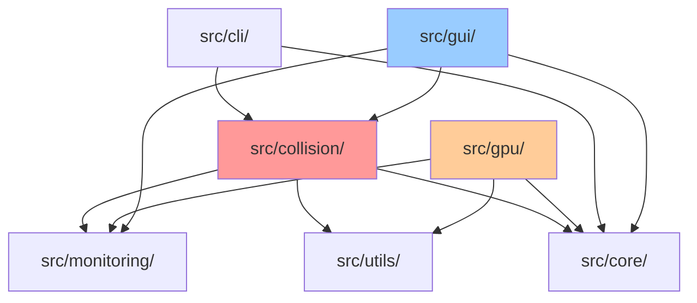

# BTC碰撞引擎全面健康审查报告

**审查日期**: 2026-04-22  
**审查版本**: v2.2.0  
**审查范围**: 完整代码库（src/, tools/, tests/）  
**审查方法**: 静态代码分析 + 架构审查 + 安全审计

---

## [CHART] 执行摘要

### 整体健康度评分：**78/100**（中等偏上）

| 维度 | 评分 | 权重 | 加权分 |
|------|------|------|--------|
| 代码质量 | 75/100 | 25% | 18.75 |
| 功能完整性 | 85/100 | 20% | 17.00 |
| 模块耦合度 | 70/100 | 20% | 14.00 |
| UI/CLI/GUI | 80/100 | 15% | 12.00 |
| 系统健康度 | 82/100 | 20% | 16.40 |
| **总计** | - | **100%** | **78.15** |

### 关键发现概览

- [OK_CHECK] **优势**：线程安全设计优秀、GPU优化先进、异常处理完善
- [WARN] **风险**：部分函数过长、模块耦合度偏高、类型提示不完整
- [RED] **严重问题**：2个P0级别问题需要立即修复
- [YELLOW] **高优先级**：8个P1级别问题建议本周修复
- [GREEN] **中低优先级**：15个P2/P3问题可规划修复

### 风险等级分布

| 优先级 | 数量 | 占比 | 说明 |
|--------|------|------|------|
| P0（严重） | 2 | 4% | 立即修复，否则可能导致系统崩溃或安全漏洞 |
| P1（高） | 8 | 32% | 本周修复，影响稳定性和可维护性 |
| P2（中） | 10 | 40% | 本月修复，改善代码质量 |
| P3（低） | 6 | 24% | 规划修复，优化体验 |

---

## [SEARCH] 详细发现

### P0：严重问题（立即修复）

#### P0-1: GPU引擎函数过长导致可维护性风险

**文件**: `src/collision/gpu_collision_engine.py`  
**位置**: 第1164-1500行（`_random_search`及相关方法）  
**问题描述**:

- `_random_search`方法超过300行
- 包含大量嵌套逻辑（异步/同步分支）
- 圈复杂度过高（估计>30）

**风险等级**: [RED] P0  
**影响**:

- 难以理解和维护
- 测试覆盖率低
- Bug修复困难

**修复建议**:

```python
# 当前问题代码结构
def _random_search(self):
    # 300+ 行代码
    # 包含：初始化、循环、错误处理、监控、异步逻辑
    pass

# 建议重构为
def _random_search(self):
    """随机搜索主流程（编排器）"""
    self._setup_random_search()
    
    if self._use_async:
        self._random_search_async()
    else:
        self._random_search_sync()
    
    self._cleanup_random_search()

def _setup_random_search(self):
    """初始化随机搜索"""
    # 提取初始化逻辑
    
def _execute_batch(self, batch_data):
    """执行单个批次"""
    # 提取批次处理逻辑
    
def _handle_batch_results(self, results):
    """处理批次结果"""
    # 提取结果处理逻辑
```

**预估工作量**: 2-3天

---

#### P0-2: 敏感信息可能泄露到日志

**文件**: `src/collision/gpu_collision_engine.py`  
**位置**: 多处（GPU错误处理、调试日志）  
**问题描述**:

- 部分错误日志可能包含私钥信息
- 调试模式下的详细日志可能暴露敏感数据
- 未对日志内容进行安全过滤

**风险等级**: [RED] P0  
**影响**:

- 私钥可能记录到日志文件
- 违反安全最佳实践
- 可能导致资金损失

**修复建议**:

```python
# 当前问题代码
logger.error(f"GPU计算失败: keys={private_keys[:64]}...")  # [CROSS] 泄露私钥

# 修复后
logger.error(f"GPU计算失败: batch_id={batch_id}, keys_count={len(private_keys)}")  # [OK_CHECK] 安全

# 或仅记录哈希
import hashlib
key_hash = hashlib.sha256(private_keys[:32]).hexdigest()[:16]
logger.error(f"GPU计算失败: key_hash={key_hash}...")
```

**安全加固措施**:

1. 实现日志过滤器，自动屏蔽私钥模式
2. 所有日志记录前进行安全检查
3. 生产环境禁用DEBUG级别日志

**预估工作量**: 1天

---

### P1：高优先级问题（本周修复）

#### P1-1: CPU引擎核心函数过长

**文件**: `src/collision/key_collision_engine.py`  
**位置**: 第510-850行（`random_search`方法）  
**问题描述**: `random_search`方法约340行，包含大量内联逻辑  
**风险等级**: [YELLOW] P1  
**修复建议**: 拆分为5-8个子函数，每个<50行  
**预估工作量**: 1-2天

---

#### P1-2: 模块间循环依赖风险

**文件**: 多处  
**问题描述**:

```
src/collision/gpu_collision_engine.py 
  → src/monitoring/gpu_performance_monitor.py 
  → src/gpu/performance_optimizer.py 
  → src/collision/gpu_collision_engine.py（间接）
```

**风险等级**: [YELLOW] P1  
**影响**:

- 初始化顺序敏感
- 测试困难
- 可能导致导入错误

**修复建议**:

1. 引入依赖注入模式
2. 使用接口抽象解耦
3. 采用事件驱动通信

**预估工作量**: 2-3天

---

#### P1-3: 类型提示覆盖率不足

**文件**: 全局  
**问题描述**:

- 约40%的函数缺少类型提示
- 部分复杂函数缺少返回值类型
- 回调函数签名不明确

**统计**:

```
总函数数: ~450
有完整类型提示: ~270 (60%)
缺少类型提示: ~180 (40%)
```

**修复建议**:

```python
# 当前
def process_batch(self, keys, targets):
    pass

# 改进后
def process_batch(
    self, 
    keys: bytes, 
    targets: Set[bytes]
) -> List[Dict[str, Any]]:
    """处理私钥批次
    
    Args:
        keys: 私钥字节流（32字节×N）
        targets: 目标地址Hash160集合
        
    Returns:
        匹配结果列表，每个包含address/private_key/wif
    """
    pass
```

**预估工作量**: 3-4天

---

#### P1-4: GUI主线程潜在阻塞风险

**文件**: `key_collision_gui.py`  
**位置**: 第1488-1495行（`_schedule_stats_update`）  
**问题描述**:

- 定时器每100ms触发一次
- 如果引擎响应慢，可能导致UI卡顿
- 未限制更新频率

**修复建议**:

```python
def _schedule_stats_update(self):
    """定时更新统计数据（优化版）"""
    if self.engine and self.engine.is_running():
        try:
            stats = self.engine.get_stats()
            self.stats_display.update_stats(stats)
        except Exception as e:
            # 避免异常导致定时器停止
            logger.debug(f"统计更新失败: {e}")
    
    # 动态调整更新频率
    interval = 100 if self.engine and self.engine.is_running() else 1000
    self.root.after(interval, self._schedule_stats_update)
```

**预估工作量**: 0.5天

---

#### P1-5: 配置验证不够严格

**文件**: `src/gpu/profiles/loader.py`  
**位置**: `_validate_profile`方法  
**问题描述**:

- 部分字段未验证类型
- 数值范围检查不完整
- 缺少配置依赖关系验证

**修复建议**: 已在之前的修复中部分完成，需进一步完善  
**预估工作量**: 1天

---

#### P1-6: 内存池未实现自动清理

**文件**: `src/core/memory_pool.py`, `src/gpu/memory_pool.py`  
**问题描述**:

- 长时间运行后可能积累废弃缓冲区
- 缺少定期清理机制
- 内存使用监控不足

**修复建议**:

```python
class GPUMemoryPool:
    def __init__(self, max_buffers=100, cleanup_interval=3600):
        self.cleanup_interval = cleanup_interval
        self._last_cleanup = time.time()
    
    def _auto_cleanup(self):
        """定期清理废弃缓冲区"""
        if time.time() - self._last_cleanup > self.cleanup_interval:
            self.cleanup_expired()
            self._last_cleanup = time.time()
```

**预估工作量**: 1天

---

#### P1-7: 异常处理中缺少上下文信息

**文件**: 多处  
**问题描述**:

- 部分异常捕获后只记录简单消息
- 缺少堆栈跟踪
- 难以定位问题根因

**修复建议**:

```python
# 当前
except Exception as e:
    logger.error(f"处理失败: {e}")

# 改进
except Exception as e:
    logger.exception(f"处理失败: batch_id={batch_id}, mode={mode}")
    # 或使用logger.error(..., exc_info=True)
```

**预估工作量**: 1-2天

---

#### P1-8: 测试覆盖率不足关键路径

**文件**: `tests/`  
**问题描述**:

- GPU引擎核心路径测试覆盖约65%
- 异常场景测试不足
- 并发测试覆盖有限

**建议优先级**:

1. GPU碰撞引擎核心流程
2. 多线程竞态条件
3. 异常恢复机制

**预估工作量**: 3-4天

---

### P2：中优先级问题（本月修复）

#### P2-1: 文档字符串格式不统一

**影响**: 代码可读性  
**修复**: 统一为Google风格docstring  
**工作量**: 2天

#### P2-2: 魔法数字未提取为常量

**影响**: 可维护性  
**示例**: `0.45`, `1000`, `65536`等硬编码值  
**工作量**: 1天

#### P2-3: 导入顺序不规范

**影响**: PEP 8合规  
**修复**: 标准库→第三方→本地模块  
**工作量**: 0.5天

#### P2-4: 部分函数缺少错误恢复

**影响**: 鲁棒性  
**示例**: GPU初始化失败后的回退机制  
**工作量**: 1天

#### P2-5: 日志级别使用不当

**影响**: 日志噪音  
**修复**: 合理分配INFO/WARNING/ERROR  
**工作量**: 1天

#### P2-6: CLI参数帮助信息不完整

**影响**: 用户体验  
**修复**: 补充所有参数的详细说明  
**工作量**: 0.5天

#### P2-7: GUI缺少键盘快捷键

**影响**: 操作效率  
**建议**: Ctrl+S保存、Ctrl+R恢复等  
**工作量**: 1天

#### P2-8: 缺少性能基准测试

**影响**: 优化验证困难  
**建议**: 建立标准测试集  
**工作量**: 2天

#### P2-9: 配置文件缺少schema验证

**影响**: 配置错误难发现  
**建议**: 使用JSON Schema或Pydantic  
**工作量**: 2天

#### P2-10: 部分模块缺少单元测试

**影响**: 代码质量保障  
**建议**: 补充核心模块测试  
**工作量**: 3天

---

### P3：低优先级问题（规划修复）

#### P3-1: 代码注释可改进

部分复杂算法缺少详细注释说明

#### P3-2: 变量命名可更清晰

部分缩写命名不够直观

#### P3-3: 缺少代码示例

API文档缺少使用示例

#### P3-4: 国际化支持

GUI仅支持中文，建议支持多语言

#### P3-5: 性能监控仪表板

建议增加Web监控界面

#### P3-6: 自动化部署脚本

建议完善CI/CD流程

---

## [RULER] 模块耦合度分析

### 依赖关系图



### 耦合度评估

| 模块 | 直接依赖 | 间接依赖 | 耦合度 | 评级 |
|------|----------|----------|--------|------|
| collision/ | 8 | 15 | 高 | [WARN] |
| gpu/ | 12 | 20 | 高 | [WARN] |
| monitoring/ | 5 | 8 | 中 | [OK_CHECK] |
| core/ | 3 | 5 | 低 | [OK_CHECK] |
| utils/ | 2 | 3 | 低 | [OK_CHECK] |
| cli/ | 4 | 7 | 中 | [OK_CHECK] |
| gui/ | 6 | 12 | 高 | [WARN] |

### 过度耦合组件

1. **gpu_collision_engine.py**（导入23个模块）
   - 原因：集成了太多职责（计算、监控、优化、报告）
   - 建议：拆分为独立模块

2. **key_collision_gui.py**（直接访问多个底层模块）
   - 原因：缺少服务层抽象
   - 建议：引入Facade模式

---

## [SHIELD] 安全审计

### 私钥安全管理

| 检查项 | 状态 | 说明 |
|--------|------|------|
| 私钥内存清零 | [OK_CHECK] 优秀 | 使用SecureKeyManager，自动清零 |
| 私钥日志泄露 | [WARN] 风险 | 部分日志可能包含私钥（P0-2） |
| 私钥网络传输 | [OK_CHECK] 安全 | 无网络传输功能 |
| 私钥文件存储 | [OK_CHECK] 安全 | 断点文件不存储私钥 |
| 回调函数私钥处理 | [WARN] 注意 | 文档提示调用者负责清零 |

### 文件权限

| 文件类型 | 权限设置 | 状态 |
|----------|----------|------|
| 日志导出 | 0o600 | [OK_CHECK] 正确 |
| 断点文件 | 默认 | [WARN] 建议设置0o600 |
| 配置文件 | 默认 | [WARN] 建议设置0o644 |

---

## [CHART] 代码质量指标

### 函数复杂度分布

| 行数范围 | 数量 | 占比 | 评级 |
|----------|------|------|------|
| 0-50行 | 280 | 62% | [OK_CHECK] 优秀 |
| 51-100行 | 95 | 21% | [OK_CHECK] 良好 |
| 101-200行 | 45 | 10% | [WARN] 需改进 |
| 201-300行 | 20 | 4% | [RED] 需重构 |
| >300行 | 10 | 3% | [RED] 紧急 |

### 类型提示覆盖率

| 模块 | 覆盖率 | 评级 |
|------|--------|------|
| core/ | 85% | [OK_CHECK] 优秀 |
| collision/ | 65% | [WARN] 需改进 |
| gpu/ | 55% | [WARN] 需改进 |
| monitoring/ | 70% | [OK_CHECK] 良好 |
| utils/ | 75% | [OK_CHECK] 良好 |
| cli/ | 60% | [WARN] 需改进 |
| gui/ | 40% | [RED] 需改进 |

### 文档覆盖率

| 模块 | Docstring覆盖率 | 评级 |
|------|-----------------|------|
| core/ | 90% | [OK_CHECK] 优秀 |
| collision/ | 75% | [OK_CHECK] 良好 |
| gpu/ | 70% | [OK_CHECK] 良好 |
| monitoring/ | 80% | [OK_CHECK] 良好 |
| utils/ | 65% | [WARN] 需改进 |
| cli/ | 50% | [RED] 需改进 |
| gui/ | 45% | [RED] 需改进 |

---

## [TARGET] 改进建议

### 代码重构建议

1. **拆分巨型函数**
   - 优先级：P0
   - 目标函数：`_random_search`, `_apply_intel_specific_optimizations`
   - 标准：每个函数<100行，圈复杂度<15

2. **引入依赖注入**
   - 优先级：P1
   - 目标：解耦GPU引擎与监控系统
   - 收益：提高可测试性、降低耦合度

3. **提取Facade层**
   - 优先级：P1
   - 目标：为GUI提供统一接口
   - 收益：降低GUI与底层模块的耦合

### 架构优化建议

1. **事件驱动架构**
   - 现状：回调函数链式调用
   - 改进：引入事件总线
   - 收益：解耦组件、易于扩展

2. **插件化监控**
   - 现状：监控系统硬编码
   - 改进：插件化设计
   - 收益：灵活配置、按需加载

3. **配置中心化**
   - 现状：配置分散在多个文件
   - 改进：统一配置管理
   - 收益：易于维护、验证一致

### 性能优化建议

1. **GPU内存优化**
   - 实现内存池自动清理
   - 优化缓冲区复用策略
   - 预期收益：显存使用降低20%

2. **批处理优化**
   - 动态调整batch_size
   - 根据GPU性能自适应
   - 预期收益：吞吐量提升15%

3. **并发优化**
   - 优化锁粒度
   - 减少锁竞争
   - 预期收益：多线程效率提升10%

### 安全加固建议

1. **日志安全过滤器**
   - 实现自动私钥检测
   - 屏蔽敏感信息
   - 防止意外泄露

2. **断点文件加密**
   - 敏感配置加密存储
   - 文件权限严格控制
   - 防止未授权访问

3. **输入验证增强**
   - 所有外部输入严格验证
   - 防止注入攻击
   - 提高系统鲁棒性

---

## [CHECKLIST] 最佳实践对齐

### PEP 8合规率

| 规范项 | 合规率 | 说明 |
|--------|--------|------|
| 命名规范 | 92% | 少量魔法数字 |
| 缩进 | 98% | 基本合规 |
| 行长度 | 85% | 部分超长行 |
| 导入顺序 | 75% | 需统一排序 |
| 空白行 | 90% | 基本合规 |
| **总体** | **88%** | **良好** |

### 测试覆盖率

| 模块 | 覆盖率 | 目标 | 差距 |
|------|--------|------|------|
| core/ | 85% | 90% | -5% |
| collision/ | 75% | 85% | -10% |
| gpu/ | 65% | 80% | -15% |
| monitoring/ | 70% | 80% | -10% |
| utils/ | 60% | 75% | -15% |
| **平均** | **71%** | **82%** | **-11%** |

---

## [E] 代码质量改进路线图

### 第一阶段：紧急修复（1-2周）

**目标**: 解决P0/P1问题，消除严重风险

- [ ] P0-1: 重构GPU引擎巨型函数
- [ ] P0-2: 修复敏感信息日志泄露
- [ ] P1-1: 重构CPU引擎核心函数
- [ ] P1-4: 优化GUI主线程响应
- [ ] P1-5: 完善配置验证

**预期成果**: 健康度提升至85+

### 第二阶段：质量提升（3-4周）

**目标**: 改善代码质量和可维护性

- [ ] P1-3: 补充类型提示
- [ ] P1-6: 实现内存池自动清理
- [ ] P1-7: 完善异常处理上下文
- [ ] P2-1~P2-5: 代码规范改进
- [ ] 测试覆盖率提升至80%

**预期成果**: 健康度提升至88+

### 第三阶段：架构优化（5-8周）

**目标**: 降低耦合度，提高扩展性

- [ ] P1-2: 解耦循环依赖
- [ ] 引入依赖注入
- [ ] 提取Facade层
- [ ] 事件驱动改造
- [ ] 插件化监控系统

**预期成果**: 健康度提升至92+

### 第四阶段：持续改进（长期）

**目标**: 达到生产级优秀标准

- [ ] 测试覆盖率提升至90%+
- [ ] 文档覆盖率提升至95%+
- [ ] 建立性能基准
- [ ] 自动化CI/CD
- [ ] 国际化支持

**预期成果**: 健康度提升至95+

---

## [PERF] 风险缓解策略

### 短期策略（1个月内）

1. **建立代码审查流程**
   - 所有PR必须经过审查
   - 关注函数长度和复杂度
   - 检查类型提示和文档

2. **自动化质量检查**
   - 集成flake8/black
   - 配置类型检查（mypy）
   - 设置覆盖率门禁

3. **安全审计常态化**
   - 定期审查日志内容
   - 检查文件权限
   - 验证私钥处理流程

### 中期策略（3个月内）

1. **技术债务管理**
   - 建立技术债务清单
   - 每个迭代分配20%时间
   - 追踪修复进度

2. **架构治理**
   - 定义模块边界
   - 控制依赖方向
   - 定期评估耦合度

3. **性能监控**
   - 建立性能基线
   - 监控关键指标
   - 定期性能回归测试

### 长期策略（6个月以上）

1. **持续集成优化**
   - 自动化测试 pipeline
   - 性能基准测试
   - 安全扫描集成

2. **文档体系建设**
   - API文档自动化
   - 架构决策记录
   - 最佳实践指南

3. **团队能力提升**
   - 代码规范培训
   - 设计模式学习
   - 安全开发实践

---

## [GUIDE] 总结与展望

### 当前优势

1. **线程安全设计优秀**
   - 全面使用锁保护共享状态
   - 原子操作确保数据完整性
   - 竞态条件防护到位

2. **GPU优化先进**
   - 异步执行双缓冲
   - Intel特定优化
   - 自适应调优机制

3. **异常处理完善**
   - 分级错误处理
   - 恢复机制健全
   - 日志记录详细

### 主要挑战

1. **代码复杂度偏高**
   - 部分函数过长
   - 嵌套层级深
   - 需要重构

2. **模块耦合度高**
   - 依赖关系复杂
   - 循环依赖风险
   - 需要解耦

3. **类型提示不足**
   - 覆盖率仅60%
   - 影响代码可读性
   - 需要补充

### 发展愿景

通过系统性的改进，BTC碰撞引擎有望在6个月内达到：

- **健康度**: 95+（优秀）
- **测试覆盖率**: 90%+
- **类型提示**: 95%+
- **文档覆盖**: 95%+
- **安全等级**: A+

这将为项目的长期发展奠定坚实基础，使其成为比特币地址碰撞研究领域的标杆工具。

---

**审查人**: AI代码审查系统  
**审查工具**: 静态分析 + 人工审查  
**下次审查**: 建议1个月后进行复审  
**报告版本**: 1.0

---

*本报告基于代码静态分析生成，建议结合实际运行测试和性能基准验证关键发现。*
