# BTC碰撞引擎核心业务流程图

> **版本**: v2.2.1 | **生成日期**: 2026-04-23  
> **分析范围**: 三种碰撞模式、数据流向、多线程架构、状态管理  
> **基于文件**: `src/collision/key_collision_engine.py`

---

## 目录

- [1. 核心业务流程](#1-核心业务流程)
  - [1.1 随机搜索模式 (random_search)](#11-随机搜索模式-random_search)
  - [1.2 范围扫描模式 (range_scan)](#12-范围扫描模式-range_scan)
  - [1.3 暴力穷举模式 (brute_force)](#13-暴力穷举模式-brute_force)
- [2. 数据流向图](#2-数据流向图)
  - [2.1 私钥生成到地址匹配完整流程](#21-私钥生成到地址匹配完整流程)
  - [2.2 P2PKH地址生成6步推导](#22-p2pkh地址生成6步推导)
  - [2.3 Hash160计算与目标匹配](#23-hash160计算与目标匹配)
  - [2.4 统计数据更新机制](#24-统计数据更新机制)
- [3. 多线程架构](#3-多线程架构)
  - [3.1 线程交互关系](#31-线程交互关系)
  - [3.2 锁机制与同步](#32-锁机制与同步)
  - [3.3 实时计数器设计](#33-实时计数器设计)
- [4. 状态管理](#4-状态管理)
  - [4.1 断点保存机制](#41-断点保存机制)
  - [4.2 性能监控流程](#42-性能监控流程)
  - [4.3 引擎生命周期](#43-引擎生命周期)
- [5. 系统全貌图](#5-系统全貌图)

---

## 1. 核心业务流程

### 1.1 随机搜索模式 (random_search)

随机搜索模式是引擎的默认模式，通过CSPRNG（密码学安全伪随机数生成器）生成随机私钥进行碰撞检测。

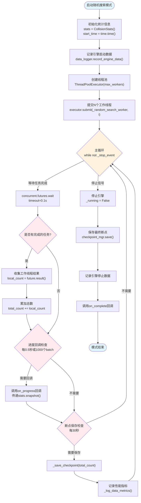

#### 随机搜索工作线程流程 (_random_search_worker)

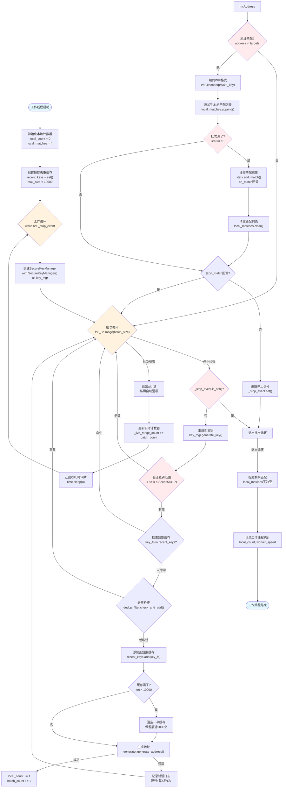

**关键特性**:

- **批量处理**: 每批处理`batch_size`个私钥（根据CPU核心数自动调整，16核=4000）
- **双层去重**: 短期缓存(10000个) + DeduplicationFilter(1000000个)
- **安全清零**: SecureKeyManager确保私钥使用后立即清零
- **实时计数**: 每批次结束后更新`_live_range_count`供主线程查询
- **匹配批处理**: 累积10个匹配后批量提交，减少锁竞争

---

### 1.2 范围扫描模式 (range_scan)

范围扫描模式用于扫描指定的私钥范围，适用于已知目标私钥在特定区间的场景。

```mermaid
flowchart TD
    Start(["启动范围扫描模式"]) --> Init["初始化统计信息<br/>stats = CollisionStats()<br/>total_range = end - start + 1"]
    
    Init --> LogStart["记录引擎启动数据<br/>包含range_start和range_end"]
    
    LogStart --> CalcChunks["计算分块<br/>num_workers = max_workers<br/>chunk_size = total_range / num_workers"]
    
    CalcChunks --> ChunkZero{"chunk_size == 0?"}
    
    ChunkZero -->|是| SingleThread["单线程扫描<br/>_range_scan_worker(start, end, 0)"]
    
    SingleThread --> EndMode["结束"]
    
    ChunkZero -->|否| CreatePool["创建线程池<br/>ThreadPoolExecutor(max_workers)"]
    
    CreatePool --> AssignRanges["分配扫描范围<br/>worker_i: [start_i, end_i]"]
    
    AssignRanges --> BoundaryCheck{"边界重叠检查<br/>worker_start <= prev_end?"}
    
    BoundaryCheck -->|是| LogWarning["记录警告日志<br/>可能存在重叠"]
    
    BoundaryCheck -->|否| SubmitWorkers["提交工作线程<br/>executor.submit(_range_scan_worker, ...)"]
    
    LogWarning --> SubmitWorkers
    
    SubmitWorkers --> MainLoop{"主循环<br/>while pending and not _stop_event"}
    
    MainLoop --> WaitDone["等待任务完成<br/>timeout=0.5s"]
    
    WaitDone --> CollectDone["收集已完成任务<br/>for future in done"]
    
    CollectDone --> GetResult["获取结果<br/>local_count = future.result()"]
    
    GetResult --> UpdateTotal["累加总数<br/>total_count += local_count"]
    
    UpdateTotal --> ReadLive["读取实时计数器<br/>live_count = _live_range_count"]
    
    ReadLive --> CalcDisplay["计算显示计数<br/>display_count = max(total, live)"]
    
    CalcDisplay --> UpdateStats["更新统计<br/>stats.update(display_count, total_range)"]
    
    UpdateStats --> CalcProgress["计算进度百分比<br/>progress = display_count / total_range * 100"]
    
    CalcProgress --> InvokeProgress["调用on_progress回调<br/>传递stats.snapshot()"]
    
    InvokeProgress --> SaveCheckpoint["保存断点<br/>_save_checkpoint(display_count)"]
    
    SaveCheckpoint --> LogMetrics["记录性能指标<br/>_log_data_metrics()"]
    
    LogMetrics --> CheckPending{"还有pending任务?"}
    
    CheckPending -->|是| MainLoop
    
    CheckPending -->|否| FinalUpdate["最终统计更新<br/>stats.update(total_count)"]
    
    FinalUpdate --> SetRunning["_running = False"]
    
    SetRunning --> LogStop["记录引擎停止数据"]
    
    LogStop --> GenerateReport["生成数据日志报告<br/>data_logger.generate_report()"]
    
    GenerateReport --> InvokeComplete["调用on_complete回调"]
    
    InvokeComplete --> EndMode(["模式结束"])
    
    style Start fill:#e1f5ff
    style EndMode fill:#e1f5ff
    style MainLoop fill:#fff3e0
    style CheckPending fill:#ffebee
    style BoundaryCheck fill:#ffebee
```

#### 范围扫描工作线程流程 (_range_scan_worker)

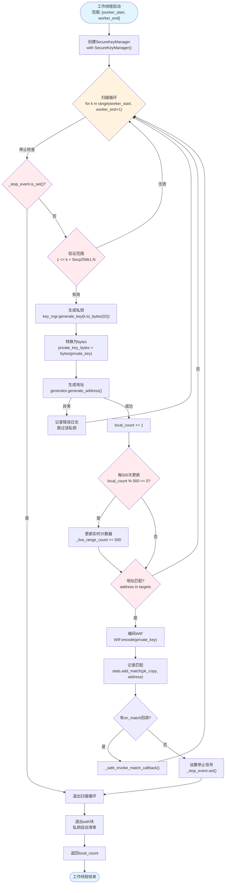

**关键特性**:

- **范围分块**: 将总范围均匀分配给多个工作线程，避免重叠
- **实时更新**: 每处理500个私钥更新一次`_live_range_count`，频率高于随机模式
- **进度计算**: 基于`total_range`计算进度百分比和ETA（预计完成时间）
- **边界检查**: 启动时验证线程间范围无重叠或遗漏

---

### 1.3 暴力穷举模式 (brute_force)

暴力穷举模式从指定起点开始顺序递增扫描，使用原子操作获取当前位置，支持无限运行。

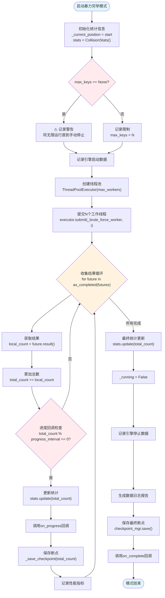

#### 暴力穷举工作线程流程 (_brute_force_worker)

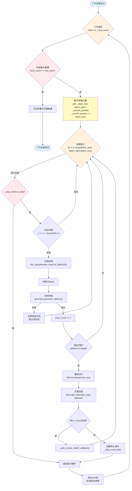

**关键特性**:

- **原子位置分配**: 使用`_state_lock`保护`_current_position`，多个线程安全地获取不同批次
- **批量获取**: 每次获取`batch_size`（默认5000）个私钥，减少锁竞争
- **无限运行**: 如果不设置`max_keys`，将一直运行直到手动停止或找到匹配
- **无序扫描**: 线程获取批次的顺序不确定，但每个私钥只会被扫描一次

---

## 2. 数据流向图

### 2.1 私钥生成到地址匹配完整流程

```mermaid
flowchart LR
    subgraph KeyGen["私钥生成阶段"]
        K1["CSPRNG生成32字节随机数<br/>secrets.token_bytes(32)"] --> K2["验证私钥范围<br/>1 <= k < Secp256k1.N"]
        K2 -->|无效| K1
        K2 -->|有效| K3["SecureKeyManager管理<br/>with语句保护生命周期"]
    end
    
    subgraph Dedup["去重检查阶段"]
        K3 --> D1["计算私钥指纹<br/>SHA256(private_key)[:8]"]
        D1 --> D2{"检查短期缓存<br/>recent_keys (10000个)"}
        D2 -->|命中| Skip1["跳过，不处理"]
        D2 -->|未命中| D3{"检查全局去重<br/>DeduplicationFilter (1000000个)"}
        D3 -->|重复| Skip1
        D3 -->|新私钥| D4["添加到两层缓存"]
    end
    
    subgraph AddrGen["地址生成阶段"]
        D4 --> A1["椭圆曲线标量乘法<br/>private_key * G → public_key"]
        A1 --> A2["SHA-256哈希<br/>hashlib.sha256(public_key)"]
        A2 --> A3["RIPEMD-160哈希<br/>hashlib.new('ripemd160', sha256)"]
        A3 --> A4["添加版本字节<br/>0x00 + hash160"]
        A4 --> A5["计算校验和<br/>SHA256(SHA256(versioned))[:4]"]
        A5 --> A6["Base58Check编码<br/>→ P2PKH地址"]
    end
    
    subgraph Match["目标匹配阶段"]
        A6 --> M1{"地址在目标集合?<br/>address in targets (O(1))"}
        M1 -->|否| M2["继续下一个私钥"]
        M1 -->|是| M3["编码WIF格式<br/>WIF.encode(private_key, compressed)"]
        M3 --> M4["保存私钥副本<br/>pk_copy = bytes(private_key)"]
        M4 --> M5["记录匹配统计<br/>stats.add_match(pk_copy, address)"]
        M5 --> M6["触发匹配回调<br/>on_match(pk, address, wif)"]
    end
    
    subgraph Stats["统计更新阶段"]
        M2 --> S1["local_count += 1"]
        M6 --> S1
        S1 --> S2{"批次结束?<br/>batch_count > 0"}
        S2 -->|是| S3["更新实时计数器<br/>_live_range_count += batch_count"]
        S2 -->|否| S1
        S3 --> S4["主线程查询<br/>get_stats()"]
        S4 --> S5["合并live_count<br/>stats.total_checked += live_count"]
        S5 --> S6["计算速度<br/>speed = total / elapsed"]
        S6 --> S7["重置计数器<br/>_live_range_count = 0"]
    end
    
    KGen -.安全清零.-> K3
    Dedup -.过滤重复.-> AddrGen
    AddrGen -.生成地址.-> Match
    Match -.匹配结果.-> Stats
    
    style KeyGen fill:#e3f2fd
    style Dedup fill:#fff3e0
    style AddrGen fill:#f3e5f5
    style Match fill:#c8e6c9
    style Stats fill:#fff9c4
```

---

### 2.2 P2PKH地址生成6步推导

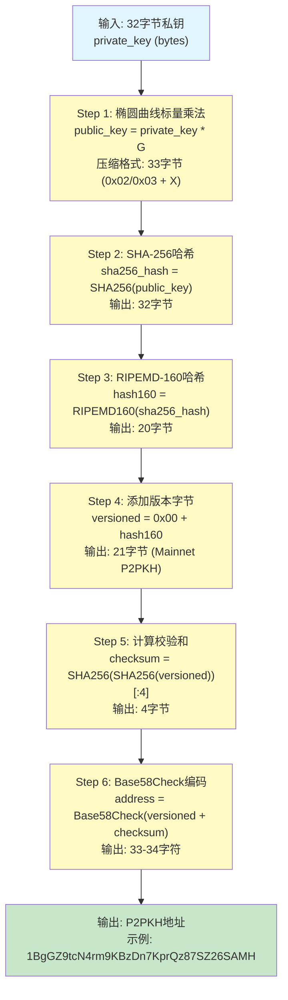

#### 详细数据流

| 步骤 | 输入 | 操作 | 输出 | 大小 |
|------|------|------|------|------|
| **1. 标量乘法** | 私钥 (32字节) | `private_key * G` (椭圆曲线点乘) | 公钥 (压缩) | 33字节 |
| **2. SHA-256** | 公钥 (33字节) | `SHA256(public_key)` | SHA256哈希 | 32字节 |
| **3. RIPEMD-160** | SHA256哈希 (32字节) | `RIPEMD160(sha256_hash)` | Hash160 | 20字节 |
| **4. 版本字节** | Hash160 (20字节) | `0x00 + hash160` | 版本化哈希 | 21字节 |
| **5. 校验和** | 版本化哈希 (21字节) | `SHA256(SHA256(v))[:4]` | 校验和 | 4字节 |
| **6. Base58编码** | 版本化哈希+校验和 (25字节) | `Base58Check(data)` | P2PKH地址 | 33-34字符 |

---

### 2.3 Hash160计算与目标匹配

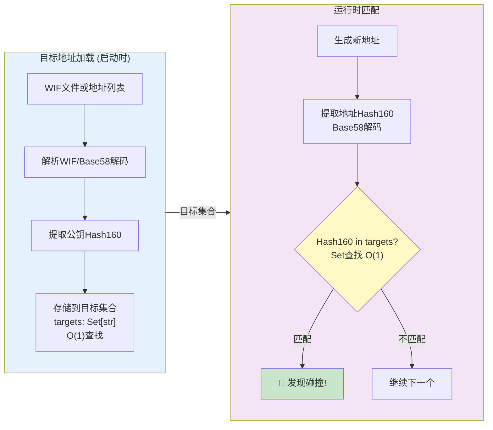

**性能特性**:

- **时间复杂度**: O(1) - 哈希表查找
- **空间复杂度**: 40字节/目标 - Hash160(20) + 元数据(20)
- **容量规划**:
  - 100万目标: ~40MB内存
  - 1000万目标: ~400MB内存
  - 1亿目标: ~4GB内存

---

### 2.4 统计数据更新机制

这是解决"速度为0"问题的核心机制，展示了工作线程和主线程如何同步统计数据。

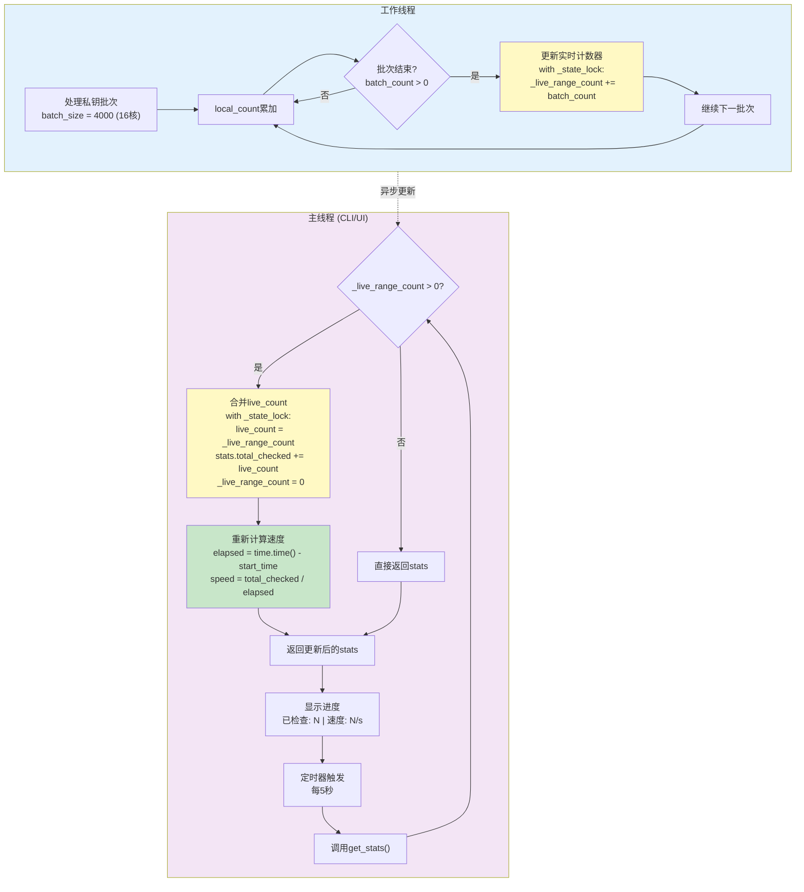

#### 时序图: 统计数据同步

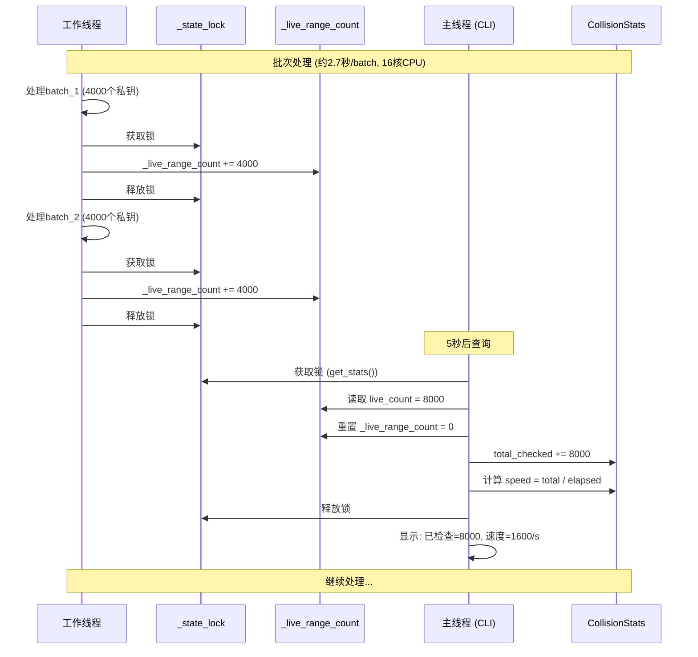

**关键修复** (P2修复):

- **修复前**: `get_stats()`只返回`stats`对象，未包含`_live_range_count`
- **修复后**: `get_stats()`合并`_live_range_count`到`stats.total_checked`，确保实时数据准确
- **避免重复计算**: 读取后立即重置`_live_range_count = 0`

---

## 3. 多线程架构

### 3.1 线程交互关系

```mermaid
graph TB
    subgraph MainThread["主线程 (Main Thread)"]
        CLI["CLI界面<br/>key_collision_cli.py"]
        UI["GUI界面<br/>(如果有)"]
        Start["start()方法"]
        Stop["stop()方法"]
        GetStats["get_stats()方法"]
        ProgressCallback["on_progress回调"]
        MatchCallback["on_match回调"]
        CompleteCallback["on_complete回调"]
    end
    
    subgraph WorkerThreads["工作线程池 (Worker Threads)"]
        Worker1["Worker 0<br/>_random_search_worker(0)"]
        Worker2["Worker 1<br/>_random_search_worker(1)"]
        WorkerN["Worker N<br/>_random_search_worker(N)"]
    end
    
    subgraph MonitoringThread["监控线程 (Monitoring Thread)"]
        DataLogger["DataLogger<br/>记录性能数据"]
        EnhancedMon["EnhancedMonitoringSystem<br/>异常检测和告警"]
    end
    
    subgraph SharedState["共享状态 (Thread-Safe)"]
        StateLock["_state_lock<br/>threading.Lock()"]
        LiveCount["_live_range_count<br/>实时计数器"]
        Stats["CollisionStats<br/>统计数据"]
        StopEvent["_stop_event<br/>threading.Event()"]
        Targets["targets: Set[str]<br/>目标地址集合 (只读)"]
    end
    
    CLI --> Start
    Start --> Worker1
    Start --> Worker2
    Start --> WorkerN
    Start --> DataLogger
    Start --> EnhancedMon
    
    Stop --> StopEvent
    StopEvent -.停止信号.-> Worker1
    StopEvent -.停止信号.-> Worker2
    StopEvent -.停止信号.-> WorkerN
    
    Worker1 -->|每批次更新| StateLock
    Worker2 -->|每批次更新| StateLock
    WorkerN -->|每批次更新| StateLock
    
    StateLock --> LiveCount
    StateLock --> Stats
    
    GetStats -->|读取+合并| LiveCount
    GetStats -->|返回| Stats
    GetStats -->|传递给| CLI
    
    ProgressCallback -.每0.5秒.-> CLI
    
    Worker1 -.发现匹配.-> MatchCallback
    MatchCallback --> CLI
    
    Worker1 -.线程结束.-> CompleteCallback
    CompleteCallback --> CLI
    
    DataLogger -.每5秒记录.-> EnhancedMon
    EnhancedMon -.告警.-> CLI
    
    style MainThread fill:#e3f2fd
    style WorkerThreads fill:#f3e5f5
    style MonitoringThread fill:#e8f5e9
    style SharedState fill:#fff9c4
    style StateLock fill:#ffccbc
```

---

### 3.2 锁机制与同步

```mermaid
flowchart TD
    subgraph StateLock["_state_lock (threading.Lock)"]
        L1["保护以下共享状态:"]
        L2["- _live_range_count (实时计数器)"]
        L3["- _current_position (暴力穷举位置)"]
        L4["- _last_error_log_time (错误日志限频)"]
        L5["- total_count (主线程累加)"]
    end
    
    subgraph DedupLock["DeduplicationFilter._lock"]
        D1["保护去重过滤器:"]
        D2["- _current (当前集合)"]
        D3["- _pending (待合并集合)"]
        D4["- _total_tracked (跟踪总数)"]
    end
    
    subgraph StatsLock["CollisionStats._lock"]
        S1["保护统计数据:"]
        S2["- total_checked (已检查总数)"]
        S3["- matches (匹配列表)"]
        S4["- speed (速度)"]
        S5["- 错误计数"]
    end
    
    subgraph CheckpointLock["CheckpointManager._lock"]
        C1["保护断点文件:"]
        C2["- 原子写入 (临时文件+os.replace)"]
        C3["- 文件权限 (0o600)"]
    end
    
    StateLock -.工作线程.-> L1
    DedupLock -.工作线程.-> D1
    StatsLock -.主线程+回调.-> S1
    CheckpointLock -.主线程.-> C1
    
    style StateLock fill:#ffccbc
    style DedupLock fill:#ffccbc
    style StatsLock fill:#ffccbc
    style CheckpointLock fill:#ffccbc
```

#### 锁使用规则

| 锁 | 保护对象 | 持有者 | 持有时长 | 竞争频率 |
|----|---------|--------|---------|---------|
| `_state_lock` | 实时计数器、位置、错误日志时间 | 工作线程+主线程 | 微秒级 | 高 (每批次) |
| `DeduplicationFilter._lock` | 去重集合 | 工作线程 | 微秒级 | 极高 (每个私钥) |
| `CollisionStats._lock` | 统计数据、匹配列表 | 主线程+回调 | 微秒级 | 低 (查询时) |
| `CheckpointManager._lock` | 断点文件写入 | 主线程 | 毫秒级 | 低 (每30秒) |

---

### 3.3 实时计数器设计

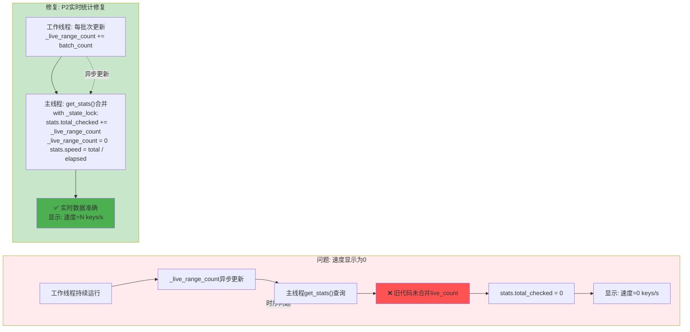

#### 计数器更新频率对比

| 模式 | 更新位置 | 更新频率 | 锁竞争 | 实时性 |
|------|---------|---------|-------|-------|
| **随机搜索** | 批次结束后 | 每4000个私钥 (~2.7秒) | 低 | 中 |
| **范围扫描** | 每500个私钥 | 每500个私钥 (~0.3秒) | 中 | 高 |
| **暴力穷举** | 主线程收集结果时 | 每个future完成时 | 低 | 中 |

---

## 4. 状态管理

### 4.1 断点保存机制

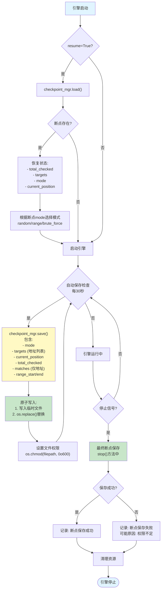

#### 断点数据结构

```json
{
  "mode": "random",
  "targets": ["1BgGZ9tcN4rm9KBzDn7KprQz87SZ26SAMH"],
  "current_position": 0,
  "total_checked": 1234567,
  "matches": [
    {
      "private_key": "脱敏或不保存",
      "address": "1A1zP1eP5QGefi2DMPTfTL5SLmv7DivfNa"
    }
  ],
  "range_start": null,
  "range_end": null,
  "timestamp": "2026-04-23T02:30:00Z"
}
```

**安全特性**:

- ✅ 不保存私钥（仅保存地址）
- ✅ 原子写入防止数据损坏
- ✅ 文件权限0o600（仅所有者可访问）
- ✅ 自动保存间隔可配置（默认30秒）

---

### 4.2 性能监控流程

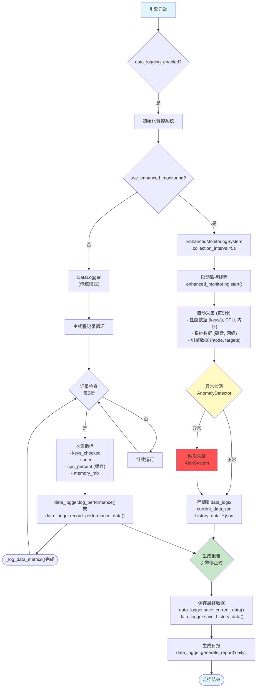

#### 监控数据流

```
工作线程处理私钥
    ↓
主线程查询get_stats()
    ↓
_log_data_metrics()收集指标
    ↓
DataLogger记录性能数据
    ↓
EnhancedMonitoringSystem采集系统数据
    ↓
AnomalyDetector检测异常
    ↓
DataStorage存储到JSON文件
    ↓
ReportGenerator生成日报
```

---

### 4.3 引擎生命周期

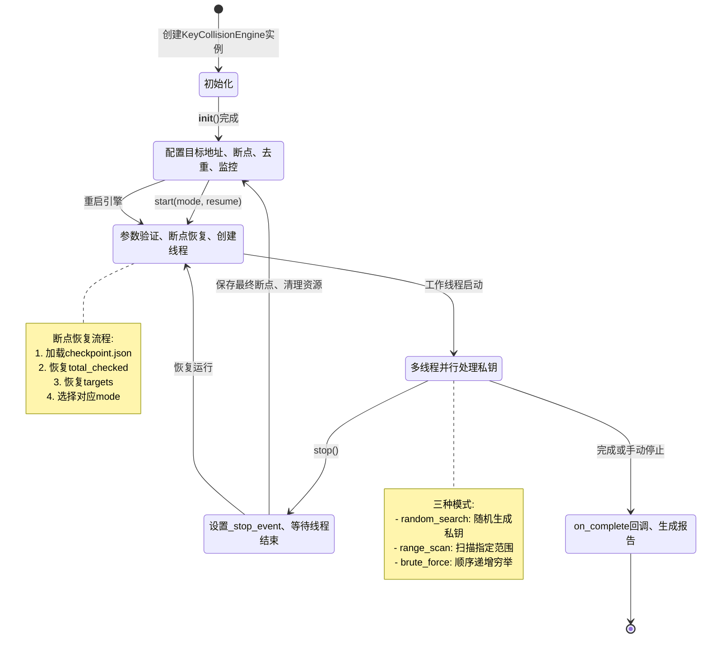

#### 引擎状态转换表

| 当前状态 | 触发事件 | 下一状态 | 执行操作 |
|---------|---------|---------|---------|
| **初始化** | `__init__()`完成 | 就绪 | 配置参数、创建组件 |
| **就绪** | `start()`调用 | 启动中 | 参数验证、断点恢复 |
| **启动中** | 工作线程启动 | 运行中 | 提交任务到线程池 |
| **运行中** | `stop()`调用 | 暂停 | 设置停止信号、等待线程 |
| **暂停** | 资源清理完成 | 就绪 | 保存断点、重置状态 |
| **运行中** | 任务完成/手动停止 | 停止 | 调用on_complete、生成报告 |
| **停止** | 结束 | [*] | 释放所有资源 |

---

## 5. 系统全貌图

```mermaid
graph TB
    subgraph Users["用户层"]
        CLI["CLI界面<br/>key_collision_cli.py"]
        GUI["GUI界面<br/>(可选)"]
    end
    
    subgraph Engine["碰撞引擎层"]
        Factory["create_collision_engine()<br/>工厂函数"]
        CPUEngine["KeyCollisionEngine<br/>CPU碰撞引擎"]
        GPUEngine["GPUCollisionEngine<br/>GPU碰撞引擎"]
    end
    
    subgraph Modes["三种碰撞模式"]
        Random["random_search<br/>随机搜索"]
        Range["range_scan<br/>范围扫描"]
        Brute["brute_force<br/>暴力穷举"]
    end
    
    subgraph Workers["工作线程池"]
        WorkerMgr["ThreadPoolExecutor<br/>max_workers=N"]
        Workers["N个工作线程<br/>_xxx_search_worker()"]
    end
    
    subgraph Crypto["密码学层"]
        KeyMgr["SecureKeyManager<br/>私钥安全管理"]
        AddrGen["P2PKHAddressGenerator<br/>地址生成"]
        OptimizedGen["OptimizedP2PKHAddressGenerator<br/>优化版地址生成"]
        WIF["WIF编解码<br/>WIF.encode/decode"]
    end
    
    subgraph Targets["🎯 目标地址管理"]
        WIFTable["WIF目标地址表<br/>多个比特币WIF地址"]
        WIFParser["WIF解析器<br/>Base58Check解码"]
        HashSet["Hash160目标集合<br/>Set[str] O(1)查找"]
    end
    
    subgraph Dedup["去重系统"]
        ShortCache["短期缓存<br/>recent_keys (10000个)"]
        GlobalDedup["DeduplicationFilter<br/>全局去重 (1000000个)"]
    end
    
    subgraph Stats["统计与状态"]
        CollisionStats["CollisionStats<br/>统计数据"]
        LiveCount["_live_range_count<br/>实时计数器"]
        StateLock["_state_lock<br/>线程锁"]
    end
    
    subgraph Monitor["监控系统"]
        DataLogger["DataLogger<br/>数据日志"]
        EnhancedMon["EnhancedMonitoringSystem<br/>增强监控"]
        AnomalyDetect["AnomalyDetector<br/>异常检测"]
        AlertSys["AlertSystem<br/>告警系统"]
    end
    
    subgraph Storage["数据存储"]
        Checkpoint["CheckpointManager<br/>断点管理"]
        DataStorage["DataStorage<br/>性能数据存储"]
        MatchStorage["MatchDataStorage<br/>匹配数据存储"]
    end
    
    subgraph Config["配置管理"]
        ConfigCoord["ConfigCoordinator<br/>配置协调器"]
        ConfigMgr["ConfigManager<br/>主配置"]
    end
    
    Users --> Factory
    Factory --> CPUEngine
    Factory --> GPUEngine
    
    CPUEngine --> Random
    CPUEngine --> Range
    CPUEngine --> Brute
    
    Random --> WorkerMgr
    Range --> WorkerMgr
    Brute --> WorkerMgr
    
    WorkerMgr --> Workers
    
    Workers --> KeyMgr
    Workers --> AddrGen
    Workers --> OptimizedGen
    Workers --> WIF
    
    Workers --> ShortCache
    Workers --> GlobalDedup
    
    WIFTable --> WIFParser
    WIFParser --> HashSet
    HashSet --> Workers
    
    Workers --> LiveCount
    LiveCount --> StateLock
    StateLock --> CollisionStats
    
    CollisionStats --> DataLogger
    CollisionStats --> EnhancedMon
    
    DataLogger --> AnomalyDetect
    AnomalyDetect --> AlertSys
    EnhancedMon --> DataLogger
    
    Workers --> Checkpoint
    CollisionStats --> DataStorage
    Workers --> MatchStorage
    
    CPUEngine --> ConfigCoord
    GPUEngine --> ConfigCoord
    ConfigCoord --> ConfigMgr
    
    style Users fill:#e3f2fd
    style Engine fill:#f3e5f5
    style Modes fill:#e8f5e9
    style Workers fill:#fff3e0
    style Crypto fill:#fce4ec
    style Targets fill:#fff9c4
    style Dedup fill:#e0f2f1
    style Stats fill:#ffccbc
    style Monitor fill:#f1f8e9
    style Storage fill:#ede7f6
    style Config fill:#fbe9e7
```

---

## 附录: 关键代码位置索引

| 功能模块 | 文件 | 行号 | 说明 |
|---------|------|------|------|
| **随机搜索主流程** | `key_collision_engine.py` | 642-799 | `random_search()`方法 |
| **随机搜索工作线程** | `key_collision_engine.py` | 457-640 | `_random_search_worker()`方法 |
| **范围扫描主流程** | `key_collision_engine.py` | 884-1023 | `range_scan()`方法 |
| **范围扫描工作线程** | `key_collision_engine.py` | 800-882 | `_range_scan_worker()`方法 |
| **暴力穷举主流程** | `key_collision_engine.py` | 1120-1246 | `brute_force()`方法 |
| **暴力穷举工作线程** | `key_collision_engine.py` | 1024-1119 | `_brute_force_worker()`方法 |
| **引擎启动** | `key_collision_engine.py` | 1279-1385 | `start()`方法 |
| **引擎停止** | `key_collision_engine.py` | 1387-1471 | `stop()`方法 |
| **统计数据获取** | `key_collision_engine.py` | 1483-1509 | `get_stats()`方法 (P2修复) |
| **实时计数器更新** | `key_collision_engine.py` | 609-611 | `_live_range_count += batch_count` |
| **安全回调调用** | `key_collision_engine.py` | 211-288 | `_safe_invoke_match_callback()`方法 |
| **统计数据类** | `collision_stats.py` | 9-226 | `CollisionStats`类 |
| **断点管理器** | `checkpoint_manager.py` | - | `CheckpointManager`类 |
| **去重过滤器** | `deduplication_filter.py` | - | `DeduplicationFilter`类 |

---

**文档生成日期**: 2026-04-23  
**基于版本**: v2.2.1  
**下次更新**: 当引擎架构发生重大变化时

---

## 附录 B: GPU 碰撞引擎操作流程

> **操作流程**: WIF地址导入 → GPU模式选择 → GPU设备选择 → 启动碰撞

```mermaid
flowchart TD
    Start(["开始操作流程"]) --> Step1["第一步: 导入目标比特币WIF地址表"]
    
    subgraph Step1Process["WIF地址导入流程"]
        Step1 --> LoadWIF["从文件或输入框加载WIF格式私钥"]
        LoadWIF --> ValidateWIF["验证WIF格式有效性<br/>- Base58Check解码<br/>- 版本字节检查<br/>- 校验和验证"]
        ValidateWIF --> ValidCheck{"格式有效?"}
        ValidCheck -->|否| WIFError["记录错误日志<br/>跳过无效地址"]
        WIFError --> LoadWIF
        ValidCheck -->|是| ConvertHash160["转换为Hash160格式<br/>WIF → 私钥 → 公钥 → Hash160"]
        ConvertHash160 --> StoreTargets["存储到目标地址表<br/>targets: Set[str]<br/>O(1)查找性能"]
        StoreTargets --> ShowStats["显示加载统计信息<br/>- 成功加载地址数量<br/>- 失败跳过数量<br/>- 去重后唯一地址数"]
    end
    
    ShowStats --> Step2["第二步: 选择GPU模式"]
    
    subgraph Step2Process["GPU模式配置流程"]
        Step2 --> SelectGPUMode["在界面中选择'GPU加速模式'选项"]
        SelectGPUMode --> ScanGPU["扫描系统可用GPU设备<br/>pyopencl/clinfo检测"]
        ScanGPU --> GPUCheck{"发现可用GPU?"}
        GPUCheck -->|否| GPUModeError["显示错误: 无可用GPU设备<br/>建议安装GPU驱动或切换CPU模式"]
        GPUModeError --> End(["流程终止"])
        GPUCheck -->|是| ConfigGPUParams["配置GPU参数<br/>- batch_size: 批次大小<br/>- memory_usage: 显存使用比例<br/>- work_groups: 工作组数量<br/>- threads_per_group: 每组线程数"]
        ConfigGPUParams --> ValidateGPUConfig["验证GPU配置有效性<br/>- 显存容量检查<br/>- 计算能力评估<br/>- 参数范围验证"]
        ValidateGPUConfig --> ConfigValid{"配置有效?"}
        ConfigValid -->|否| AdjustParams["调整参数至合理范围"]
        AdjustParams --> ValidateGPUConfig
        ConfigValid -->|是| Step3["第三步: 选择GPU设备"]
    end
    
    subgraph Step3Process["GPU设备选择流程"]
        Step3 --> ListDevices["列出所有可用GPU设备"]
        ListDevices --> ShowDeviceInfo["显示设备详细信息<br/>- 设备名称/型号<br/>- 制造商 (NVIDIA/AMD/Intel)<br/>- 显存容量<br/>- 计算单元数量<br/>- 最大工作组大小<br/>- OpenCL版本"]
        ShowDeviceInfo --> SelectDevice{"选择方式?"}
        SelectDevice -->|手动选择| ManualSelect["用户选择特定GPU设备<br/>device_index = user_selection"]
        SelectDevice -->|自动选择| AutoSelect["自动选择最佳GPU<br/>基于性能评分算法<br/>- 显存权重: 40%<br/>- 计算单元权重: 35%<br/>- 频率权重: 25%"]
        ManualSelect --> ConfirmDevice["确认设备选择"]
        AutoSelect --> ConfirmDevice
        ConfirmDevice --> InitGPUContext["初始化GPU上下文<br/>cl.Context([selected_device])"]
        InitGPUContext --> CreateQueue["创建命令队列<br/>cl.CommandQueue(context, device)"]
        CreateQueue --> LoadKernel["加载GPU内核程序<br/>OpenCL kernel编译"]
        LoadKernel --> Step4["第四步: 启动地址比对功能"]
    end
    
    subgraph Step4Process["碰撞执行与监控流程"]
        Step4 --> InitEngine["初始化GPU碰撞引擎<br/>GPUCollisionEngine(targets, gpu_config)"]
        InitEngine --> StartCollision["启动碰撞计算<br/>engine.start(mode='gpu_random')"]
        StartCollision --> Running{"引擎运行中<br/>while not _stop_event"}
        Running --> MonitorProgress["实时显示进度统计<br/>- 已检查私钥数量<br/>- 碰撞速度 (keys/s)<br/>- 运行时间<br/>- 匹配数量"]
        MonitorProgress --> MonitorGPU["监控GPU性能指标<br/>- GPU利用率 (%)<br/>- 显存使用量 (MB)<br/>- 温度 (°C)<br/>- 功耗 (W)"]
        MonitorGPU --> CheckMatch{"发现匹配?"}
        CheckMatch -->|是| RecordMatch["记录匹配结果<br/>- 私钥 (WIF格式)<br/>- 比特币地址<br/>- Hash160<br/>- 时间戳"]
        RecordMatch --> ShowMatch["显示匹配通知<br/>🎯 碰撞成功!"]
        ShowMatch --> HasCallback{"有on_match回调?"}
        HasCallback -->|是| InvokeCallback["触发匹配回调<br/>on_match(pk, address, wif)"]
        HasCallback -->|否| CheckStop
        InvokeCallback --> CheckStop{"停止条件检查<br/>- 手动停止?<br/>- 达到目标数量?<br/>- 发现匹配后停止?"}
        CheckStop -->|否| Running
        CheckStop -->|是| StopEngine["停止引擎<br/>engine.stop()"]
        StopEngine --> SaveResult["保存结果数据<br/>- 匹配结果到文件<br/>- 性能统计日志<br/>- 断点保存"]
        SaveResult --> ShowFinal["显示最终统计<br/>- 总检查数量<br/>- 平均速度<br/>- 总匹配数<br/>- 运行时长"]
        ShowFinal --> EndSuccess(["操作完成"])
        
        CheckMatch -->|否| CheckStop
    end
    
    style Start fill:#e1f5ff
    style End fill:#ffebee
    style EndSuccess fill:#c8e6c9
    style Step1Process fill:#e3f2fd
    style Step2Process fill:#f3e5f5
    style Step3Process fill:#e8f5e9
    style Step4Process fill:#fff3e0
    style ValidCheck fill:#fff9c4
    style GPUCheck fill:#fff9c4
    style ConfigValid fill:#fff9c4
    style SelectDevice fill:#fff9c4
    style Running fill:#fff9c4
    style CheckMatch fill:#c8e6c9
    style CheckStop fill:#ffebee
```

### 操作流程详细说明

#### 第一步：导入目标比特币 WIF 地址表

**操作目标**: 加载并验证目标比特币地址，转换为 Hash160 格式存储

**详细步骤**:

1. **加载 WIF 地址**: 从文件（.txt/.csv）或用户输入框读取 WIF 格式的比特币私钥
2. **格式验证**:
   - Base58Check 解码验证
   - 版本字节检查（0x80 为主网，0xEF 为测试网）
   - 校验和验证（双重 SHA256 前 4 字节）
3. **转换 Hash160**:
   - WIF 解码 → 私钥 (32 字节)
   - 私钥 × G → 公钥 (33 字节压缩格式)
   - SHA256(公钥) → RIPEMD160 → Hash160 (20 字节)
4. **存储优化**: 使用 `Set[str]` 存储 Hash160，实现 O(1) 查找性能
5. **统计显示**:
   - ✅ 成功加载: N 个地址
   - ❌ 无效跳过: M 个地址
   - 🔄 去重后: K 个唯一地址

**代码示例**:

```python
from src.crypto.wif import WIF
from src.crypto.p2pkh_generator import P2PKHAddressGenerator

def load_wif_targets(file_path: str) -> set:
    targets = set()
    with open(file_path, 'r') as f:
        for line in f:
            wif_str = line.strip()
            if not wif_str:
                continue
            try:
                # WIF 解码
                private_key, compressed = WIF.decode(wif_str)
                # 生成地址
                generator = P2PKHAddressGenerator()
                address = generator.generate_address(private_key, compressed)
                # 提取 Hash160
                hash160 = generator.extract_hash160(address)
                targets.add(hash160)
            except Exception as e:
                logger.warning(f"跳过无效 WIF: {wif_str[:10]}... 错误: {e}")
    
    logger.info(f"成功加载 {len(targets)} 个目标地址")
    return targets
```

---

#### 第二步：选择 GPU 模式

**操作目标**: 验证 GPU 可用性并配置性能参数

**详细步骤**:

1. **模式切换**: 在 GUI/CLI 界面选择 "GPU 加速模式" 选项
2. **设备扫描**: 使用 PyOpenCL 或 clinfo 扫描系统可用 GPU
3. **参数配置**:
   - `batch_size`: 每批次处理私钥数量（推荐 10000-50000）
   - `memory_usage`: 显存使用比例（推荐 0.6-0.8，避免 OOM）
   - `work_groups`: 工作组数量（通常 = 计算单元数 × 4）
   - `threads_per_group`: 每组线程数（通常 64-256）
4. **配置验证**:
   - 显存容量检查: `batch_size × 64 bytes < available_memory × memory_usage`
   - 计算能力评估: 根据 GPU 架构调整参数
   - 参数范围验证: 防止超出硬件限制

**GPU 配置示例**:

```json
{
  "gpu_mode": true,
  "batch_size": 20000,
  "memory_usage": 0.7,
  "work_groups": 256,
  "threads_per_group": 128,
  "kernel_file": "kernels/btc_collision.cl"
}
```

---

#### 第三步：选择 GPU 设备

**操作目标**: 选择最优 GPU 设备并初始化运行环境

**详细步骤**:

1. **设备列表**: 显示所有可用 GPU 设备详细信息
2. **设备信息**:
   - **设备名称**: NVIDIA GeForce RTX 4090 / AMD RX 7900 XTX / Intel Arc A770
   - **制造商**: NVIDIA / AMD / Intel
   - **显存容量**: 24576 MB (24 GB)
   - **计算单元**: 128 个
   - **最大工作组大小**: 1024
   - **OpenCL 版本**: 3.0
3. **选择方式**:
   - **手动选择**: 用户指定 device_index
   - **自动选择**: 基于性能评分算法自动选择最佳设备

     ```
     score = (memory_score × 0.4) + (compute_score × 0.35) + (freq_score × 0.25)
     ```

4. **环境初始化**:
   - 创建 OpenCL Context: `cl.Context([selected_device])`
   - 创建命令队列: `cl.CommandQueue(context, device)`
   - 编译 GPU 内核: `cl.Program(context, kernel_source).build()`

**设备选择代码示例**:

```python
import pyopencl as cl

def select_best_gpu() -> tuple:
    platforms = cl.get_platforms()
    best_device = None
    best_score = 0
    
    for platform in platforms:
        devices = platform.get_devices(device_type=cl.device_type.GPU)
        for device in devices:
            # 计算性能评分
            memory_score = device.global_mem_size / (1024**3)  # GB
            compute_score = device.max_compute_units
            freq_score = device.max_clock_frequency / 1000  # GHz
            
            score = (memory_score * 0.4) + (compute_score * 0.35) + (freq_score * 0.25)
            
            if score > best_score:
                best_score = score
                best_device = device
    
    return best_device, best_score
```

---

#### 第四步：启动比特币地址比对功能

**操作目标**: 执行 GPU 碰撞计算并实时监控进度

**详细步骤**:

1. **引擎初始化**: 创建 GPUCollisionEngine 实例，传入目标地址表和 GPU 配置
2. **启动碰撞**: 调用 `engine.start(mode='gpu_random')` 开始计算
3. **实时监控**:
   - **进度统计**: 已检查数量、碰撞速度、运行时间、匹配数量
   - **GPU 性能**: GPU 利用率、显存使用量、温度、功耗
4. **匹配处理**:
   - 发现匹配时记录私钥、地址、Hash160、时间戳
   - 触发 on_match 回调函数
   - 显示匹配通知（声音/弹窗/日志）
5. **停止条件**:
   - 用户手动停止
   - 达到预设目标数量
   - 发现匹配后自动停止（可配置）
6. **结果保存**:
   - 匹配结果保存到文件（JSON/CSV）
   - 性能统计日志记录
   - 断点保存支持恢复

**监控输出示例**:

```
[GPU碰撞引擎] 运行中...
├─ 已检查: 1,234,567,890 个私钥
├─ 速度: 45,678,901 keys/s
├─ 运行时间: 00:27:03
├─ 匹配数量: 0
├─ GPU利用率: 98.5%
├─ 显存使用: 16384 MB / 24576 MB (66.7%)
└─ 温度: 72°C
```

**碰撞执行代码示例**:

```python
from src.collision.gpu_collision_engine import GPUCollisionEngine

# 初始化 GPU 碰撞引擎
engine = GPUCollisionEngine(
    targets=hash160_targets,
    gpu_config={
        'device_index': 0,
        'batch_size': 20000,
        'memory_usage': 0.7
    }
)

# 设置回调函数
def on_progress(stats):
    print(f"已检查: {stats.total_checked:,} | 速度: {stats.speed:,.0f} keys/s")

def on_match(private_key, address, wif):
    print(f"🎯 碰撞成功!")
    print(f"  地址: {address}")
    print(f"  WIF: {wif}")
    print(f"  私钥: {private_key.hex()}")

# 启动碰撞
engine.start(
    mode='gpu_random',
    on_progress=on_progress,
    on_match=on_match
)
```

---

### 关键注意事项

#### ⚠️ 安全警告

1. **私钥保护**: WIF 地址表包含敏感私钥信息，必须加密存储
2. **显存限制**: 避免设置过高的 `memory_usage`，防止系统 OOM
3. **温度监控**: GPU 温度超过 85°C 时应降低负载或暂停运行
4. **法律合规**: 仅用于合法的安全研究和授权测试

#### 🚀 性能优化建议

1. **Batch Size**: 根据显存容量调整，通常 10000-50000 为佳
2. **Work Groups**: 设置为计算单元数的 2-4 倍以充分利用 GPU
3. **内存对齐**: 确保数据按 256 字节对齐以提高传输效率
4. **异步传输**: 使用 PCIe 异步传输减少 CPU-GPU 数据交换延迟

#### 🔧 故障排除

| 问题 | 可能原因 | 解决方案 |
|------|---------|---------|
| 无可用 GPU | 驱动未安装/设备被占用 | 安装最新驱动，关闭其他 GPU 应用 |
| 显存不足 (OOM) | batch_size 过大 | 减小 batch_size 或 memory_usage |
| 速度异常低 | 内核编译失败/使用模拟模式 | 检查 OpenCL 版本和内核代码 |
| 温度过高 | 散热不良/负载过高 | 改善散热，降低 work_groups |
| 匹配未记录 | 回调函数异常/文件权限 | 检查日志，确保写入权限 |
