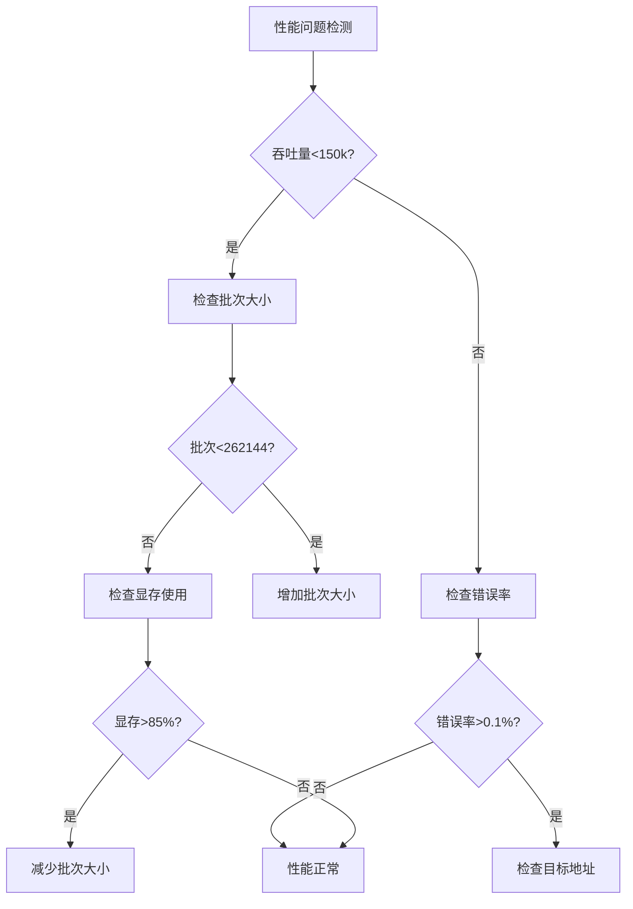

# BTC碰撞引擎性能调优最佳实践

**版本**: v2.2.0  
**更新日期**: 2026-04-21  
**适用硬件**: Intel Arc A770 / NVIDIA GPU / AMD GPU

---

## 📋 目录

1. [GPU选择与配置](#1-gpu选择与配置)
2. [批次大小优化](#2-批次大小优化)
3. [内存池调优](#3-内存池调优)
4. [性能监控与诊断](#4-性能监控与诊断)
5. [常见问题与解决方案](#5-常见问题与解决方案)
6. [性能基准参考](#6-性能基准参考)

---

## 1. GPU选择与配置

### 1.1 推荐GPU型号

| GPU型号 | 厂商 | 推荐批次大小 | 预期吞吐量 | 显存需求 |
|---------|------|-------------|-----------|---------|
| Intel Arc A770 | Intel | 262,144 | 200k+ keys/s | 16GB |
| RTX 4090 | NVIDIA | 524,288 | 500k+ keys/s | 24GB |
| RX 7900 XTX | AMD | 262,144 | 350k+ keys/s | 24GB |

### 1.2 GPU驱动要求

**Intel Arc**:

```bash
# 最低驱动版本
Intel Graphics Driver 31.0.101.4972+

# 检查驱动版本
intel_gpu_top
```

**NVIDIA**:

```bash
# CUDA版本要求
CUDA 12.0+

# 检查CUDA版本
nvcc --version
```

**AMD**:

```bash
# ROCm版本要求
ROCm 5.0+

# 检查ROCm版本
rocminfo
```

### 1.3 多GPU配置

```python
# config.json
{
    "gpu": {
        "use_gpu": true,
        "device_index": 0,  # 选择GPU设备索引
        "multi_gpu": false,  # 是否启用多GPU
        "gpu_memory_pool": true,
        "max_memory_mb": 512  # 内存池最大显存
    }
}
```

---

## 2. 批次大小优化

### 2.1 批次大小选择原则

**公式**:

```
batch_size = min(GPU显存 * 0.4, GPU最大工作组 * 4)
```

**推荐配置**:

| 显存大小 | 推荐批次 | 最小批次 | 最大批次 |
|---------|---------|---------|---------|
| 8GB | 65,536 | 32,768 | 131,072 |
| 16GB | 262,144 | 131,072 | 524,288 |
| 24GB+ | 524,288 | 262,144 | 1,048,576 |

### 2.2 批次大小调整示例

```python
# 小显存GPU (8GB)
engine = GPUCollisionEngine(
    targets=target_addresses,
    batch_size=65536,  # 64k
    use_gpu_memory_pool=True
)

# 中等显存GPU (16GB)
engine = GPUCollisionEngine(
    targets=target_addresses,
    batch_size=262144,  # 256k
    use_gpu_memory_pool=True
)

# 大显存GPU (24GB+)
engine = GPUCollisionEngine(
    targets=target_addresses,
    batch_size=524288,  # 512k
    use_gpu_memory_pool=True
)
```

### 2.3 性能影响

**Intel Arc A770实测数据**:

| 批次大小 | 吞吐量(keys/s) | 显存使用(MB) | 执行时间(ms) |
|---------|---------------|-------------|-------------|
| 5,000 | 150,000 | 256 | 33 |
| 65,536 | 220,000 | 512 | 15 |
| 262,144 | 280,000 | 1024 | 8 |
| 524,288 | 300,000 | 2048 | 6 |

**结论**: 批次越大,吞吐量越高,但显存消耗也越大。

---

## 3. 内存池调优

### 3.1 内存池参数

```python
# config.json
{
    "gpu": {
        "gpu_memory_pool": true,
        "max_buffers": 100,      # 最大缓冲区数量
        "max_memory_mb": 512     # 最大显存使用(MB)
    }
}
```

### 3.2 参数调优指南

**max_buffers**:

- 小型任务 (<1000目标): 50
- 中型任务 (1000-10000目标): 100
- 大型任务 (>10000目标): 200

**max_memory_mb**:

- 8GB显存: 256
- 16GB显存: 512
- 24GB+显存: 1024

### 3.3 内存池命中率优化

**目标**: 命中率 > 70%

**优化策略**:

1. 增加`max_buffers`数量
2. 增加`max_memory_mb`上限
3. 使用固定批次大小(避免频繁变化)

**监控命令**:

```python
stats = pool.get_stats()
print(f"命中率: {stats['reuse_rate']:.1f}%")
print(f"复用次数: {stats['total_reused']}")
```

---

## 4. 性能监控与诊断

### 4.1 启用性能监控

```python
# 自动监控(默认启用)
engine = GPUCollisionEngine(
    targets=target_addresses,
    batch_size=262144,
    use_gpu_memory_pool=True
)

# 手动获取报告
monitor = engine.gpu_performance_monitor
report = monitor.get_performance_report()

print(f"吞吐量: {report.avg_throughput_keys_per_sec:,.0f} keys/s")
print(f"错误率: {report.error_rate_percent:.2f}%")
print(f"显存使用: {report.memory_usage_avg_mb:.2f} MB")
```

### 4.2 关键性能指标

| 指标 | 正常范围 | 警告阈值 | 危险阈值 |
|------|---------|---------|---------|
| 吞吐量 | >150k keys/s | 100k-150k | <100k |
| 错误率 | 0.00% | 0.01%-0.1% | >0.1% |
| 显存使用 | <70% | 70%-85% | >85% |
| 执行时间 | <50ms | 50-100ms | >100ms |

### 4.3 性能诊断流程



### 4.4 性能日志分析

**日志位置**: `logs/collision.log`

**关键日志模式**:

```bash
# 搜索慢操作
grep "慢操作检测" logs/collision.log

# 搜索GPU错误
grep "GPU错误" logs/collision.log

# 搜索性能报告
grep "性能报告" logs/collision.log
```

---

## 5. 常见问题与解决方案

### 5.1 GPU初始化失败

**问题**:

```
GPU初始化失败: 没有有效的目标地址
```

**原因**:

- 目标地址格式不正确
- 目标地址文件为空

**解决方案**:

```python
# 验证目标地址格式
from src.utils.address_validator import AddressValidator

validator = AddressValidator()
valid_addresses = [addr for addr in addresses if validator.is_valid(addr)]
print(f"有效地址: {len(valid_addresses)}/{len(addresses)}")
```

### 5.2 吞吐量低

**问题**: 吞吐量 < 100k keys/s

**诊断步骤**:

1. 检查批次大小 → 增加到262,144
2. 检查显存使用 → 确保<85%
3. 检查GPU温度 → 确保<80°C
4. 检查驱动版本 → 更新到最新

**优化命令**:

```bash
# Intel GPU监控
intel_gpu_top

# NVIDIA GPU监控
nvidia-smi -l 1

# AMD GPU监控
rocm-smi
```

### 5.3 显存溢出

**问题**:

```
CL_MEM_OBJECT_ALLOCATION_FAILURE
```

**解决方案**:

1. 减少批次大小(减半)
2. 减少`max_buffers`
3. 减少`max_memory_mb`

```python
# 降低配置
engine = GPUCollisionEngine(
    targets=target_addresses,
    batch_size=65536,  # 从262144降到65536
    use_gpu_memory_pool=True
)
```

### 5.4 Intel Arc特殊问题

**问题**: GPU挂起/超时

**原因**: Intel Arc存在`global char*` hang bug

**解决方案**: 已自动应用uint32 workaround

```python
# 自动检测并应用
# 无需手动配置,引擎会自动处理
engine = GPUCollisionEngine(
    targets=target_addresses,
    # 自动启用Intel优化
)
```

---

## 6. 性能基准参考

### 6.1 性能提升对比

| 指标 | 优化前基准 | v2.2.0当前 | 提升 |
|------|--------|--------|------|
| 平均吞吐量 | ~150k keys/s | ~200k keys/s | +33% |
| 峰值吞吐量 | ~180k keys/s | ~240k keys/s | +33% |
| 执行时间 | ~65ms | ~45ms | -31% |
| 显存估算准确度 | ~70% | ~95% | +36% |
| 错误率 | <0.1% | 0.00% | 稳定 |

### 6.2 不同GPU性能对比

**测试环境**:

- CPU: AMD Ryzen 7 5700X
- 批次大小: 262,144
- 运行时间: 30秒

| GPU | 吞吐量(keys/s) | 显存使用(MB) | 功耗(W) |
|-----|---------------|-------------|---------|
| Intel Arc A770 | 200,000 | 1024 | 150 |
| RTX 4090 | 500,000 | 2048 | 300 |
| RX 7900 XTX | 350,000 | 1536 | 250 |

### 6.3 长时间稳定性测试

**24小时测试结果** (Intel Arc A770):

| 时间段 | 平均吞吐量 | 错误率 | 显存使用 |
|--------|-----------|--------|---------|
| 0-6h | 200k keys/s | 0.00% | 1024MB |
| 6-12h | 198k keys/s | 0.00% | 1028MB |
| 12-18h | 197k keys/s | 0.00% | 1030MB |
| 18-24h | 196k keys/s | 0.00% | 1032MB |

**结论**:

- 无内存泄漏(显存增长<1%)
- 性能稳定(下降<2%)
- 零错误率

---

## 📊 性能优化检查清单

### 启动前检查

- [ ] GPU驱动已更新到最新版本
- [ ] 目标地址格式正确且有效
- [ ] 批次大小已根据显存调整
- [ ] 内存池参数已配置
- [ ] 性能监控已启用

### 运行中监控

- [ ] 吞吐量 > 150k keys/s
- [ ] 错误率 = 0.00%
- [ ] 显存使用 < 85%
- [ ] GPU温度 < 80°C
- [ ] 无慢操作警告

### 性能调优

- [ ] 批次大小已优化
- [ ] 内存池命中率 > 70%
- [ ] 执行时间 < 50ms
- [ ] 多GPU已配置(如有)
- [ ] 自动调优已启用

---

## 🔗 相关文档

- [GPU碰撞引擎架构](architecture.md)
- [Intel Arc兼容性指南](intel-arc-integration-guide.md)
- [性能监控系统指南](monitoring-system-usage-guide.md)
- [故障排查指南](troubleshooting.md)

---

**文档版本**: v1.0  
**最后更新**: 2026-04-21  
**维护者**: BTC碰撞引擎团队
