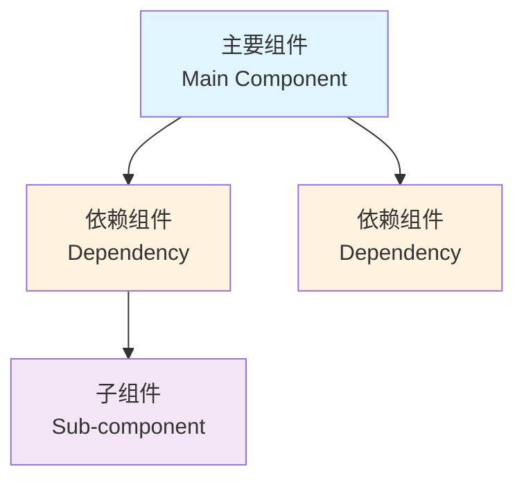
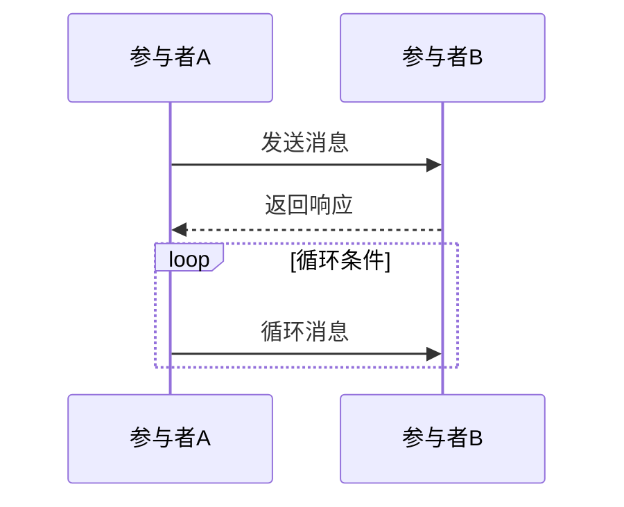
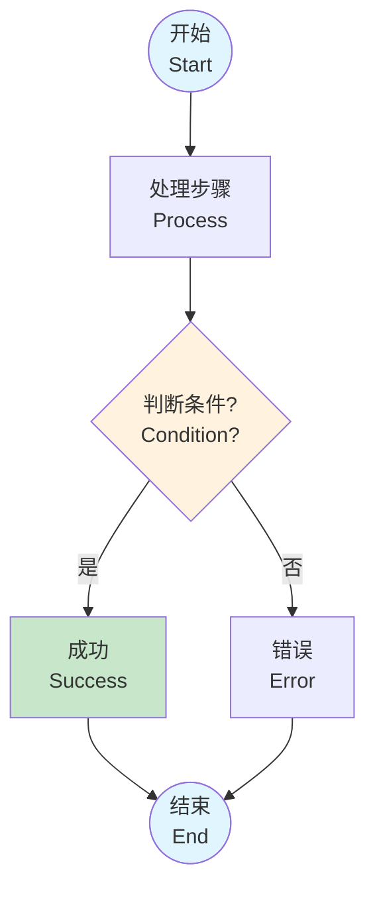

# Mermaid图表与文档格式统一规范

**制定时间**: 2026-04-20  
**适用范围**: 所有Markdown文档中的Mermaid图表

---

## 📋 格式规范

### 1. 图表标题格式

**标准格式**:
```markdown
**图X.Y**: 图表描述（Mermaid 图表类型）
```

**示例**:
```markdown
**图3.1**: 核心模块依赖关系（Mermaid graph TD）
**图2.1**: CLI启动序列图（Mermaid sequenceDiagram）
**图7.1**: 程序运行完整流程图（Mermaid flowchart TD）
```

**规则**:
- ✅ 使用粗体 `**图X.Y**: `
- ✅ 章节号.序号（如3.1、2.1）
- ✅ 括号内注明图表类型
- ✅ 图表类型使用小写（graph TD、sequenceDiagram、flowchart LR）

---

### 2. 代码块格式

**标准格式**:
````markdown
```mermaid
图表类型
    缩进4空格
    节点定义
    连接关系
    
    style 节点 fill:#颜色
```
````

**规则**:
- ✅ 使用 \`\`\`mermaid 标记
- ✅ 图表类型后换行
- ✅ 所有内容缩进4个空格
- ✅ 空行分隔逻辑块
- ✅ style语句前空一行

---

### 3. 节点命名格式

#### 3.1 普通节点

**标准格式**:
```mermaid
NodeID["中文描述<br/>English Description"]
```

**示例**:
```mermaid
A["P2PKHAddressGenerator<br/>地址生成器"]
CLI["key_collision_cli.py<br/>命令行界面"]
```

**规则**:
- ✅ 使用双引号包裹
- ✅ 中文在前，英文在后
- ✅ 使用 `<br/>` 换行
- ✅ 英文首字母大写
- ✅ 节点ID使用大写字母或缩写（A、B、C或CLI、GUI、Engine）

#### 3.2 特殊节点

**决策节点（菱形）**:
```mermaid
DecisionNode{"条件判断?<br/>Condition?"}
```

**起点/终点（圆角）**:
```mermaid
StartNode(["开始<br/>Start"])
EndNode(["结束<br/>End"])
```

---

### 4. 连接关系格式

**标准格式**:
```mermaid
SourceNode --> TargetNode
SourceNode -->|标签| TargetNode
SourceNode -->> TargetNode: 消息
SourceNode -.可选.-> TargetNode
```

**规则**:
- ✅ 箭头前后各一个空格
- ✅ 标签使用 `|标签|` 格式
- ✅ 实线 `-->`、虚线 `-.->`、双向 `<-->`
- ✅ sequenceDiagram使用 `->>` 和 `-->>`

---

### 5. 颜色标注规范

**标准颜色映射**:

| 颜色代码 | 颜色名称 | 使用场景 | 示例 |
|---------|---------|---------|------|
| `#e1f5ff` | 浅蓝色 | 起点、终点、主要组件 | 主线程、用户界面 |
| `#fff3e0` | 浅橙色 | 决策点、中间层、控制流 | 引擎层、管理器 |
| `#e8f5e9` | 浅绿色 | 成功状态、完成状态 | 统计、日志 |
| `#ffebee` | 浅红色 | 安全、警告、错误 | SecureKeyManager |
| `#f3e5f5` | 浅紫色 | 底层组件、基础模块 | 密码学库 |
| `#c8e6c9` | 绿色 | 最终输出、结果 | 地址生成结果 |

**style格式**:
```mermaid
style NodeID fill:#颜色代码
```

**规则**:
- ✅ 所有style语句放在图表末尾
- ✅ style前空一行
- ✅ 每个style单独一行
- ✅ 使用6位颜色代码（#RRGGBB）

---

### 6. 子图格式

**标准格式**:
```mermaid
subgraph SubgraphID["🔤 Emoji 中文名称 English Name"]
    Node1["节点1"]
    Node2["节点2"]
end
```

**示例**:
```mermaid
subgraph UI["🖥️ 用户界面层 User Interface Layer"]
    CLI["CLI界面<br/>命令行交互"]
    GUI["GUI界面<br/>Tkinter图形界面"]
end
```

**规则**:
- ✅ subgraph ID使用大写字母
- ✅ 标题使用双引号
- ✅ 包含Emoji图标（可选但推荐）
- ✅ 中英双语标题
- ✅ end单独一行

---

### 7. 图表说明格式

**标准格式**:
```markdown
**说明**:
- **节点名称**：功能描述
- **节点名称**：功能描述

**特点**:
- 特点1
- 特点2
```

**规则**:
- ✅ 使用粗体标题（**说明**:、**特点**:、**示例**:)
- ✅ 节点名称加粗
- ✅ 使用无序列表
- ✅ 每个说明项单独一行

---

### 8. 文档标题格式

**章节标题**:
```markdown
## X. 章节标题

### X.Y 子章节标题

#### X.Y.Z 小节标题
```

**规则**:
- ✅ 使用 `##` 表示二级标题（章节）
- ✅ 使用 `###` 表示三级标题（子章节）
- ✅ 使用 `####` 表示四级标题（小节）
- ✅ 标题后空一行
- ✅ 章节号使用阿拉伯数字

---

### 9. 代码示例格式

**标准格式**:
````markdown
**示例**:
```python
from module import Class

# 创建实例
instance = Class()
result = instance.method()
```
````

**规则**:
- ✅ 使用粗体 **示例**:
- ✅ 指定语言（python、json、bash）
- ✅ 代码缩进4空格
- ✅ 包含注释说明
- ✅ 示例前后各空一行

---

### 10. 表格格式

**标准格式**:
```markdown
| 列名1 | 列名2 | 列名3 |
|------|------|------|
| 内容1 | 内容2 | 内容3 |
```

**规则**:
- ✅ 表头和内容之间必须有分隔线
- ✅ 分隔线使用 `|------|`
- ✅ 列对齐使用冒号（`:---`、`---:`、`:---:`）
- ✅ 每列前后各一个空格

---

## 📝 格式检查清单

### Mermaid图表检查

- [ ] 图表标题格式正确（**图X.Y**: 描述（Mermaid 类型））
- [ ] 代码块使用 \`\`\`mermaid
- [ ] 节点使用双引号包裹
- [ ] 中英双语标注（中文<br/>English）
- [ ] 缩进4个空格
- [ ] style语句在末尾
- [ ] 颜色代码正确（#RRGGBB）
- [ ] 箭头前后有空格
- [ ] subgraph正确配对

### 文档格式检查

- [ ] 标题层级正确（##、###、####）
- [ ] 标题后空一行
- [ ] 代码示例指定语言
- [ ] 表格格式正确
- [ ] 列表缩进一致
- [ ] 段落间空一行

---

## 🔧 常见问题

### Q1: 节点名称太长怎么办？

**A**: 使用 `<br/>` 换行，保持每行不超过30个字符。

```mermaid
LongNode["很长的节点名称<br/>Long Node Name<br/>分多行显示"]
```

### Q2: 颜色如何选择？

**A**: 参考第5节的颜色映射表，根据节点类型选择对应颜色。

### Q3: sequenceDiagram的participant如何命名？

**A**: 使用缩写，显示名称使用中英双语。

```mermaid
participant Engine as 碰撞引擎 Collision Engine
participant GUI as GUI界面
```

### Q4: 子图需要Emoji吗？

**A**: Emoji是可选的，但推荐使用，可以增强可读性。

---

## ✅ 格式模板

### graph TD 模板

````markdown
**图X.Y**: 图表描述（Mermaid graph TD）



**说明**:
- **主要组件**：功能描述
- **依赖组件**：功能描述
````

### sequenceDiagram 模板

````markdown
**图X.Y**: 序列图描述（Mermaid sequenceDiagram）



**说明**:
- 序列说明
- 交互流程
````

### flowchart TD 模板

````markdown
**图X.Y**: 流程图描述（Mermaid flowchart TD）



**说明**:
- 流程说明
- 判断条件
````

---

**规范版本**: v1.0  
**制定日期**: 2026-04-20  
**适用范围**: 所有项目文档
