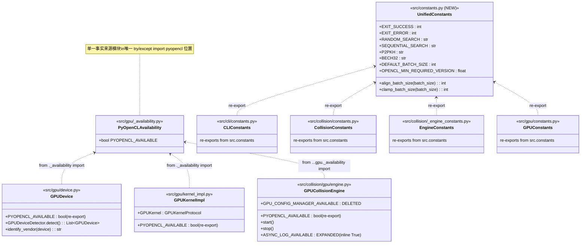
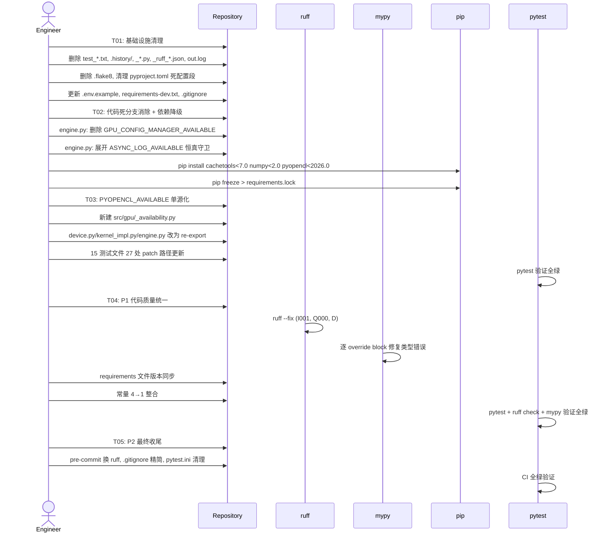
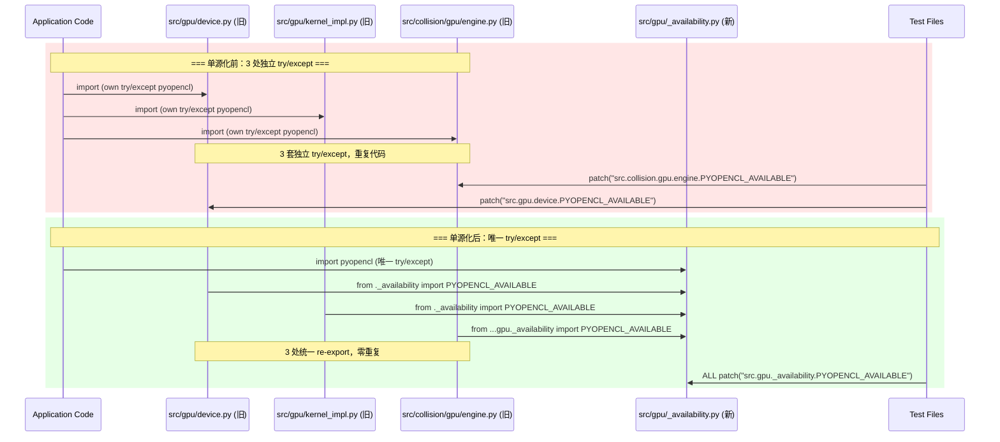
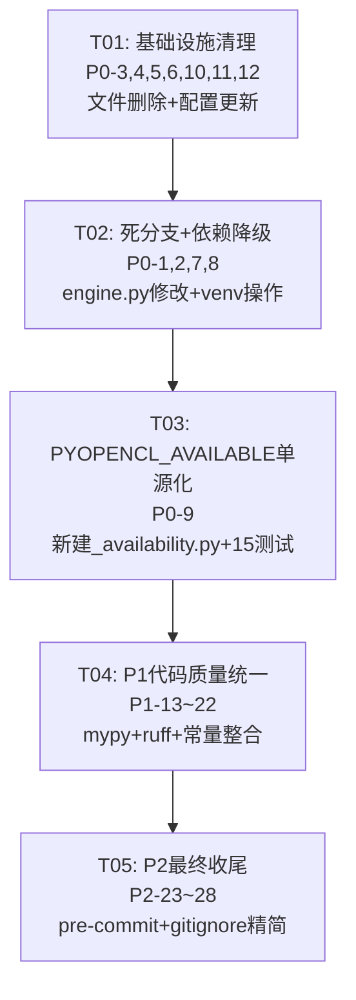

# btc-collision-engine 代码规范统一 — 系统设计文档

> **版本**: 1.1 | **日期**: 2026-05-28 | **作者**: Bob (Architect)
>
> **v1.1 更新**: 新增 PERF-2 Intel Arc profiling 序列化修复（运行时热修复，非计划内 P-ID）

---

## Part A: 系统设计

### 1. 实现方案

#### 1.1 核心技术挑战与策略

| 挑战 | 策略 |
|------|------|
| **150+ 源文件批量修改** | ruff `--fix --unsafe-fixes` 自动处理机械性修改（引号、导入排序、简单 docstring）；其余手工 + mypy 逐文件修复 |
| **PYOPENCL_AVAILABLE 单源化** | 新建 `src/gpu/_availability.py` 提供单一事实来源；旧位置改为 `from ._availability import PYOPENCL_AVAILABLE` 的 re-export；15 个测试文件 27 处 patch 路径从 `src.gpu.device.PYOPENCL_AVAILABLE` / `src.collision.gpu.engine.PYOPENCL_AVAILABLE` 统一到 `src.gpu._availability.PYOPENCL_AVAILABLE` |
| **mypy ignore_errors 消除** | 按 pyproject.toml 中 6 个 `[[tool.mypy.overrides]]` block 分组，逐组修复类型错误后移除豁免；优先修复 "次预存类型债务" block |
| **常量碎片化整合** | 4 个常量文件 → 合并为 `src/constants.py`（顶层统一模块），旧位置 re-export 保持向后兼容 |
| **版本降级** | 收紧 3 个包上限（cachetools<7.0, numpy<2.0, pyopencl<2026.0），执行 `pip install` 后重新生成 `requirements.lock` |

#### 1.2 框架与工具选型

| 工具 | 用途 | 理由 |
|------|------|------|
| **ruff ≥0.9.0** | Lint + Format + Import Sort | 已有 `[tool.ruff]` 配置完备，替代 black/flake8 |
| **mypy ≥1.0.0** | 类型检查 | 已有 6 个 override block 渐近目标 |
| **pytest** | 测试验证 | 已有完整测试套件 |
| **Python 3.12+** | 运行时 | 已有 `.python-version` 和 `requires-python` |

#### 1.3 架构模式

采用 **单一事实来源（Single Source of Truth）** 模式：
- **可用性标志**: `src/gpu/_availability.py` 是唯一的 `PYOPENCL_AVAILABLE` 定义点
- **常量**: `src/constants.py` 是顶层统一常量入口
- **依赖版本**: `pyproject.toml` 是唯一主版本声明源，其他 requirements 文件从此派生

---

### 2. 文件列表

> 操作类型：**M**=修改, **A**=新增, **D**=删除

#### Phase A: 基础设施清理（T01）

| 文件 | 操作 | 说明 |
|------|------|------|
| 根目录 `test_*.txt` (24 文件) | **D** | P0-3: 删除临时测试输出 |
| `.history/` (349 文件, 5.8MB) | **D** | P0-3: 删除 IDE 历史 |
| `out.log` | **D** | P0-11: 物理删除日志 |
| `_ruff_*.json` (5 文件) | **D** | P0-3: 删除 ruff 临时输出 |
| `_*.py` (10 文件) | **D** | P0-12: 删除临时脚本 |
| `_*.txt` (4 文件) | **D** | P0-3: 删除临时文本 |
| `.flake8` | **D** | P0-4: 删除 flake8 独立配置 |
| `pyproject.toml` | **M** | P0-4: 删除 `[tool.flake8]`/`[tool.black]`/`[tool.basedpyright]`段 |
| `.env.example` | **M** | P0-5: 与 `os.getenv()` 交叉比对后增补缺失项 |
| `requirements-dev.txt` | **M** | P0-6: 删除 black/flake8，增加 ruff |
| `.gitignore` | **M** | P0-10: 添加 `_ruff_*.json` 规则；P2-26: 精简至≤50行 |

#### Phase B: 代码死分支消除 + 依赖降级（T02）

| 文件 | 操作 | 说明 |
|------|------|------|
| `src/collision/gpu/engine.py` | **M** | P0-1: 删除 `GPU_CONFIG_MANAGER_AVAILABLE=False`；P0-2: 展开 `ASYNC_LOG_AVAILABLE=True` 恒真守卫（删除 L121-123、L403-405，内联真值） |
| `requirements.lock` | **M** | P0-8: 同步为降级后版本 |

#### Phase C: PYOPENCL_AVAILABLE 单源化（T03）

| 文件 | 操作 | 说明 |
|------|------|------|
| `src/gpu/_availability.py` | **A** | P0-9: 新建，唯一 `PYOPENCL_AVAILABLE` 定义 |
| `src/gpu/device.py` | **M** | P0-9: 删除本地 try/except 定义，改为 `from ._availability import PYOPENCL_AVAILABLE` |
| `src/gpu/kernel_impl.py` | **M** | P0-9: 同上 |
| `src/collision/gpu/engine.py` | **M** | P0-9: 同上（与 T02 改动叠加） |
| `tests/conftest.py` | **M** | P0-9: patch 路径 `src.collision.gpu.engine.PYOPENCL_AVAILABLE` → `src.gpu._availability.PYOPENCL_AVAILABLE` |
| `tests/acceptance/conftest.py` | **M** | P0-9: 同上 |
| `tests/gpu_compatibility_test.py` | **M** | P0-9: patch 路径 `src.gpu.device.PYOPENCL_AVAILABLE` → `src.gpu._availability.PYOPENCL_AVAILABLE` |
| `tests/gpu_mock_factory.py` | **M** | P0-9: patch 路径更新 |
| `tests/gpu_mock_patch.py` | **M** | P0-9: patch 路径更新 |
| `tests/gpu/test_e2e_closed_loop_gpu.py` | **M** | P0-9: patch 路径更新 |
| `tests/gpu/test_gpu_collision_engine.py` | **M** | P0-9: patch 路径更新（3 处） |
| `tests/gpu/test_gpu_core.py` | **M** | P0-9: patch 路径更新 |
| `tests/gpu/test_gpu_crypto_backend_performance.py` | **M** | P0-9: patch 路径更新 |
| `tests/gpu/test_gpu_engine_refactor_phase6.py` | **M** | P0-9: patch 路径更新（2 处） |
| `tests/gpu/test_gpu_exception_handling.py` | **M** | P0-9: patch 路径更新（4 处） |
| `tests/gpu/test_gpu_module.py` | **M** | P0-9: patch 路径更新 |
| `tests/gpu/test_gpu_performance_verification.py` | **M** | P0-9: patch 路径更新（2 处） |
| `tests/gpu/test_gpu_refactored_methods.py` | **M** | P0-9: patch 路径更新 |
| `tests/test_error_counter_thread_safety.py` | **M** | P0-9: patch 路径更新 |

#### Phase D: P1 代码质量统一（T04）

| 文件 | 操作 | 说明 |
|------|------|------|
| `pyproject.toml` | **M** | P1-13: 删除 6 个 `ignore_errors = true` override block（逐组修复后删除） |
| `src/**/*.py` (~40 文件) | **M** | P1-13: mypy 类型错误修复 |
| `src/**/*.py` (所有 public API) | **M** | P1-14: Google-style docstring |
| `src/**/*.py` (全 src/) | **M** | P1-15: ruff I001 导入排序 |
| `src/**/*.py` (残余单引号文件) | **M** | P1-16: 引号统一双引号 |
| `requirements-base.txt` | **M** | P1-17: 以 pyproject.toml 为准同步版本 |
| `requirements-gpu.txt` | **M** | P1-17: 同上 |
| `requirements-dev.txt` | **M** | P1-17: 同上（与 T01 叠加） |
| `src/**/*.py` (混用相对导入文件) | **M** | P1-18: `.`/`..` → `from src.xxx import` |
| `src/collision/` `src/core/` `src/config/` `src/monitoring/` `src/utils/` (25 文件) | **M** | P1-19: 删除 `#!/usr/bin/env python3` shebang |
| `src/**/*.py` (约 0 文件) | **M** | P1-20: 编码声明已清零，仅确认 |
| `src/**/*.py` (11 .format + 39 %) | **M** | P1-21: 转换为 f-string |
| `src/constants.py` | **A** | P1-22: 顶层统一常量模块 |
| `src/cli/constants.py` | **M** | P1-22: 迁移内容至 src/constants.py，保留 re-export |
| `src/collision/constants.py` | **M** | P1-22: 同上 |
| `src/collision/_engine_constants.py` | **M** | P1-22: 同上 |
| `src/gpu/constants.py` | **M** | P1-22: 同上 |

#### Phase E: P2 最终收尾（T05）

| 文件 | 操作 | 说明 |
|------|------|------|
| `pyproject.toml` | **M** | P2-23: `[tool.mypy]` 逐步启用 strict 子标志 |
| `src/**/*.py` (命名违规文件) | **M** | P2-24: 命名规范修复 |
| `.pre-commit-config.yaml` | **M** | P2-25: 替换 black/flake8 为 ruff；添加 mypy hook |
| `.gitignore` | **M** | P2-26: 精简 335→≤50 行（与 T01 叠加） |
| `ROADMAP.md` | **M** | P2-27: 更新为标准化完成状态 |
| `pytest.ini` | **M** | P2-28: 删除 `ignore::DeprecationWarning` |

---

### 3. 数据结构和接口



---

### 4. 程序调用流程

#### 4.1 Phase 执行总流程



#### 4.2 PYOPENCL_AVAILABLE 单源化前后对比



---

### 5. 待明确事项

| # | 事项 | 假设 |
|---|------|------|
| 1 | P1-20 编码声明文件数：搜索确认 `src/` `tests/` `scripts/` `tools/` 中已无 `# -*- coding:` 声明 | 零文件需修改，仅 confirm |
| 2 | P1-21 %格式化数量：搜索到 773 处，远超 PRD 所述 39 处 | 按 PRD 指定的 39+11=50 处执行；PRD 可能指特定子集 |
| 3 | P1-18 绝对导入范围 vs 相对导入量级：src/ 大量使用 `from ..xxx import` (150+ 处) | 仅转换 PRD 明确标识的"混用"文件，非全部 |
| 4 | P2-24 命名规范审计具体范围未定义 | 仅修复 ruff N8xx 规则报告项 |
| 5 | P2-26 .gitignore 精简：哪些规则保留需判断 | 保留 Python 缓存/venv/build/IDE/OS 标准规则；移除历史累积的根目录临时文件单列规则 |

---

## Part B: 任务分解

### 6. 依赖包与工具

```
- ruff>=0.9.0          # Lint + Format + Import Sort（替代 black/flake8）
- mypy>=1.0.0,<2.0.0   # 类型检查
- pytest>=9.0.0,<10.0.0 # 测试框架
- cachetools>=5.3.0,<7.0.0   # P0-7: 降级上限
- numpy>=1.24.0,<2.0.0       # P0-7: 降级上限（锁定 1.x）
- pyopencl>=2022.1,<2026.0   # P0-7: 降级上限
```

---

### 7. 共享知识（跨文件约定）

```
- 所有 PYOPENCL_AVAILABLE patch 目标路径统一为 "src.gpu._availability.PYOPENCL_AVAILABLE"
- 绝对导入格式: from src.{module} import {name}（基于 pyproject.toml packages.find.include=["src*"]）
- Docstring 风格: Google-style（与 ruff [tool.ruff.lint.pydocstyle] convention="google" 一致）
- 引号风格: 双引号（ruff Q000/QQ 规则）
- Line length: 105（与现有 ruff 配置一致）
- Python 版本: 3.12+（与现有 pyproject.toml 一致）
- 常量整合后: 内部代码从 src.constants import，旧路径保留 re-export 向后兼容
- 依赖版本: pyproject.toml 为唯一主版本源，requirements-*.txt 为派生
- mypy: P1 目标消除所有 ignore_errors；P2 目标逐步启用 strict 子标志
- 所有修改必须通过: ruff check && mypy src/ && pytest 验证
```

---

### 8. 任务列表（ORDERED, 含依赖）

#### T01: 项目基础设施清理

| 属性 | 内容 |
|------|------|
| **Task ID** | T01 |
| **优先级** | P0 |
| **映射 P-ID** | P0-3, P0-4, P0-5, P0-6, P0-10, P0-11, P0-12 |
| **依赖** | 无 |
| **预估工时** | 1h |

**涉及文件**:
- **删除 (D)**: 根目录 `test_*.txt` (24), `.history/` (349 files), `_ruff_*.json` (5), `_*.py` (10), `_*.txt` (4), `out.log`, `.flake8`
- **修改 (M)**: `pyproject.toml` (删 `[tool.flake8]`/`[tool.black]`/`[tool.basedpyright]`), `.env.example` (与 `os.getenv()` 交叉比对), `requirements-dev.txt` (删 black/flake8 → 加 ruff>=0.9.0), `.gitignore` (加 `_ruff_*.json`)

**验收标准**:
1. 根目录无 `test_*.txt`、`_*.py`、`_*.json`、`_*.txt`、`out.log`
2. `.history/` 目录已删除
3. `.flake8` 文件已删除
4. `pyproject.toml` 中无 `[tool.flake8]`、`[tool.black]`、`[tool.basedpyright]`
5. `.env.example` 中每个变量与 `src/` 中 `os.getenv()` 调用匹配（0 差异）
6. `requirements-dev.txt` 包含 `ruff>=0.9.0`，不含 black/flake8
7. `.gitignore` 包含 `_ruff_*.json` 规则

---

#### T02: 代码死分支消除 + 依赖降级

| 属性 | 内容 |
|------|------|
| **Task ID** | T02 |
| **优先级** | P0 |
| **映射 P-ID** | P0-1, P0-2, P0-7, P0-8 |
| **依赖** | T01 (文件删除后避免垃圾提交) |
| **预估工时** | 1.5h |

**涉及文件**:
- **修改 (M)**: `src/collision/gpu/engine.py`, `requirements.lock`
- **环境操作**: `pip install "cachetools<7.0" "numpy<2.0" "pyopencl<2026.0"` + 重新生成 lock

**验收标准**:
1. `src/collision/gpu/engine.py` 中无 `GPU_CONFIG_MANAGER_AVAILABLE` 变量
2. `src/collision/gpu/engine.py` 中 `ASYNC_LOG_AVAILABLE` 变量已删除，其使用处已内联为 `True`
3. `pip freeze` 确认 `cachetools<7.0`, `numpy<2.0`, `pyopencl<2026.0` 已安装
4. `requirements.lock` 各包版本在 `pyproject.toml` 约束范围内
5. `python -c "from src.collision.gpu.engine import GPUCollisionEngine"` 无 ImportError

---

#### T03: PYOPENCL_AVAILABLE 单源化

| 属性 | 内容 |
|------|------|
| **Task ID** | T03 |
| **优先级** | P0 |
| **映射 P-ID** | P0-9 |
| **依赖** | T02 (engine.py 与 T02 修改同一文件，需要顺序) |
| **预估工时** | 2h |

**涉及文件**:
- **新增 (A)**: `src/gpu/_availability.py`
- **修改 (M)**: `src/gpu/device.py`, `src/gpu/kernel_impl.py`, `src/collision/gpu/engine.py`
- **修改 (M) — 测试**: `tests/conftest.py`, `tests/acceptance/conftest.py`, `tests/gpu_compatibility_test.py`, `tests/gpu_mock_factory.py`, `tests/gpu_mock_patch.py`, `tests/gpu/test_e2e_closed_loop_gpu.py`, `tests/gpu/test_gpu_collision_engine.py`, `tests/gpu/test_gpu_core.py`, `tests/gpu/test_gpu_crypto_backend_performance.py`, `tests/gpu/test_gpu_engine_refactor_phase6.py`, `tests/gpu/test_gpu_exception_handling.py`, `tests/gpu/test_gpu_module.py`, `tests/gpu/test_gpu_performance_verification.py`, `tests/gpu/test_gpu_refactored_methods.py`, `tests/test_error_counter_thread_safety.py`

**验收标准**:
1. `src/gpu/_availability.py` 是唯一含 `try/except ImportError pyopencl` 的文件
2. `src/gpu/device.py`, `src/gpu/kernel_impl.py`, `src/collision/gpu/engine.py` 均通过 `from ._availability import PYOPENCL_AVAILABLE` 导入
3. 所有 15 个测试文件中 `PYOPENCL_AVAILABLE` 的 patch 目标路径统一为 `src.gpu._availability.PYOPENCL_AVAILABLE`
4. `pytest` 全绿（CPU 测试 + GPU mock 测试）
5. `grep -rn "except ImportError:" src/` 仅 `src/gpu/_availability.py` 一处命中

---

#### T04: P1 代码质量统一

| 属性 | 内容 |
|------|------|
| **Task ID** | T04 |
| **优先级** | P1 |
| **映射 P-ID** | P1-13, P1-14, P1-15, P1-16, P1-17, P1-18, P1-19, P1-20, P1-21, P1-22 |
| **依赖** | T03 (mypy 与类型注解相关) |
| **预估工时** | 8h |

**涉及文件**:
- **新增 (A)**: `src/constants.py`
- **修改 (M)**: `pyproject.toml`, `requirements-base.txt`, `requirements-gpu.txt`, `requirements-dev.txt`, `src/cli/constants.py`, `src/collision/constants.py`, `src/collision/_engine_constants.py`, `src/gpu/constants.py`
- **修改 (M) — mypy**: ~40 源文件（按 6 个 override block 分组修复）
- **修改 (M) — docstring**: `src/` 所有 public API 文件
- **修改 (M) — import sort**: `src/` 全量（ruff --fix 自动）
- **修改 (M) — quotes**: 残余单引号文件（ruff --fix 自动）
- **修改 (M) — absolute imports**: 混用相对导入的文件
- **修改 (M) — shebang**: `src/collision/` `src/core/` `src/config/` `src/monitoring/` `src/utils/` 共 25 文件
- **修改 (M) — f-string**: 50 处 `.format()`/`%` 格式化

**验收标准**:
1. `pyproject.toml` 中所有 `ignore_errors = true` 已删除
2. `mypy src/` 零错误
3. `ruff check src/` 零 D 规则违规（public API docstring 完整）
4. `ruff check src/ --select I` 零 I001 违规
5. `ruff check src/ --select Q` 零引号违规
6. `requirements-base.txt`, `requirements-gpu.txt`, `requirements-dev.txt` 版本约束与 `pyproject.toml` 完全一致
7. `grep -rn "^from \.\.|^from \." src/` 零命中（绝对导入统一）
8. `grep -rn "^#!/usr/bin/env python" src/collision/ src/core/ src/config/ src/monitoring/ src/utils/` 零命中
9. `src/constants.py` 包含所有 4 个子模块常量的合集
10. 旧常量文件通过 `from src.constants import *` 保持 re-export

---

#### T05: P2 最终收尾

| 属性 | 内容 |
|------|------|
| **Task ID** | T05 |
| **优先级** | P2 |
| **映射 P-ID** | P2-23, P2-24, P2-25, P2-26, P2-27, P2-28 |
| **依赖** | T04 (所有 P0/P1 完成后再做 P2 收尾) |
| **预估工时** | 2.5h |

**涉及文件**:
- **修改 (M)**: `pyproject.toml`, `.pre-commit-config.yaml`, `.gitignore`, `ROADMAP.md`, `pytest.ini`
- **修改 (M)**: `src/` 中 ruff N8xx 命名违规文件

**验收标准**:
1. `pyproject.toml` `[tool.mypy]` 启用 `strict = true` 或至少 3 个 strict 子标志
2. `ruff check src/ --select N` 零命名违规
3. `.pre-commit-config.yaml` 中 black/flake8 已替换为 ruff，已添加 mypy hook
4. `wc -l .gitignore` 输出 ≤50
5. `ROADMAP.md` 反映标准化完成状态
6. `pytest.ini` 中无 `ignore::DeprecationWarning`/`ignore::PendingDeprecationWarning`
7. `pytest` 全绿 + `ruff check` 全绿 + `mypy src/` 全绿

---

### 9. 任务依赖图



---

## Part C: 运行时热修复 (v1.1)

### PERF-2: Intel Arc profiling 序列化修复

| 属性 | 内容 |
|------|------|
| **发现日期** | 2026-05-28 |
| **影响** | Intel Arc A770 GPU 利用率呈尖刺/齿轮状（每批次完成→等待→下一批次） |
| **根因** | `device.py` 创建 OOO 命令队列时附加 `PROFILING_ENABLE`。Intel compute-runtime FAQ 确认此标志在 OOO 队列上强制内核串行执行 |
| **修复** | Intel Arc 分支移除 `PROFILING_ENABLE`，仅保留 `OUT_OF_ORDER_EXEC_MODE_ENABLE` |
| **影响文件** | `src/gpu/device.py` L700-730（仅 Intel Arc 分支） |
| **参考** | https://github.com/intel/compute-runtime/blob/master/opencl/doc/FAQ.md |
| **验证** | 全项目 `clGetEventProfilingInfo` 零引用 — profiling 数据从未被消费 |

**修复前**:
```python
ooo_prop = PROFILING_ENABLE | OUT_OF_ORDER_EXEC_MODE_ENABLE
# Intel Arc 也使用 → 内核串行化 → 尖刺利用率
```

**修复后**:
```python
ooo_prop = PROFILING_ENABLE | OUT_OF_ORDER_EXEC_MODE_ENABLE  # NVIDIA/AMD 保留
if vendor == "intel":
    ooo_prop = OUT_OF_ORDER_EXEC_MODE_ENABLE  # Intel: 仅 OOO，去 profiling
```

    T01 --> T02
    T02 --> T03
    T03 --> T04
    T04 --> T05
```
