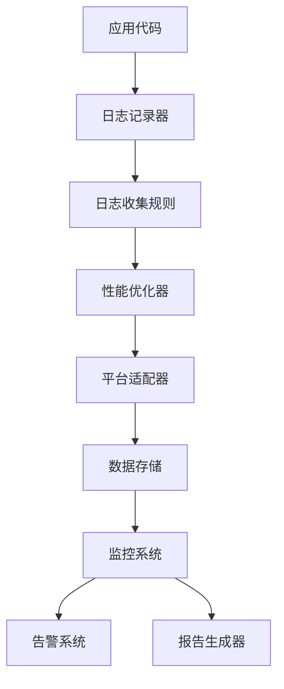

# 日志监控系统使用指南

本文档详细介绍了比特币私钥对撞引擎的日志监控系统，包括系统架构、配置选项、使用方法和最佳实践。

## 1. 系统架构

### 1.1 核心组件

- **日志收集规则配置系统**：支持基于模块的日志级别控制、关键字过滤、上下文增强和动态规则管理
- **日志依赖管理机制**：明确日志组件与其他系统模块的依赖关系，确保正确的初始化顺序
- **日志性能优化器**：利用异步处理、批量写入和平台特定优化提高日志处理性能
- **平台适配器**：处理不同操作系统的特定问题，确保日志系统在所有平台上稳定运行
- **日志监控集成器**：将新的日志监控系统与现有监控框架集成，实现数据共享和统一管理

### 1.2 数据流



## 2. 配置选项

### 2.1 日志配置文件

日志配置文件位于 `config.json` 中的 `logging` 部分：

```json
{
  "logging": {
    "level": "INFO",
    "file": "logs/collision.log",
    "format": "%(asctime)s - %(name)s - %(levelname)s - %(message)s",
    "max_bytes": 10485760,
    "backup_count": 5,
    "enable_console": true,
    "enable_file": true,
    "rotation_type": "size",
    "rotation_when": "midnight",
    "rotation_interval": 1,
    "compress_backups": false
  }
}
```

### 2.2 日志收集规则配置

日志收集规则配置文件默认位于 `logs/log_rules.json`：

```json
{
  "rules": [
    {
      "name": "核心模块详细日志",
      "module_pattern": "core.*",
      "level": "DEBUG",
      "include_patterns": [],
      "exclude_patterns": [],
      "enabled": true,
      "context_fields": ["timestamp", "module", "level"],
      "sample_rate": 1,
      "max_logs_per_second": 0.0
    },
    {
      "name": "GPU模块性能日志",
      "module_pattern": "gpu.*",
      "level": "INFO",
      "include_patterns": ["performance", "speed", "benchmark"],
      "exclude_patterns": [],
      "enabled": true,
      "context_fields": ["timestamp", "module", "level", "gpu_id", "speed"],
      "sample_rate": 1,
      "max_logs_per_second": 0.0
    },
    {
      "name": "错误和异常",
      "module_pattern": ".*",
      "level": "ERROR",
      "include_patterns": [],
      "exclude_patterns": [],
      "enabled": true,
      "context_fields": ["timestamp", "module", "level", "exception"],
      "sample_rate": 1,
      "max_logs_per_second": 0.0
    },
    {
      "name": "高频操作采样",
      "module_pattern": ".*",
      "level": "DEBUG",
      "include_patterns": ["loop", "iteration", "batch"],
      "exclude_patterns": [],
      "enabled": true,
      "sample_rate": 100,
      "max_logs_per_second": 10
    }
  ]
}
```

### 2.3 性能优化配置

性能优化配置可以通过 `LogPerformanceConfig` 类进行设置：

| 参数 | 类型 | 默认值 | 描述 |
|------|------|--------|------|
| async_enabled | bool | True | 是否启用异步日志 |
| buffer_size | int | 10000 | 日志缓冲区大小 |
| flush_interval | float | 1.0 | 刷新间隔（秒） |
| batch_size | int | 100 | 批量写入大小 |
| use_thread_pool | bool | True | 是否使用线程池 |
| thread_pool_size | int | 4 | 线程池大小 |
| compression_enabled | bool | False | 是否启用压缩 |
| memory_threshold | int | 1024 | 内存阈值（MB） |

## 3. 使用方法

### 3.1 初始化日志系统

```python
from src.utils.logging_config import init_logging
from src.utils.log_dependency_manager import init_log_dependencies
from src.utils.log_collection_rules import init_log_collection_rules
from src.monitoring.log_monitoring_integrator import init_log_monitoring_integration

# 初始化日志依赖
init_log_dependencies()

# 初始化日志系统
init_logging({
    "level": "INFO",
    "file": "logs/app.log"
})

# 初始化日志收集规则
init_log_collection_rules("logs/log_rules.json")

# 初始化日志监控集成
init_log_monitoring_integration()
```

### 3.2 基本日志记录

```python
import logging
from src.utils import get_configured_logger

# 获取配置好的日志记录器
logger = get_configured_logger("my_module")

# 记录不同级别的日志
logger.debug("调试信息")
logger.info("普通信息")
logger.warning("警告信息")
logger.error("错误信息")
logger.critical("严重错误信息")

# 记录异常
try:
    raise ValueError("测试异常")
except ValueError:
    logger.exception("发生异常")
```

### 3.3 使用统一日志接口

```python
from src.monitoring.log_monitoring_integrator import log

# 使用统一日志接口
log(
    module="my_module",
    level="info",
    message="操作完成",
    speed=1000.0,
    total_checked=1000000,
    matches_found=0
)

# 记录错误
log(
    module="my_module",
    level="error",
    message="操作失败",
    error_code=404,
    details="资源未找到"
)
```

### 3.4 使用采样日志

对于高频操作，使用采样日志可以减少日志量：

```python
from src.utils.logger import get_sampled_logger

# 创建采样日志记录器，每100条记录1条
sampled_logger = get_sampled_logger("my_module", sample_rate=100)

# 在循环中使用
for i in range(10000):
    sampled_logger.debug(f"处理项目 {i}")
```

### 3.5 使用异步日志

对于高并发场景，使用异步日志可以提高性能：

```python
from src.utils.logger import AsyncFileHandler
import logging

# 创建异步文件处理器
async_handler = AsyncFileHandler("logs/async.log", max_bytes=10*1024*1024)

# 创建日志记录器
logger = logging.getLogger("async_logger")
logger.addHandler(async_handler)
logger.setLevel(logging.INFO)

# 记录日志
logger.info("异步日志测试")

# 程序结束前关闭处理器
async_handler.close()
```

## 4. 监控与报告

### 4.1 获取日志统计信息

```python
from src.monitoring.log_monitoring_integrator import get_integration_stats

# 获取日志统计信息
stats = get_integration_stats()
print(stats)
```

### 4.2 查看最近日志

```python
from src.monitoring.log_monitoring_integrator import get_log_monitoring_integrator

# 获取集成器实例
integrator = get_log_monitoring_integrator()

# 获取最近的50条日志
recent_logs = integrator.get_recent_logs(50)
for log in recent_logs:
    print(log)
```

### 4.3 生成报告

日志监控系统会自动生成性能报告，存储在 `data_logs` 目录中。可以通过以下方式手动生成报告：

```python
from src.monitoring.data_logger import DataLogger

# 创建数据日志记录器
data_logger = DataLogger()

# 生成每日报告
daily_report = data_logger.generate_report("daily")
print(daily_report)

# 生成每周报告
weekly_report = data_logger.generate_report("weekly")
print(weekly_report)

# 生成每月报告
monthly_report = data_logger.generate_report("monthly")
print(monthly_report)
```

## 5. 平台适配

日志监控系统会自动适配不同的操作系统平台：

### 5.1 Windows 平台

- 使用 `SafeRotatingFileHandler` 避免文件锁问题
- 处理控制台编码问题，确保中文日志正常显示
- 使用平台特定的日志目录：`%APPDATA%\btc-collision-engine\logs`

### 5.2 Linux 平台

- 设置日志文件权限为 0o600，确保安全性
- 使用平台特定的日志目录：`~/.local/share/btc-collision-engine/logs`
- 支持 syslog 集成（可选）

### 5.3 macOS 平台

- 使用平台特定的日志目录：`~/Library/Logs/btc-collision-engine`
- 支持 macOS 原生日志系统集成（可选）

## 6. 最佳实践

### 6.1 日志级别使用建议

- **DEBUG**：详细的调试信息，仅在开发和调试时使用
- **INFO**：普通的信息性消息，如操作完成、状态变更等
- **WARNING**：警告信息，如性能下降、资源不足等
- **ERROR**：错误信息，如操作失败、异常发生等
- **CRITICAL**：严重错误信息，如系统崩溃、数据丢失等

### 6.2 日志格式建议

- 包含时间戳、模块名称、日志级别和消息
- 对于错误日志，包含异常类型和堆栈信息
- 对于性能日志，包含相关的性能指标

### 6.3 性能优化建议

- 对于高频操作，使用采样日志
- 对于高并发场景，使用异步日志
- 合理设置日志级别，避免过多的低级别日志
- 定期清理旧日志，避免磁盘空间不足

### 6.4 安全建议

- 避免在日志中记录敏感信息，如私钥、密码等
- 设置适当的文件权限，确保日志文件的安全性
- 定期备份重要的日志文件

## 7. 故障排除

### 7.1 日志文件未创建

- 检查日志目录是否存在，是否有写入权限
- 检查磁盘空间是否充足
- 检查日志配置是否正确

### 7.2 日志内容乱码

- 确保使用 UTF-8 编码
- 在 Windows 平台，使用 `SafeStreamHandler` 处理控制台编码问题

### 7.3 日志性能问题

- 启用异步日志
- 使用采样日志减少日志量
- 调整缓冲区大小和批量写入设置

### 7.4 依赖问题

- 运行 `python -m src.utils.log_dependency_manager` 检查依赖状态
- 确保所有必需的依赖都已安装

## 8. 示例配置

### 8.1 生产环境配置

```json
{
  "logging": {
    "level": "INFO",
    "file": "logs/collision.log",
    "format": "%(asctime)s - %(name)s - %(levelname)s - %(message)s",
    "max_bytes": 10485760,
    "backup_count": 10,
    "enable_console": false,
    "enable_file": true,
    "rotation_type": "size"
  }
}
```

### 8.2 开发环境配置

```json
{
  "logging": {
    "level": "DEBUG",
    "file": "logs/development.log",
    "format": "%(asctime)s - %(name)s - %(levelname)s - %(message)s",
    "max_bytes": 5242880,
    "backup_count": 5,
    "enable_console": true,
    "enable_file": true,
    "rotation_type": "size"
  }
}
```

## 9. 总结

日志监控系统是比特币私钥对撞引擎的重要组成部分，它提供了全面的日志记录、监控和报告功能。通过合理配置和使用，可以帮助开发者和运维人员更好地了解系统运行状态，及时发现和解决问题，确保系统的稳定运行。

---

**注意**：本文档适用于比特币私钥对撞引擎 v3.3.1 及以上版本。
