# BTC碰撞引擎拓扑图文档 v3.5.1

> **版本**: v3.5.1 (Phase 6) | **最后更新**: 2026-05-08
> **面向**: 开发者/架构师
> **更新说明**: 新增 GPU Phase 6 重构架构、异步双缓冲数据流、监控告警、CLI/Wizard 交互、配置管理等拓扑图

## 目录

- [图1: 系统整体架构拓扑图 (v3.5.1 更新)](#图1-系统整体架构拓扑图)
- [图2: GPU引擎 Phase 6 重构架构拓扑图 (全新)](#图2-gpu引擎-phase-6-重构架构拓扑图)
- [图3: 核心密码学模块关系图 (v3.5.1 更新)](#图3-核心密码学模块关系图)
- [图4: 碰撞检测完整数据流拓扑图 (v3.5.1 更新)](#图4-碰撞检测完整数据流拓扑图)
- [图5: GPU异步双缓冲数据流拓扑图 (全新)](#图5-gpu异步双缓冲数据流拓扑图)
- [图6: 监控与告警系统拓扑图 (全新)](#图6-监控与告警系统拓扑图)
- [图7: 模块间依赖关系拓扑图 (v3.5.1 更新)](#图7-模块间依赖关系拓扑图)
- [图8: CLI/Wizard 交互拓扑图 (全新)](#图8-cliwizard-交互拓扑图)
- [图9: 配置管理系统拓扑图 (全新)](#图9-配置管理系统拓扑图)
- [图10: 技术栈与外部依赖拓扑图 (v3.5.1 更新)](#图10-技术栈与外部依赖拓扑图)
- [图11: 测试体系拓扑图 (全新)](#图11-测试体系拓扑图)

---

## 图1: 系统整体架构拓扑图

BTC碰撞引擎 v3.5.1 的 10 层架构拓扑图，展示从用户界面到底层 GPU 驱动的完整层级关系。

```mermaid
graph TB
    subgraph UserInterface["用户界面层"]
        CLI["命令行界面<br/>src/cli/ 19文件"]
        Wizard["交互式向导<br/>src/wizard/ 11文件"]
        GUI["图形界面<br/>key_collision_gui.py"]
    end

    subgraph EngineLayer["碰撞引擎层"]
        CPUEngine["CPU碰撞引擎<br/>KeyCollisionEngine"]
        GPUEngineShim["GPU引擎 Shim层<br/>gpu_collision_engine.py<br/>78行 向后兼容"]
        MPEngine["多进程引擎<br/>MultiprocessEngine"]
        HybridEngine["混合引擎<br/>HybridEngine"]
    end

    subgraph GPUPhase6["GPU引擎 Phase 6 子模块"]
        GPUCoord["引擎协调器<br/>engine.py 1109行"]
        Facade["外观层<br/>facade.py"]
        Core["碰撞核心<br/>core.py"]
        Monitoring["监控管道<br/>monitoring.py"]
        Vendor["厂商策略<br/>vendor_strategy.py"]
        Protocols["协议定义<br/>protocols.py 5接口"]
    end

    subgraph CryptoBackend["加密后端层"]
        CryptoMgr["加密后端管理器<br/>CryptoBackendManager"]
        PurePython["PurePython后端"]
        OpenSSL["OpenSSL后端"]
        Coincurve["Coincurve后端 libsecp256k1"]
        ECDSA["ECDSA后端"]
    end

    subgraph CoreCrypto["核心密码学层"]
        Secp256k1["secp256k1 椭圆曲线"]
        AddrGen["地址生成器"]
        Precompute["预计算点表"]
        BigInt["大整数优化 gmpy2"]
        SIMD["SIMD哈希优化"]
        MemPool["内存池"]
        SecureKey["安全密钥管理"]
        KeyGen["密钥生成器"]
    end

    subgraph MonitorLayer["监控与告警层"]
        MonSys["增强型监控系统"]
        DataLogger["数据日志"]
        GPUPerfMon["GPU性能监控"]
        AlertSys["告警系统"]
        NotifCh["多渠道通知"]
    end

    subgraph DataLayer["数据存储层"]
        Checkpoint["断点管理器"]
        Dedup["去重过滤器 Bloom"]
        Stats["碰撞统计"]
        MatchStorage["匹配存储"]
        JSONFiles["JSON数据文件"]
        LogFiles["日志文件"]
    end

    subgraph GPULayer["GPU加速层 src/gpu/ 48文件"]
        PyOpenCL["PyOpenCL"]
        OpenCLRuntime["OpenCL运行时"]
        GPUKernel["GPU内核 kernel.py"]
        GPUDevice["GPU设备管理"]
        AsyncExec["异步执行器"]
        MemManager["GPU内存管理"]
        MultiGPU["多GPU协调"]
        LoadBal["负载均衡"]
    end

    subgraph ConfigLayer["配置层"]
        ConfigMgr["配置管理器 850行"]
        ConfigWatch["配置热重载监视器"]
        CryptoConfig["加密配置"]
        GPUConfig["GPU配置"]
        PerfConfig["性能监控配置"]
    end

    subgraph I18nLayer["国际化层"]
        Translator["翻译器 Translator"]
        LangDetect["语言检测器"]
        Locales["locales/ JSON语言文件"]
    end

    CLI --> CPUEngine
    Wizard --> CPUEngine
    Wizard --> GPUEngineShim
    GUI --> CPUEngine
    CLI --> GPUEngineShim

    GPUEngineShim --> GPUCoord
    GPUCoord --> Facade
    GPUCoord --> Core
    GPUCoord --> Monitoring
    GPUCoord --> Vendor
    Facade --> Protocols

    CPUEngine --> CryptoMgr
    GPUCoord --> CryptoMgr
    GPUCoord --> GPUDevice
    GPUDevice --> PyOpenCL
    PyOpenCL --> OpenCLRuntime

    CryptoMgr --> Coincurve
    CryptoMgr --> OpenSSL
    CryptoMgr --> ECDSA
    CryptoMgr --> PurePython
    PurePython --> Secp256k1
    PurePython --> AddrGen
    AddrGen --> Precompute
    AddrGen --> BigInt
    AddrGen --> SIMD
    AddrGen --> MemPool

    CPUEngine --> MonSys
    GPUCoord --> MonSys
    MonSys --> DataLogger
    MonSys --> GPUPerfMon
    MonSys --> AlertSys
    AlertSys --> NotifCh

    CPUEngine --> Checkpoint
    CPUEngine --> Dedup
    CPUEngine --> Stats
    GPUCoord --> Stats
    Checkpoint --> JSONFiles
    DataLogger --> JSONFiles
    MonSys --> LogFiles

    CPUEngine --> ConfigMgr
    GPUCoord --> ConfigMgr
    ConfigMgr --> ConfigWatch
    ConfigMgr --> CryptoConfig
    ConfigMgr --> GPUConfig
    ConfigMgr --> PerfConfig

    CLI --> Translator
    Wizard --> Translator
    Translator --> LangDetect
    Translator --> Locales
```

---

## 图2: GPU引擎 Phase 6 重构架构拓扑图

展示 GPU 引擎从原始 1,466 行单体到 Phase 6 重构后的分布式架构。

```mermaid
graph TB
    subgraph Phase6["Phase 6 引擎协调器 engine.py 1109行"]
        Engine["GPUCollisionEngine<br/>组合所有Phase 2-5组件"]
    end

    subgraph Phase1["Phase 1: 协议定义 protocols.py"]
        Proto1["IGPUDeviceManager"]
        Proto2["IKernelExecutor"]
        Proto3["IAsyncExecutionPipeline"]
        Proto4["IMonitoringPipeline"]
        Proto5["ICollisionCore"]
        Proto6["VendorOptimizationStrategy"]
        DataTypes["GPUDevice/GPUContext<br/>MatchResult/CollisionResult<br/>GPUExecutionContext"]
    end

    subgraph Phase2["Phase 2: 外观层 facade.py"]
        Facade["GPUEngineFacade"]
        DevAdapt["DeviceManagerAdapter<br/>→ IGPUDeviceManager"]
        KernAdapt["GPUKernelAdapter<br/>→ IKernelExecutor"]
        AsyncAdapt["AsyncPipelineAdapter<br/>→ IAsyncExecutionPipeline"]
    end

    subgraph Phase3["Phase 3: 监控管道 monitoring.py"]
        PerfPipeline["PerformanceMonitoringPipeline<br/>→ IMonitoringPipeline"]
        PerfMon["性能监控"]
        AnomalyDetect["异常检测"]
        DataLog["数据日志集成"]
    end

    subgraph Phase4["Phase 4: 碰撞核心 core.py"]
        CollCore["CollisionCore<br/>→ ICollisionCore"]
        CollStats["碰撞统计 CollisionStats"]
        Checkpoint["断点管理 CheckpointManager"]
        Dedup["去重过滤 DeduplicationFilter"]
        SearchCoord["搜索模式协调器"]
    end

    subgraph Phase5["Phase 5: 厂商策略 vendor_strategy.py"]
        VendorFactory["VendorOptimizationFactory"]
        NvidiaStrat["NVIDIA优化策略"]
        AMDStrat["AMD优化策略"]
        IntelStrat["Intel优化策略"]
    end

    subgraph Shim["Shim 向后兼容层"]
        OldImport["gpu_collision_engine.py<br/>78行 重导出"]
        OldAPI["保留所有旧导入路径<br/>Monkey-patch兼容"]
    end

    subgraph GPUSubsystem["src/gpu/ 底层GPU子系统 48文件"]
        GPUDevice["GPUDevice GPUDeviceDetector"]
        GPUContext["GPUContext"]
        GPUKernel["GPUKernel kernel_impl.py"]
        AsyncExec["AsyncGPUExecutor"]
        MemPool["GPU内存池"]
        SearchModes["搜索模式 Random/Range/BruteForce"]
        MultiGPU["多GPU引擎"]
    end

    Engine --> Facade
    Engine --> PerfPipeline
    Engine --> CollCore
    Engine --> VendorFactory

    Facade --> DevAdapt
    Facade --> KernAdapt
    Facade --> AsyncAdapt

    DevAdapt --> Proto1
    KernAdapt --> Proto2
    AsyncAdapt --> Proto3
    PerfPipeline --> Proto4
    CollCore --> Proto5
    VendorFactory --> Proto6

    DevAdapt --> GPUDevice
    DevAdapt --> GPUContext
    KernAdapt --> GPUKernel
    AsyncAdapt --> AsyncExec

    CollCore --> CollStats
    CollCore --> Checkpoint
    CollCore --> Dedup
    CollCore --> SearchCoord

    VendorFactory --> NvidiaStrat
    VendorFactory --> AMDStrat
    VendorFactory --> IntelStrat

    OldImport --> Engine
    OldAPI --> OldImport
```

---

## 图3: 核心密码学模块关系图

展示核心密码学模块之间的依赖关系，包含 v3.5.0 新增的性能优化模块。

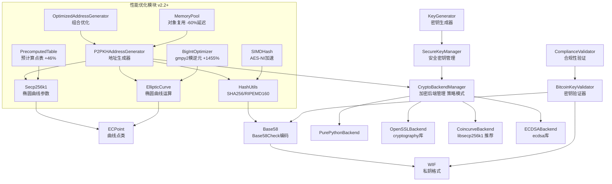

---

## 图4: 碰撞检测完整数据流拓扑图

展示从输入到碰撞匹配的完整数据流（已验证）。

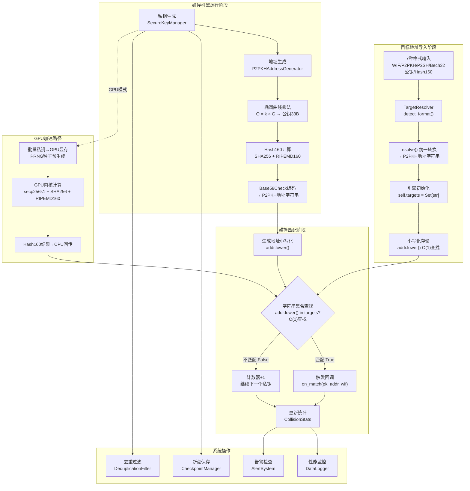

---

## 图5: GPU异步双缓冲数据流拓扑图

对比展示同步模式与异步双缓冲模式的数据流差异。

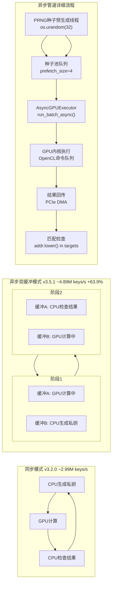

---

## 图6: 监控与告警系统拓扑图

展示 v3.5.0 增强后的监控告警系统架构。

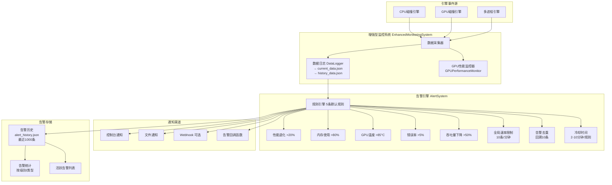

---

## 图7: 模块间依赖关系拓扑图

展示 v3.5.1 全部 11 个 src 子模块之间的 import 依赖关系。

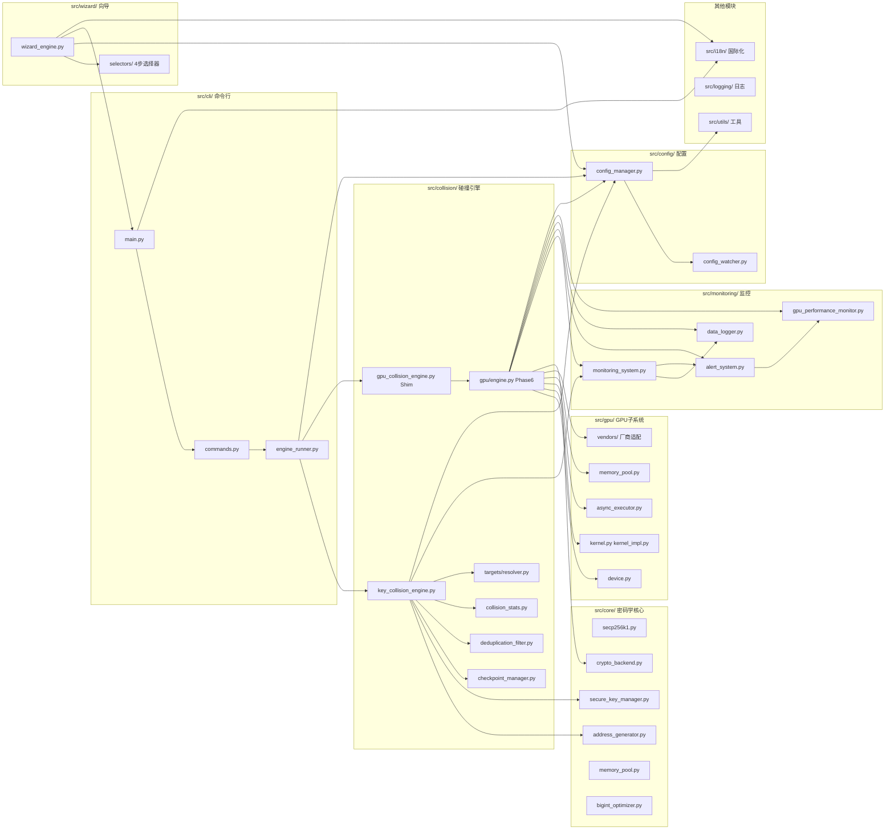

---

## 图8: CLI/Wizard 交互拓扑图

展示 CLI 命令行系统与 Wizard 交互式向导的完整交互流程。

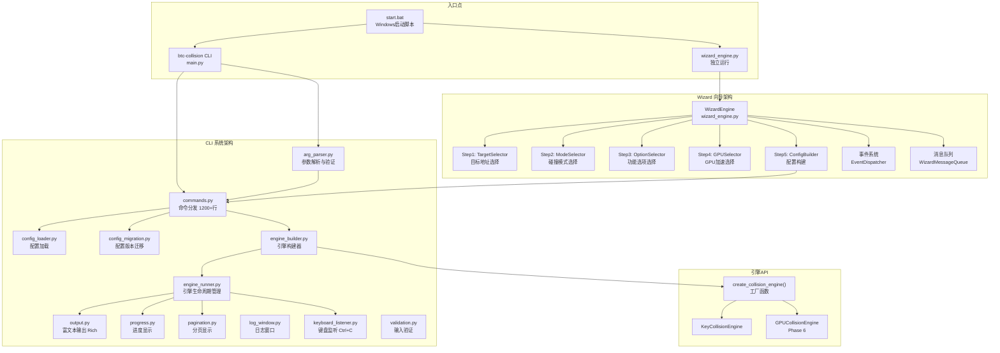

---

## 图9: 配置管理系统拓扑图

展示配置管理的完整架构，包括热重载、验证和协调机制。

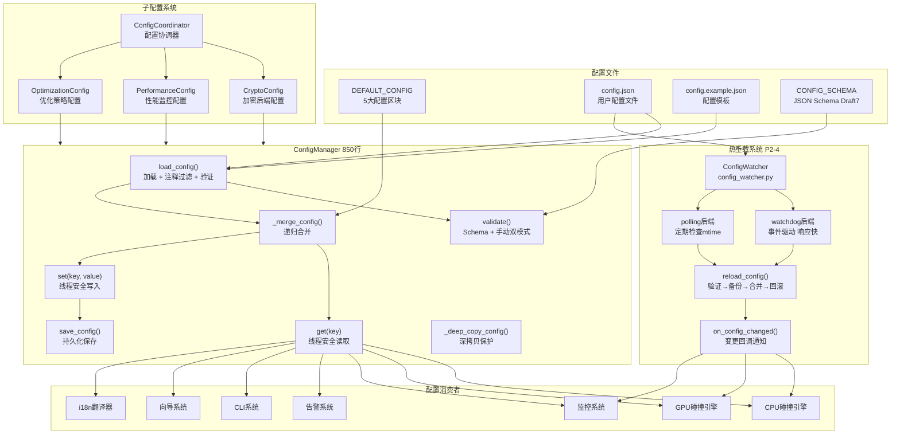

---

## 图10: 技术栈与外部依赖拓扑图

展示项目完整技术栈和依赖层次。

```mermaid
graph TD
    subgraph PythonRuntime["Python 运行时"]
        Py39["Python 3.9+ 标准库"]
        Secrets["secrets CSPRNG"]
        Hashlib["hashlib SHA256/RIPEMD160"]
        Threading["threading 多线程"]
        ConcurrentF["concurrent.futures"]
        JSON["json/ujson"]
        Logging["logging"]
        Asyncio["asyncio"]
    end

    subgraph CoreDeps["核心依赖 13个"]
        Coincurve["coincurve >=18.0<br/>libsecp256k1绑定"]
        Gmpy2["gmpy2 >=2.1<br/>大整数运算"]
        Pycrypto["pycryptodome >=3.19<br/>SIMD哈希 AES-NI"]
        Cryptography["cryptography >=43.0<br/>OpenSSL后端"]
        Cachetools["cachetools >=5.3<br/>LRU缓存"]
        Bech32["bech32 >=1.2<br/>SegWit地址"]
        ECDSA["ecdsa >=0.18<br/>ECDSA后端"]
        Psutil["psutil >=5.9<br/>系统监控"]
        PyNaCl["PyNaCl >=1.5<br/>安全内存清零"]
        Rich["rich >=13.0<br/>CLI富文本"]
        CFFI["cffi >=1.15<br/>C FFI"]
        JSONSchema["jsonschema >=4.0<br/>配置验证"]
        Setproctitle["setproctitle >=1.3<br/>进程名"]
    end

    subgraph GPUDeps["GPU可选依赖"]
        PyOpenCL["pyopencl >=2022.1<br/>OpenCL绑定"]
        Numpy["numpy >=1.24<br/>GPU数据处理"]
    end

    subgraph DevDeps["开发依赖"]
        Pytest["pytest >=9.0"]
        PytestCov["pytest-cov"]
        Mypy["mypy >=1.0"]
        Black["black >=24.0"]
        Flake8["flake8 >=6.0"]
        Bandit["bandit >=1.7"]
        Sphinx["sphinx >=7.0"]
    end

    subgraph SystemDeps["系统依赖"]
        OpenCLRT["OpenCL运行时<br/>Intel/NVIDIA/AMD"]
        GPUDriver["GPU驱动<br/>CUDA/ROCm/Arc"]
        PCIe["PCIe总线<br/>CPU-GPU传输"]
    end

    subgraph ProjectModules["项目模块"]
        Core["src/core/ 密码学"]
        Collision["src/collision/ 碰撞"]
        GPUSrc["src/gpu/ GPU子系统"]
        CLI["src/cli/ 命令行"]
        Monitoring["src/monitoring/ 监控"]
        Config["src/config/ 配置"]
        Wizard["src/wizard/ 向导"]
        I18n["src/i18n/ 国际化"]
        Utils["src/utils/ 工具"]
    end

    Core --> Coincurve
    Core --> Gmpy2
    Core --> Pycrypto
    Core --> Cryptography
    Core --> ECDSA
    Core --> Bech32
    Core --> PyNaCl
    Core --> CFFI

    Collision --> Core
    Collision --> Cachetools
    GPUSrc --> PyOpenCL
    GPUSrc --> Numpy
    GPUSrc --> OpenCLRT
    OpenCLRT --> GPUDriver
    PyOpenCL --> OpenCLRT

    CLI --> Rich
    CLI --> Setproctitle
    Monitoring --> Psutil
    Config --> JSONSchema
    Wizard --> Rich

    Core --> Py39
    Collision --> Py39
    CLI --> Py39
    Monitoring --> Py39
```

---

## 图11: 测试体系拓扑图

展示完整的测试体系架构，含 CI/CD 流水线。

```mermaid
graph TB
    subgraph TestCategories["测试分类"]
        Unit["单元测试<br/>unit marker"]
        Integration["集成测试<br/>integration marker"]
        Smoke["冒烟测试<br/>smoke marker"]
        Regression["回归测试<br/>regression marker"]
        GPUUnit["GPU单元测试<br/>gpu_unit marker"]
        GPUHW["GPU硬件测试<br/>gpu_hardware marker"]
        GPUKernel["GPU内核测试<br/>gpu_kernel marker"]
        Security["安全测试<br/>security marker"]
        PerfBench["性能基准<br/>performance/benchmark"]
        ThreadSafety["线程安全测试<br/>thread_safety marker"]
        CrossPlat["跨平台测试<br/>cross_platform marker"]
        EdgeCase["边界条件测试<br/>edge_cases marker"]
    end

    subgraph TestInfra["测试基础设施"]
        Conftest["conftest.py<br/>24KB 共享夹具"]
        MockFactory["gpu_mock_factory.py<br/>GPU Mock工厂"]
        MockPatch["gpu_mock_patch.py<br/>Mock补丁"]
        TestHelpers["test_helpers.py<br/>测试辅助函数"]
    end

    subgraph PriorityMarkers["优先级标记"]
        P1["p1_high<br/>高优先级修复"]
        P2["p2_medium<br/>中优先级修复"]
        P3["p3_low<br/>低优先级修复"]
        Flaky["flaky<br/>不稳定测试 允许重试"]
    end

    subgraph CI["CI/CD 流水线 .github/workflows/"]
        CITest["ci.yml<br/>代码质量检查"]
        Deploy["deploy.yml<br/>部署流水线"]
        DocQuality["doc-quality.yml<br/>文档质量检查"]
        Release["release.yml<br/>发布流水线"]
    end

    subgraph ToolChain["工具链"]
        Pytest["pytest + pytest-cov"]
        Coverage["覆盖率报告<br/>--cov=src"]
        Mypy["mypy 类型检查<br/>Python 3.11"]
        Black["black 格式化<br/>100字符列"]
        Flake8["flake8 代码质量<br/>E203,W503忽略"]
        Bandit["bandit 安全扫描<br/>B101跳过"]
    end

    subgraph TestResults["测试输出"]
        HTMLCover["htmlcov/<br/>HTML覆盖率"]
        XMLCover["coverage.xml<br/>CI集成"]
        TestReport["test_results/<br/>测试报告"]
        BenchResults[".benchmarks/<br/>基准数据"]
    end

    Unit --> Conftest
    Integration --> Conftest
    GPUUnit --> MockFactory
    GPUUnit --> MockPatch
    GPUHW --> Conftest
    PerfBench --> BenchResults

    CITest --> Pytest
    CITest --> Mypy
    CITest --> Black
    CITest --> Flake8
    CITest --> Bandit
    Deploy --> TestReport

    Pytest --> HTMLCover
    Pytest --> XMLCover
    Pytest --> Coverage
```
