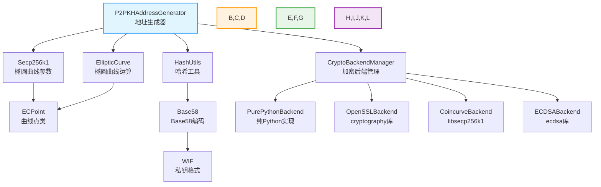
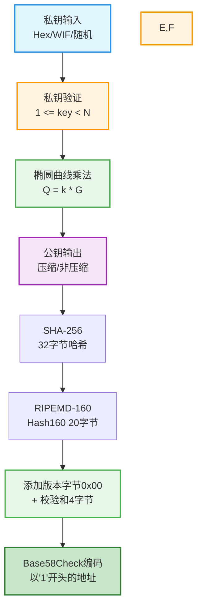
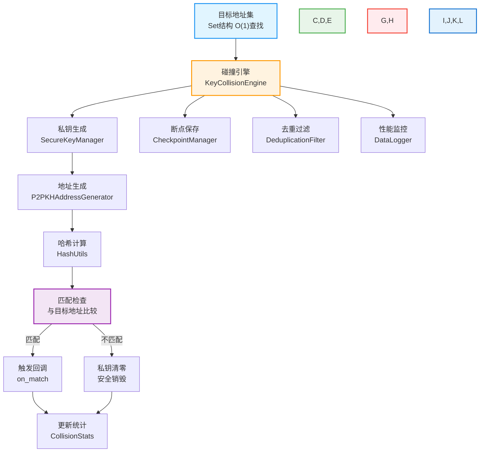
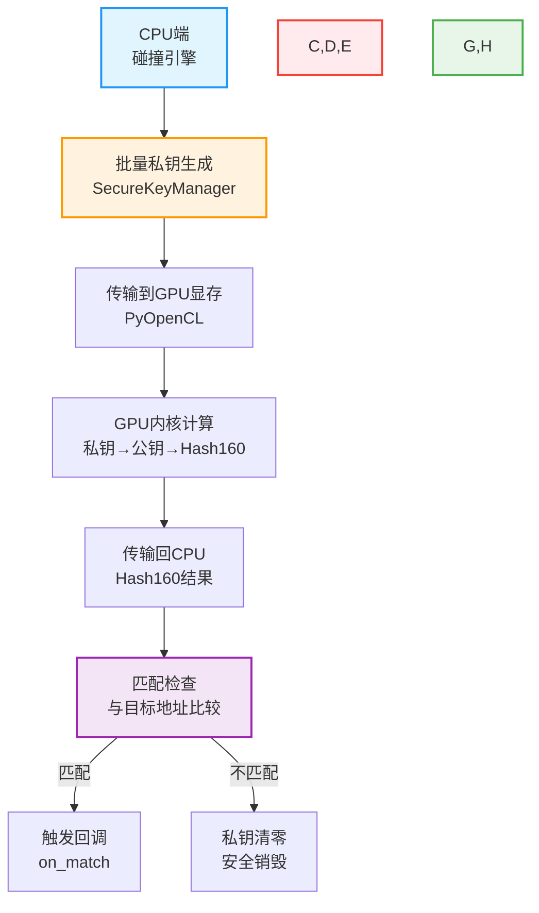
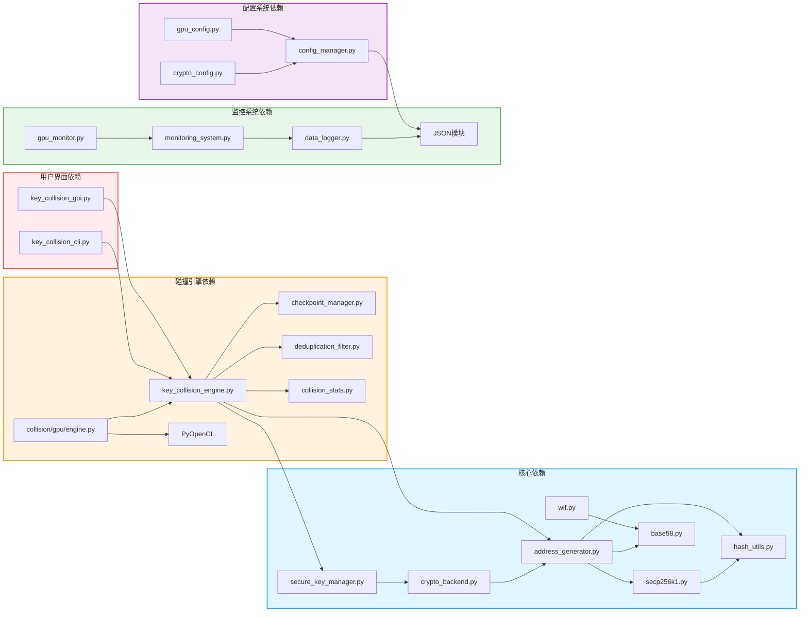
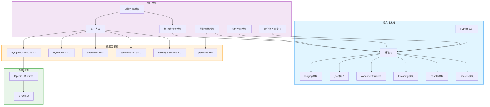

# BTC碰撞引擎拓扑图文档

> **版本**: v4.5.1 | **最后更新**: 2026-05-21  
> **面向**: 开发者/架构师

## 目录

- [1. 系统架构拓扑图](#1-系统架构拓扑图)

- [2. 核心模块关系图](#2-核心模块关系图)

- [3. 数据流向图](#3-数据流向图)

- [4. 依赖关系图](#4-依赖关系图)

- [5. 模块职责表](#5-模块职责表)

- [6. 技术栈依赖](#6-技术栈依赖)

## 1. 系统架构拓扑图

**图1.1**: BTC碰撞引擎系统架构拓扑图

```mermaid
graph TB
    subgraph User_Interface["用户界面层"]
        CLI["命令行界面<br/>key_collision_cli.py"]
        GUI["图形界面<br/>key_collision_gui.py"]
    end
    
    subgraph Engine_Layer["碰撞引擎层"]
        CPUEngine["CPU碰撞引擎<br/>KeyCollisionEngine"]
        GPUEngine["GPU碰撞引擎<br/>GPUCollisionEngine"]
        ThreadPool["线程池<br/>ThreadPoolExecutor"]
    end
    
    subgraph Crypto_Layer["加密算法层"]
        CryptoMgr["加密后端管理器<br/>CryptoBackendManager"]
        PurePython["纯Python后端"]
        OpenSSL["OpenSSL后端"]
        Coincurve["Coincurve后端"]
        ECDSA["ECDSA后端"]
        SecureKey["安全密钥管理器<br/>SecureKeyManager"]
    end
    
    subgraph Core_Layer["核心密码学层"]
        Secp256k1["椭圆曲线<br/>secp256k1.py"]
        HashUtils["哈希工具<br/>hash_utils.py"]
        Base58["Base58编码<br/>base58.py"]
        WIF["WIF格式<br/>wif.py"]
        AddrGen["地址生成器<br/>address_generator.py"]
    end
    
    subgraph Monitor_Layer["监控与日志层"]
        MonSys["监控系统<br/>MonitoringSystem"]
        DataLogger["数据日志<br/>DataLogger"]
        GPUMonitor["GPU监控<br/>GPUMonitor"]
        Anomaly["异常检测<br/>AnomalyDetector"]
    end
    
    subgraph Data_Layer["数据存储层"]
        Checkpoint["断点管理器<br/>CheckpointManager"]
        Dedup["去重过滤器<br/>DeduplicationFilter"]
        Stats["碰撞统计<br/>CollisionStats"]
        JSONFiles["JSON数据文件"]
        LogFiles["日志文件"]
    end
    
    subgraph GPU_Layer["GPU加速层"]
        PyOpenCL["PyOpenCL"]
        OpenCLRuntime["OpenCL运行时"]
        GPUKernel["GPU内核<br/>OpenCL Kernel"]
        GPUDevice["GPU设备管理<br/>GPUDevice"]
    end
    
    subgraph Config_Layer["配置层"]
        ConfigMgr["配置管理器<br/>ConfigManager"]
        CryptoConfig["加密配置<br/>CryptoConfig"]
        GPUConfig["GPU配置<br/>GPUConfig"]
    end
    
    %% 用户界面到引擎层
    CLI --> CPUEngine
    GUI --> CPUEngine
    CLI -.可选.-> GPUEngine
    GUI -.可选.-> GPUEngine
    
    %% 引擎层内部
    CPUEngine --> ThreadPool
    GPUEngine --> GPUDevice
    GPUDevice --> PyOpenCL
    PyOpenCL --> OpenCLRuntime
    GPUDevice --> GPUKernel
    
    %% 引擎到加密层
    CPUEngine --> CryptoMgr
    GPUEngine --> CryptoMgr
    CPUEngine --> SecureKey
    GPUEngine --> SecureKey
    
    %% 加密层到核心层
    CryptoMgr --> Coincurve
    CryptoMgr --> OpenSSL
    CryptoMgr --> ECDSA
    CryptoMgr --> PurePython
    PurePython --> Secp256k1
    PurePython --> AddrGen
    AddrGen --> HashUtils
    AddrGen --> Base58
    Base58 --> WIF
    
    %% 引擎到监控层
    CPUEngine --> MonSys
    GPUEngine --> MonSys
    MonSys --> DataLogger
    MonSys --> GPUMonitor
    MonSys --> Anomaly
    
    %% 引擎到数据层
    CPUEngine --> Checkpoint
    CPUEngine --> Dedup
    CPUEngine --> Stats
    Checkpoint --> JSONFiles
    DataLogger --> JSONFiles
    GPUMonitor --> JSONFiles
    MonSys --> LogFiles
    CPUEngine --> LogFiles
    
    %% 配置层
    CPUEngine --> ConfigMgr
    GPUEngine --> ConfigMgr
    CryptoMgr --> CryptoConfig
    CryptoConfig --> ConfigMgr
    GPUDevice --> GPUConfig
    GPUConfig --> ConfigMgr
    
    %% 样式
    classDef UI fill:#e1f5ff,stroke:#2196f3,stroke-width:2px;
    classDef Engine fill:#fff3e0,stroke:#ff9800,stroke-width:2px;
    classDef Crypto fill:#e8f5e9,stroke:#4caf50,stroke-width:2px;
    classDef Core fill:#f3e5f5,stroke:#9c27b0,stroke-width:2px;
    classDef Monitor fill:#fff3e0,stroke:#ff9800,stroke-width:2px;
    classDef Data fill:#e8f5e9,stroke:#4caf50,stroke-width:2px;
    classDef GPU fill:#ffebee,stroke:#f44336,stroke-width:2px;
    classDef Config fill:#e3f2fd,stroke:#2196f3,stroke-width:2px;
    
    class CLI,GUI UI;
    class CPUEngine,GPUEngine,ThreadPool Engine;
    class CryptoMgr,PurePython,OpenSSL,Coincurve,ECDSA,SecureKey Crypto;
    class Secp256k1,HashUtils,Base58,WIF,AddrGen Core;
    class MonSys,DataLogger,GPUMonitor,Anomaly Monitor;
    class Checkpoint,Dedup,Stats,JSONFiles,LogFiles Data;
    class PyOpenCL,OpenCLRuntime,GPUKernel,GPUDevice GPU;
    class ConfigMgr,CryptoConfig,GPUConfig Config;

```

## 2. 核心模块关系图

**图2.1**: 核心密码学模块关系图

**图2.2**: 碰撞引擎组件关系图

```mermaid
graph TD
    A["KeyCollisionEngine<br/>CPU碰撞引擎"] --> B["CollisionStats<br/>碰撞统计"]
    A --> C["CheckpointManager<br/>断点管理器"]
    A --> D["DeduplicationFilter<br/>去重过滤器"]
    A --> E["TargetResolver<br/>目标解析器"]
    A --> F["P2PKHAddressGenerator<br/>地址生成器"]
    A --> G["SecureKeyManager<br/>安全密钥管理"]
    A --> H["DataLogger<br/>数据日志"]
    A --> I["MonitoringSystem<br/>监控系统"]
    
    J["GPUCollisionEngine<br/>GPU碰撞引擎"] --> K["GPUDevice<br/>GPU设备管理"]
    J --> L["GPUKernel<br/>OpenCL内核"]
    J --> M["GPUMonitor<br/>GPU监控"]
    J --> F
    J --> G
    J --> I
    
    style A,J fill:#e1f5ff,stroke:#2196f3,stroke-width:2px;
    style B,C,D,E fill:#fff3e0,stroke:#ff9800,stroke-width:2px;
    style F,G fill:#e8f5e9,stroke:#4caf50,stroke-width:2px;
    style H,I,M fill:#f3e5f5,stroke:#9c27b0,stroke-width:2px;
    style K,L fill:#ffebee,stroke:#f44336,stroke-width:2px;

```

## 3. 数据流向图

**图3.1**: 地址生成数据流

**图3.2**: 碰撞检测数据流

**图3.3**: GPU加速数据流

## 4. 依赖关系图

**图4.1**: 模块依赖关系图

## 5. 模块职责表

| 模块 | 主要职责 | 文件位置 | 依赖关系 |
|------|----------|----------|----------|
| **核心密码学** | | | |
| Secp256k1 | 椭圆曲线参数和运算 | src/core/secp256k1.py | - |
| HashUtils | 哈希函数实现 | src/core/hash_utils.py | - |
| Base58 | Base58编码/解码 | src/core/base58.py | - |
| WIF | WIF格式处理 | src/core/wif.py | Base58 |
| AddressGenerator | 地址生成 | src/core/address_generator.py | Secp256k1, HashUtils, Base58 |
| CryptoBackendManager | 加密后端管理 | src/core/crypto_backend.py | AddressGenerator |
| SecureKeyManager | 安全密钥管理 | src/core/secure_key_manager.py | - |
| **碰撞引擎** | | | |
| KeyCollisionEngine | CPU碰撞检测 | src/collision/key_collision_engine.py | AddressGenerator, SecureKeyManager |
| GPUCollisionEngine | GPU碰撞检测 | src/collision/gpu/engine.py | PyOpenCL, GPUDeviceManager |
| CheckpointManager | 断点管理 | src/collision/checkpoint_manager.py | - |
| DeduplicationFilter | 去重过滤 | src/collision/deduplication_filter.py | - |
| CollisionStats | 碰撞统计 | src/collision/collision_stats.py | - |
| **监控系统** | | | |
| MonitoringSystem | 监控系统 | src/monitoring/monitoring_system.py | - |
| DataLogger | 数据日志 | src/monitoring/data_logger.py | - |
| GPUMonitor | GPU监控 | src/monitoring/gpu_monitor.py | - |
| **配置系统** | | | |
| ConfigManager | 配置管理 | src/config/config_manager.py | - |
| CryptoConfig | 加密配置 | src/config/crypto_config.py | ConfigManager |
| GPUConfig | GPU配置 | src/config/gpu_config.py | ConfigManager |
| **用户界面** | | | |
| CLI | 命令行界面 | key_collision_cli.py | KeyCollisionEngine |
| GUI | 图形界面 | key_collision_gui.py | KeyCollisionEngine |

## 6. 技术栈依赖

**图6.1**: 技术栈依赖图

## 总结

BTC碰撞引擎采用分层架构设计，各模块职责明确，依赖关系合理。核心密码学模块提供基础功能，碰撞引擎层实现核心业务逻辑，监控系统提供运行时监控，配置系统管理各种参数，用户界面提供交互方式。

通过GPU加速、多线程并行、批量处理等技术，系统实现了高效的私钥碰撞检测能力。同时，通过安全密钥管理、断点续传、去重过滤等功能，确保了系统的安全性和可靠性。

拓扑图文档清晰展示了系统的整体架构、模块关系和数据流向，为开发者理解和维护系统提供了重要参考。